# Тема 1. Введение в Python
Отчет по Теме #1 выполнил(а):
- Аверкиев Егор Алексеевич
- ИВТ-22-1

| Задание | Лаб_раб |
| ------ | ------ |
| Задание 1 | + |
| Задание 2 | + |
| Задание 3 | + |
| Задание 4 | + |
| Задание 5 | + |
| Задание 6 | + |
| Задание 7 | + |
| Задание 8 | + |
| Задание 9 | + |
| Задание 10 | + |
| Задание 11 | + |
| Задание 12 | + |
| Задание 13 | + |
| Задание 14 | + |
| Задание 15 | + |

знак "+" - задание выполнено; знак "-" - задание не выполнено;

Работу проверили:
- к.э.н., доцент Панов М.А.

## Лабораторная работа №1
### Установка
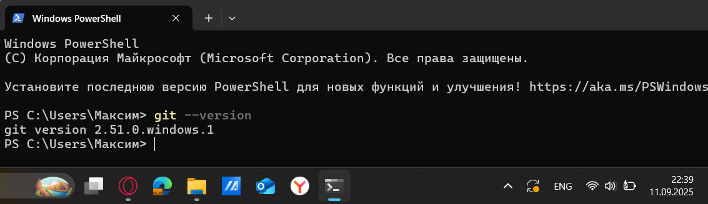

## Лабораторная работа №2
### Настройка
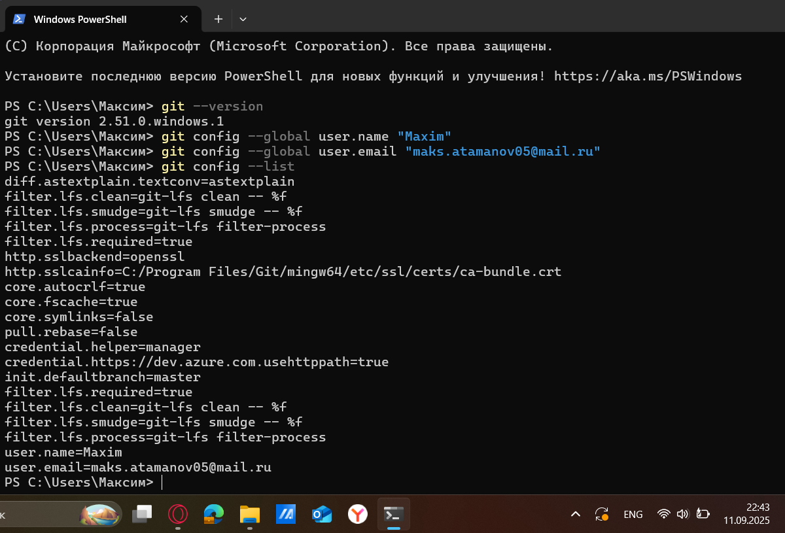

## Лабораторная работа №3
### Создание нового репозитория
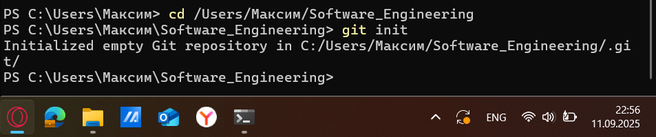

## Лабораторная работа №4
### Подготовка файлов
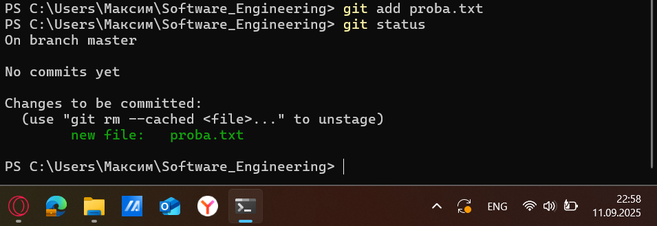

## Лабораторная работа №5
### Фиксация изменений
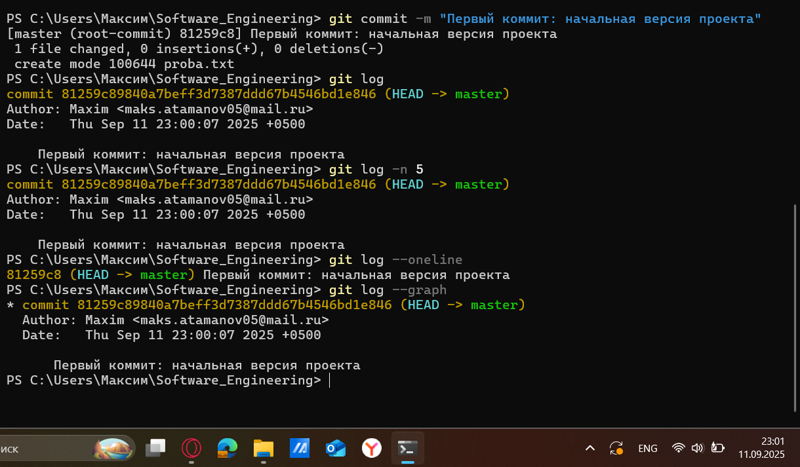

## Лабораторная работа №6
### Подключение к удаленному репозиторию
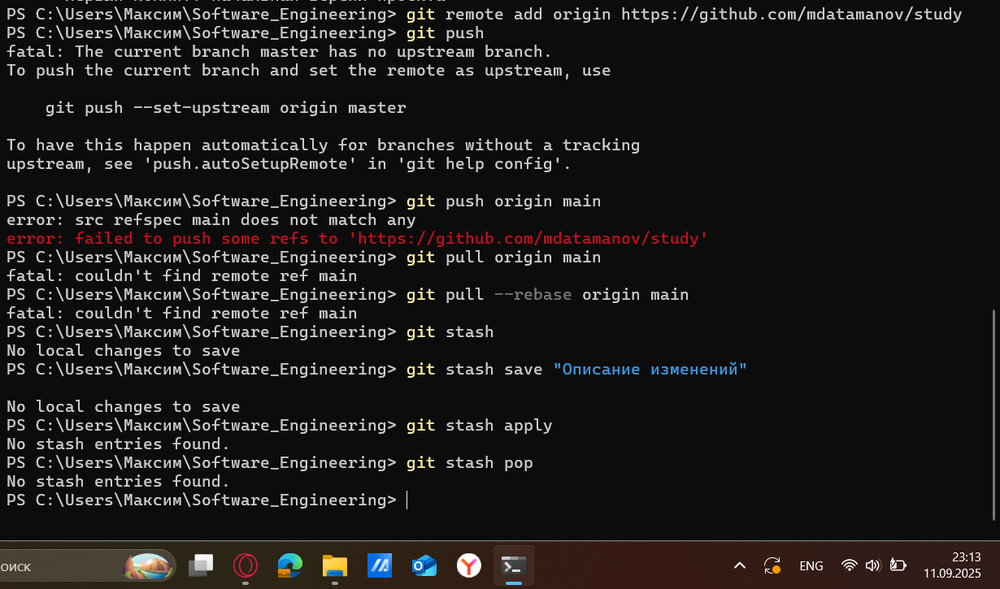

## Лабораторная работа №7
### Ветвление
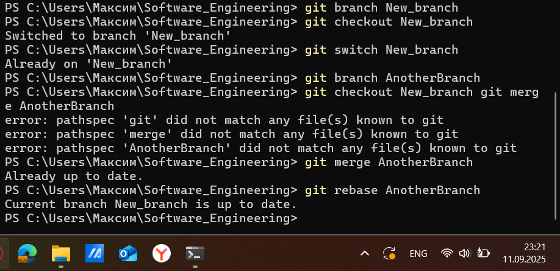

## Лабораторная работа №8
### Особенности применения "Фетч"
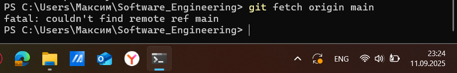

## Лабораторная работа №9
### Удаление файлов, веток, локальных и удалённых репозиториев
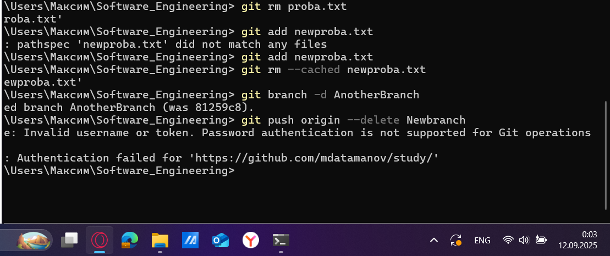

## Лабораторная работа №10
### Отслеживание изменений в коммитах
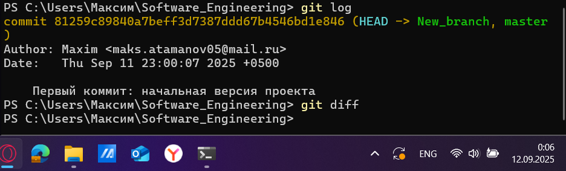

## Лабораторная работа №11
### Возвращение файла к предыдущему (определенному) состоянию
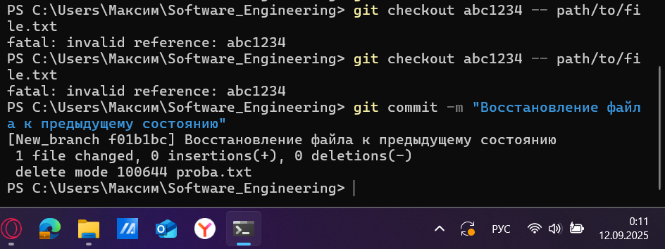

## Лабораторная работа №12
### Возвращение к предыдущему коммиту
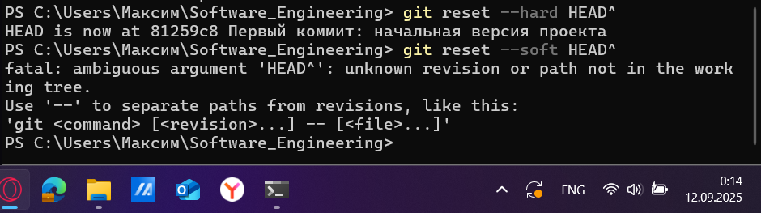

## Лабораторная работа №13
### Исправление коммита
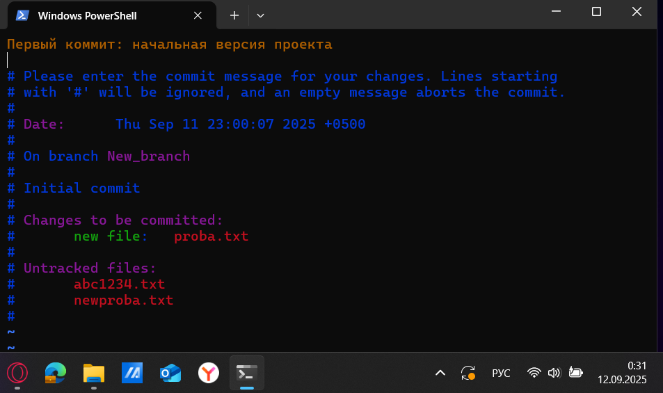

## Лабораторная работа №14
### Разрешение конфликтов при слиянии
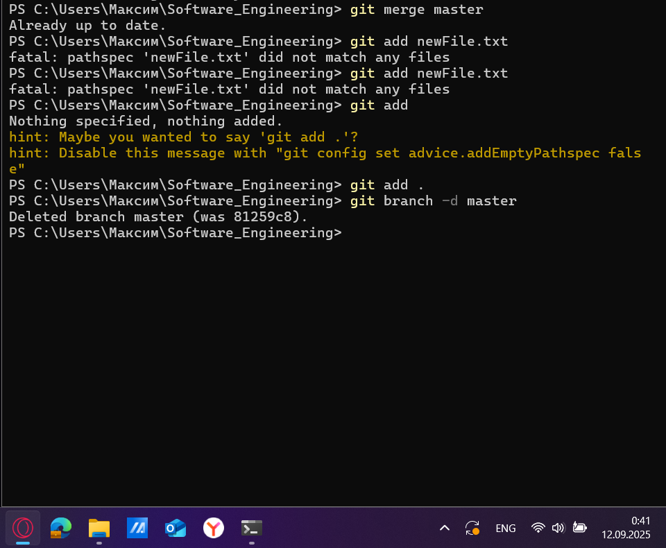

## Лабораторная работа №15
### Настройка .gitignore
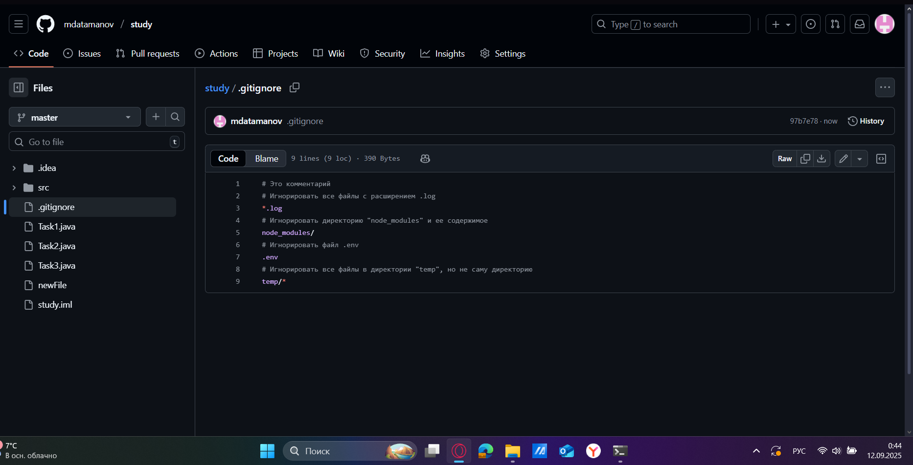

## Общие выводы по теме
- Git является очень полезным инструментом, делающим процесс разработки ПО более эффективным. Так, например, Git позволяет: отслеживать изменения в файлах и управлять их версиями, создавать отдельные ветви для разработки, эффективно работать разработчикам над одним и тем же проектом, производить откат к предыдущим версиям для исправления ошибок, удаленно хранить код и т.д.
