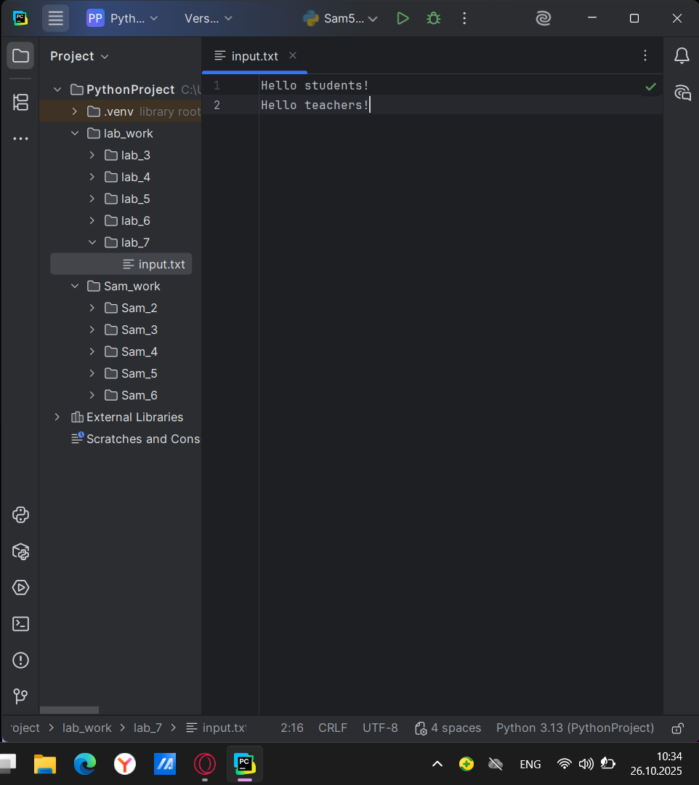
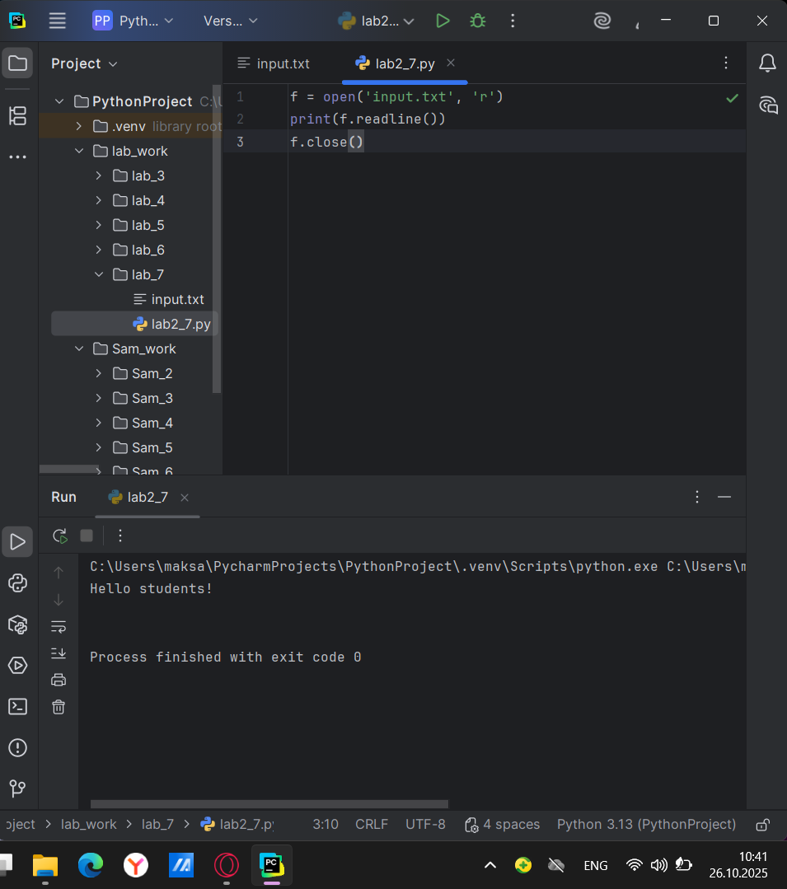
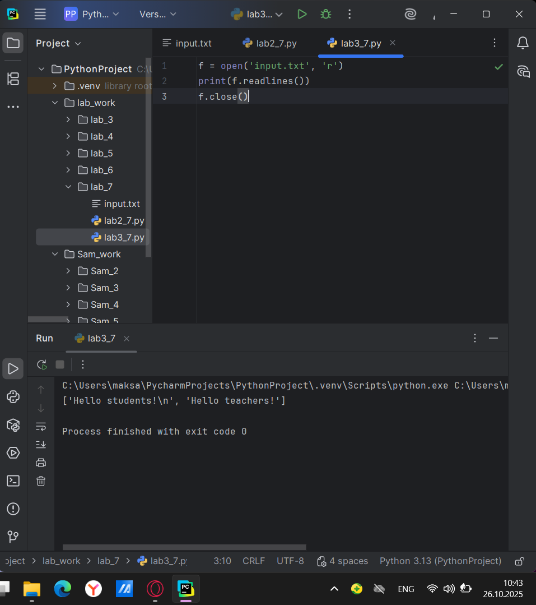

# Тема 7. Работа с файлами: ввод, вывод.
Отчет по Теме #7 выполнил:
- Атаманов Максим Денисович
- ИВТ-23-1

| Задание | Лаб_раб | Сам_раб |
| ------ | ------ | ------ |
| Задание 1 | + | + |
| Задание 2 | + | + |
| Задание 3 | + | + |
| Задание 4 | + | + |
| Задание 5 | + | + |
| Задание 6 | + | + |
| Задание 7 | + | + |
| Задание 8 | + | + |
| Задание 9 | + | + |
| Задание 10 | + | + |

знак "+" - задание выполнено; знак "-" - задание не выполнено;

Работу проверили:
- Ротенштрайх Т.В.

## Лабораторная работа №1
### Составьте текстовый файл и положите его в одну директорию с программой на Python. Текстовый файл должен состоять минимум из двух строк. 

### Результат.


## Лабораторная работа №2
### Напишите программу, которая выведет только первую строку из вашего файла, при этом используйте конструкцию open()/close().

```python
f = open('input.txt', 'r')
print(f.readline())
f.close()
```
### Результат


## Лабораторная работа №3
### Напишите программу, которая выведет все строки из вашего файла в массиве, при этом используйте конструкцию open()/close().

```python
f = open('input.txt', 'r')
print(f.readlines())
f.close()
```
### Результат


## Лабораторная работа №4
### Напишите программу, которая выведет все строки из вашего файла в массиве, при этом используйте конструкцию with open().

```python
with open ('input.txt', 'r') as f:
    print(f.readlines())
```
### Результат

   
## Лабораторная работа №5
### Напишите программу, которая выведет каждую строку из вашего файла отдельно, при этом используйте конструкцию with open().

```python
with open('input.txt', 'r') as f:
    for line in f:
        print(line)
```
### Результат


## Лабораторная работа №6
### Напишите программу, которая будет добавлять новую строку в ваш файл, а потом выведет полученный файл в консоль. Вывод можно осуществлять любым способом. Обязательно проверьте сам файл, чтобы изменения в нем тоже отображались.

```python
with open('input.txt', 'a+') as f:
    f.write('\nIm additional line')

with open('input.txt', 'r') as f:
    result = f.readlines()
    print(result)
```
### Результат


## Лабораторная работа №7
### Напишите программу, которая перепишет всю информацию, которая была у вас в файле до этого, например напишет любые данные из произвольно вами составленного списка. Также не забудьте проверить что измененная вами информация сохранилась в файле.

```python
lines = ['one', 'two', 'three']
with open('input.txt', 'w') as f:
    for line in lines:
        f.write('\nCycle run ' + line)
    print('Done!')
```
### Результат


## Лабораторная работа №8
### Выберите любую папку на своем компьютере, имеющую вложенные директории. Выведите на печать в терминал ее содержимое, как и всех подкаталогов при помощи функции print_docs(directory).

```python
with open('input.txt', 'r') as f:
    for line in f:
        print(line)
```
### Результат


## Лабораторная работа №9
### Напишите программу, которая выведет каждую строку из вашего файла отдельно, при этом используйте конструкцию with open().

```python
with open('input.txt', 'r') as f:
    for line in f:
        print(line)
```
### Результат


## Лабораторная работа №10
### Напишите программу, которая выведет каждую строку из вашего файла отдельно, при этом используйте конструкцию with open().

```python
with open('input.txt', 'r') as f:
    for line in f:
        print(line)
```
### Результат


## Самостоятельная работа №1
### При создании сайта у вас возникла потребность обрабатывать данные пользователя в странной форме, а потом переводить их в нужные вам форматы. Вы хотите принимать от пользователя последовательность чисел, разделенных пробелом, а после переформатировать эти данные в список и кортеж. Реализуйте вашу задумку. 

```python
my_string = input('Введите последовательность чисел через пробел: ')
my_tuple = tuple(my_string.split(' '))
my_list = my_string.split(' ')
print(my_tuple)
print(my_list)
```

### Результат

  
## Самостоятельная работа №2
### Николай знает, что кортежи являются неизменяемыми, но он очень упрямый и всегда хочет доказать, что он прав. Студент решил создать функцию, которая будет удалять первое появление определенного элемента из кортежа по значению и возвращать кортеж без него. Попробуйте повторить шедевр не признающего авторитеты начинающего программиста. Но учтите, что Николай не всегда уверен в наличии элемента в кортеже

```python
def remove_first_occurrence(tuple_data, element):
    temp_list = list(tuple_data)
    if element in temp_list:
        temp_list.remove(element)
    return tuple(temp_list)
test_cases = [
    ((1, 2, 3), 1),
    ((1, 2, 3, 1, 2, 3, 4, 5, 2, 3, 4, 2, 4, 2), 3),
    ((2, 4, 6, 6, 4, 2), 9)
]

print("Результаты:")
for i, (tpl, elem) in enumerate(test_cases, 1):
    result = remove_first_occurrence(tpl, elem)
    print(f"Тест {i}: {result}")
```

### Результат


## Самостоятельная работа №3
###  Ребята поспорили кто из них одним нажатием на numpad наберет больше повторяющихся цифр, но не понимают, как узнать победителя. Вам им нужно в этом помочь. Дана строка в виде случайной последовательности чисел от 0 до 9 (длина строки минимум 15 символов). Требуется создать словарь, который в качестве ключей будет принимать данные числа (т. е. ключи будут типом int), а в качестве значений – количество этих чисел в имеющейся последовательности.

```python
# Получаем строку от пользователя
numbers_string = input("Введите последовательность чисел (минимум 15 символов): ")

# Проверяем длину строки
if len(numbers_string) < 15:
    print("Ошибка: строка должна содержать минимум 15 символов!")
else:
    # Создаем словарь для подсчета чисел
    count_dict = {}

    # Перебираем каждый символ в строке
    for char in numbers_string:
        # Преобразуем символ в число
        num = int(char)

        # Увеличиваем счетчик для этого числа
        if num in count_dict:
            count_dict[num] += 1
        else:
            count_dict[num] = 1

    # Выводим результат
    print("Результат подсчета:")
    for number, count in sorted(count_dict.items()):
        print(f"Цифра {number}: {count} раз(а)")

    # Определяем победителя (цифра с максимальным количеством)
    max_count = max(count_dict.values())
    winning_numbers = [num for num, count in count_dict.items() if count == max_count]

    print(f"\nПобедитель(и): цифра {winning_numbers} - набрана {max_count} раз(а)")
```

### Результат


## Самостоятельная работа №4
### Ваш хороший друг владеет офисом со входом по электронным картам, ему нужно чтобы вы написали программу, которая показывала в каком порядке сотрудники входили и выходили из офиса. Определение сотрудника происходит по id. Напишите функцию, которая на вход принимает кортеж и случайный элемент (id), его можно придумать самостоятельно.

```python
def get_office_sequence(tuple_data, employee_id):
    # Если элемента нет в кортеже
    if employee_id not in tuple_data:
        return ()

    # Находим индекс первого вхождения
    first_index = tuple_data.index(employee_id)

    # Находим индекс второго вхождения
    # Ищем начиная с позиции после первого вхождения
    try:
        second_index = tuple_data.index(employee_id, first_index + 1)
        # Возвращаем срез от первого до второго вхождения включительно
        return tuple_data[first_index:second_index + 1]
    except ValueError:
        # Если второго вхождения нет - возвращаем от первого до конца
        return tuple_data[first_index:]


# Тестирование на примерах из задания
test_cases = [
    ((1, 2, 3), 8),
    ((1, 8, 3, 4, 8, 8, 9, 2), 8),
    ((1, 2, 8, 5, 1, 2, 9), 8)
]

print("Результаты:")
for i, (tpl, elem) in enumerate(test_cases, 1):
    result = get_office_sequence(tpl, elem)
    print(f"Тест {i}: {result}")
```

### Результат


## Самостоятельная работа №5
### Самостоятельно придумайте и решите задачу, в которой будут обязательно использоваться кортеж или список. Проведите минимум три теста для проверки работоспособности вашей задачи. 

```python
def calculate_average_grades(students_data):
    result = {}

    for student in students_data:
        name = student[0]
        grades = student[1]

        # Рассчитываем средний балл
        if grades:  # проверяем, что список оценок не пустой
            average = sum(grades) / len(grades)
        else:
            average = 0  # если нет оценок

        result[name] = round(average, 2)  # округляем до 2 знаков

    return result


# Тест 1: Обычный случай
print("Тест 1: Обычный случай")
students1 = (
    ("Анна", [4, 5, 5, 4, 3]),
    ("Иван", [3, 4, 5, 3, 4]),
    ("Мария", [5, 5, 5, 5, 5])
)
result1 = calculate_average_grades(students1)
print(f"Результат: {result1}")
print("Ожидаем: Анна - 4.2, Иван - 3.8, Мария - 5.0")
print()

# Тест 2: Студент без оценок
print("Тест 2: Студент без оценок")
students2 = (
    ("Петр", [4, 3, 5]),
    ("Ольга", []),  # нет оценок
    ("Сергей", [2, 3, 2, 4])
)
result2 = calculate_average_grades(students2)
print(f"Результат: {result2}")
print("Ожидаем: Петр - 4.0, Ольга - 0.0, Сергей - 2.75")
print()

# Тест 3: Один студент
print("Тест 3: Один студент")
students3 = (
    ("Алексей", [5, 4, 5, 3, 5, 4]),
)
result3 = calculate_average_grades(students3)
print(f"Результат: {result3}")
print("Ожидаем: Алексей - 4.33")
print()

# Дополнительный тест: Все студенты без оценок
print("Дополнительный тест: Все без оценок")
students4 = (
    ("Дмитрий", []),
    ("Елена", [])
)
result4 = calculate_average_grades(students4)
print(f"Результат: {result4}")
print("Ожидаем: Дмитрий - 0.0, Елена - 0.0")
```

### Результат


## Общие выводы по теме
Во всех задачах эффективно использовались встроенные функции Python для работы с коллекциями, обрабатывались различные сценарии входных данных и крайние случаи. Работа демонстрирует практическое применение основных структур данных Python для решения реальных задач.

