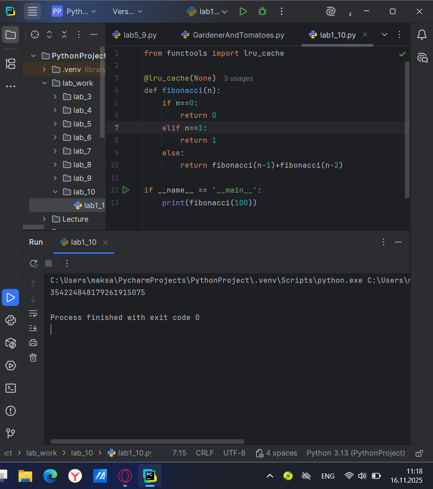
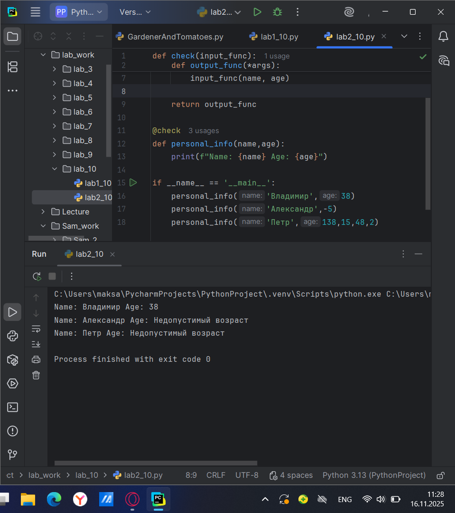
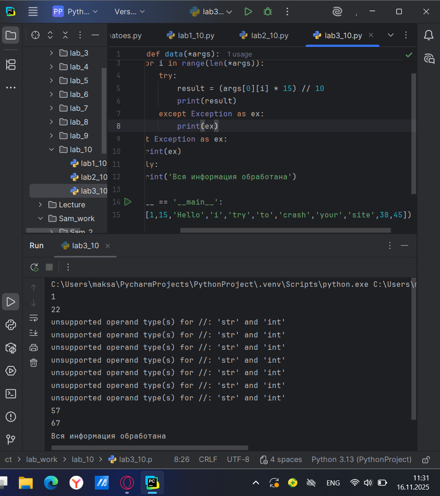
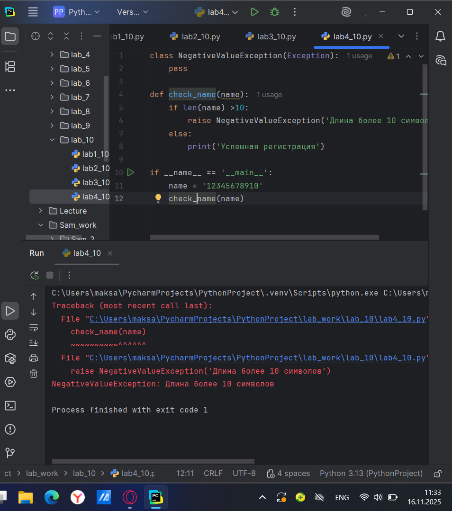
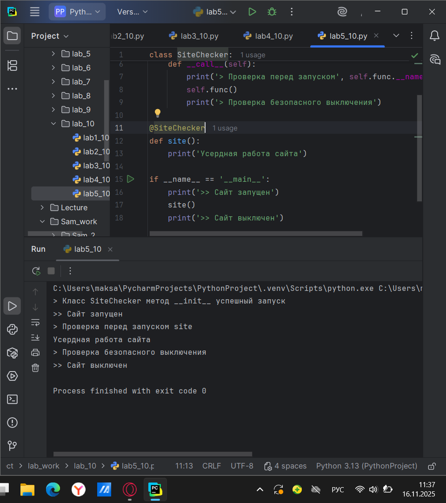
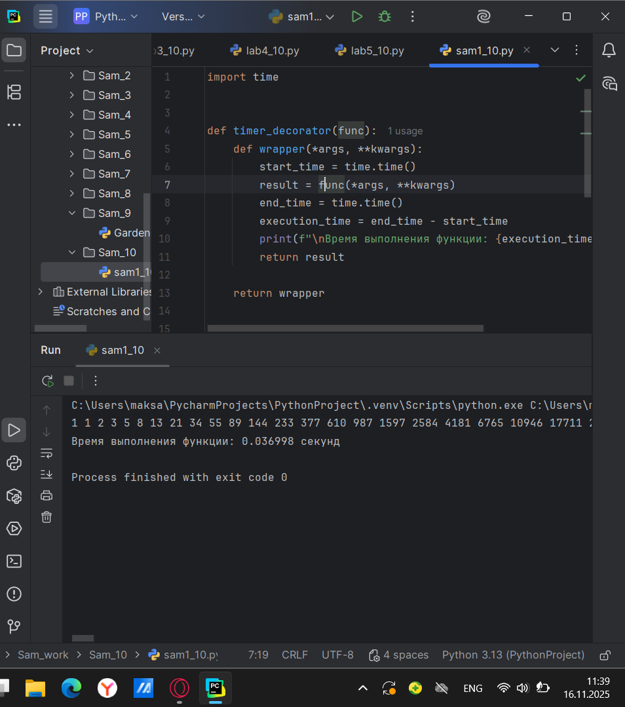
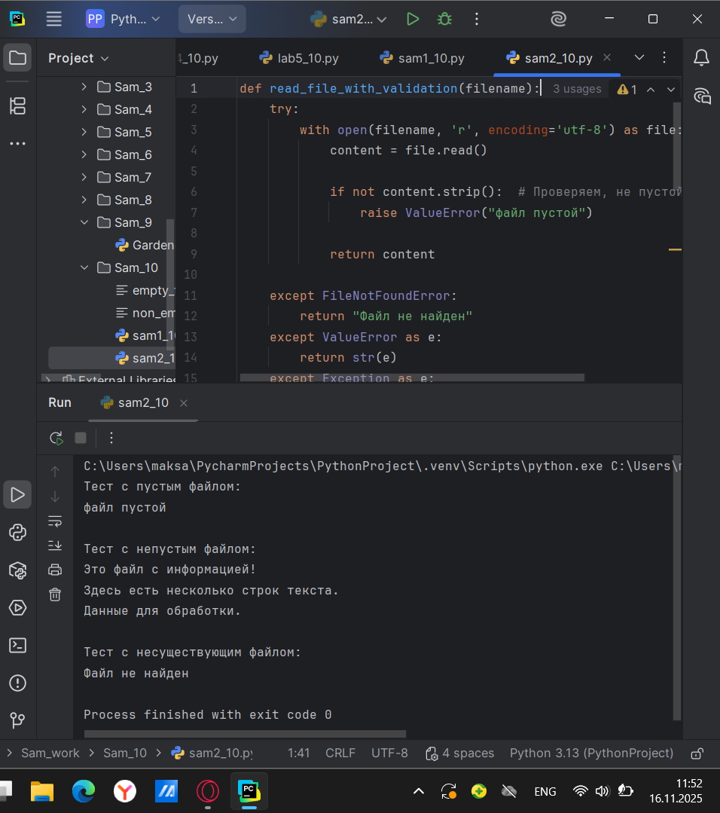
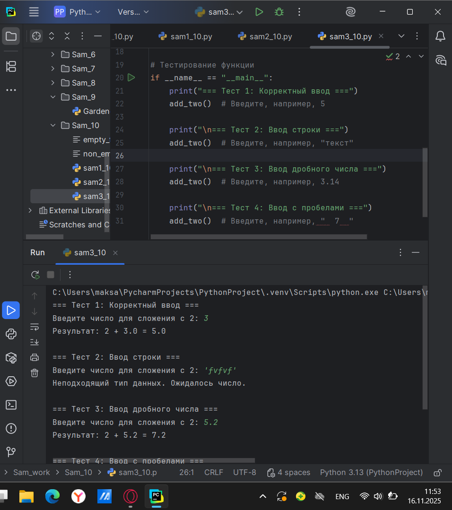
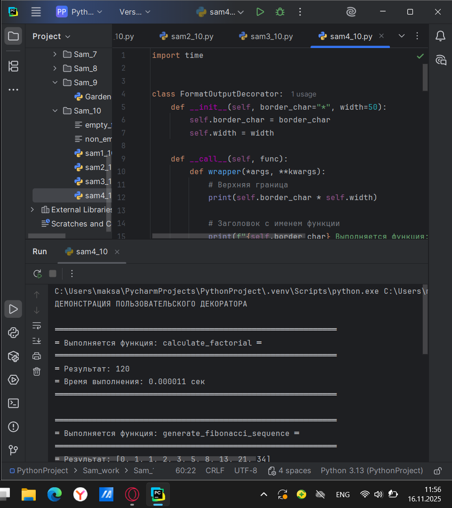
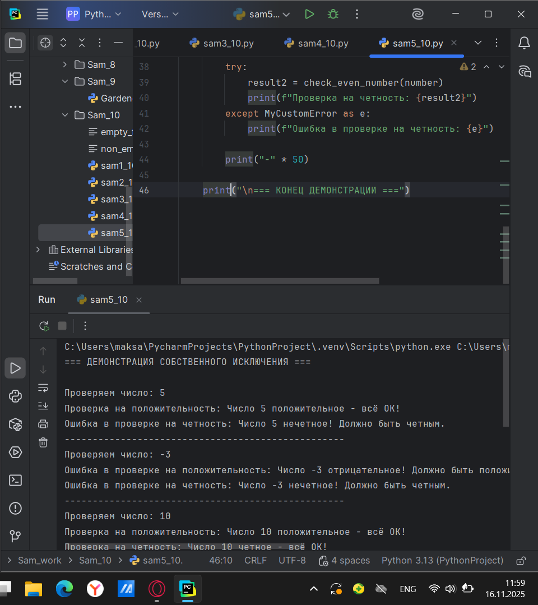

# Тема 10. Декораторы и исключения.
Отчет по Теме #10 выполнил:
- Атаманов Максим Денисович
- ИВТ-23-1

| Задание | Лаб_раб | Сам_раб |
| ------ | ------ | ------ |
| Задание 1 | + | + |
| Задание 2 | + | + |
| Задание 3 | + | + |
| Задание 4 | + | + |
| Задание 5 | + | + |

знак "+" - задание выполнено; знак "-" - задание не выполнено;

Работу проверили:
- Ротенштрайх Т.В.

## Лабораторная работа №1
### Наверняка вы думаете, что декораторы – это какая-то бесполезная вещь, которая вам никогда не пригодится, но тут вдруг на паре по математике преподаватель просит всех посчитать число Фибоначчи для 100. Кто-то будет считать вручную (так точно не нужно), кто-то посчитает на калькуляторе, а кто-то подумает, что он самый крутой и напишет рекурсивную программу на Python и немного огорчится, потому что данная программа будет достаточно долго считаться, если ее просто так запускать. Но именно тут к вам на помощь приходят декораторы, например @lru_cache (он предназначен для решения задач динамическим программированием, если простыми словами, то этот декоратор запоминает промежуточные результаты и при рекурсивном вызове функции программа не будет считать одни и те же значения, а просто “возьмёт их из этого декоратора”. Вам нужно написать программу, которая будет считать числа Фибоначчи для 100 и запустить ее без этого декоратора и с ним, посмотреть на разницу во времени решения поставленной задачи. 

```python
from functools import lru_cache

@lru_cache(None)
def fibonacci(n):
    if n==0:
        return 0
    elif n==1:
        return 1
    else:
        return fibonacci(n-1)+fibonacci(n-2)

if __name__ == '__main__':
    print(fibonacci(100))
```

### Результат.


## Лабораторная работа №2
### Илья пишет свой сайт и ему необходимо сделать минимальную проверку ввода данных пользователя при регистрации. Для этого он реализовал функцию, которая выводит данные пользователя на экран и решил, что будет проверять правильность введённых данных при помощи декоратора, но в этом ему потребовалась ваша помощь. 

```python
def check(input_func):
    def output_func(*args):
        name, age = args[0], args[1]

        if age < 0 or age > 130:
            age = 'Недопустимый возраст'
        input_func(name, age)
        
    return output_func

@check
def personal_info(name,age):
    print(f"Name: {name} Age: {age}")

if __name__ == '__main__':
    personal_info('Владимир',38)
    personal_info('Александр',-5)
    personal_info('Петр',138,15,48,2)
```
### Результат


## Лабораторная работа №3
### Вам понравилась идея Ильи с сайтом, и вы решили дальше работать вместе с ним. Но вот в вашем проекте появилась проблема, кто-то пытается сломать вашу функцию с получением данных для сайта. Эта функция работает только с данными integer, а какой-то недохакер пытается все сломать и вместо нужного типа данных отправляет string.

```python
def data(*args):
    try:
        for i in range(len(*args)):
            try:
                result = (args[0][i] * 15) // 10
                print(result)
            except Exception as ex:
                print(ex)
    except Exception as ex:
        print(ex)
    finally:
        print('Вся информация обработана')

if __name__ == '__main__':
    data([1,15,'Hello','i','try','to','crash','your','site',38,45])
```


### Результат


## Лабораторная работа №4
### Продолжая работу над сайтом, вы решили написать собственное исключение, которое будет вызываться в случае, если в функцию проверки имени при регистрации передана строка длиннее десяти символов, а если имя имеет допустимую длину, то в консоль выводиться “Успешная регистрация”.

```python
class NegativeValueException(Exception):
    pass

def check_name(name):
    if len(name) >10:
        raise NegativeValueException('Длина более 10 символов')
    else:
        print('Успешная регистрация')

if __name__ == '__main__':
    name = '12345678910'
    check_name(name)
```
### Результат

   
## Лабораторная работа №5
### После запуска сайта вы поняли, что вам необходимо добавить логгер, для отслеживания его работы. Готовыми вариантами вы не захотели пользоваться, и поэтому решили создать очень простую пародию. Для этого создали две функции: __init__() (вызывается при создании класса декоратора в программе) и __call__() (вызывается при вызове декоратора). Создайте необходимый вам декоратор. Выведите все логи в консоль.

```python
class SiteChecker:
    def __init__(self, func):
        print('> Класс SiteChecker метод __init__ успешный запуск')
        self.func = func

    def __call__(self):
        print('> Проверка перед запуском', self.func.__name__)
        self.func()
        print('> Проверка безопасного выключения')

@SiteChecker
def site():
    print('Усердная работа сайта')

if __name__ == '__main__':
    print('>> Сайт запущен')
    site()
    print('>> Сайт выключен')
```
### Результат


## Самостоятельная работа №1
### Вовочка решил заняться спортивным программированием на python, но для этого он должен знать за какое время выполняется его программа. Он решил, что для этого ему идеально подойдет декоратор для функции, который будет выяснять за какое время выполняется та или иная функция. Помогите Вовочке в его начинаниях и напишите такой декоратор.

```python
import time


def timer_decorator(func):
    def wrapper(*args, **kwargs):
        start_time = time.time()
        result = func(*args, **kwargs)
        end_time = time.time()
        execution_time = end_time - start_time
        print(f"\nВремя выполнения функции: {execution_time:.6f} секунд")
        return result

    return wrapper


@timer_decorator
def fibonacci():
    fib1 = fib2 = 1
    print(fib1, fib2, end=' ')

    for i in range(2, 200):
        fib1, fib2 = fib2, fib1 + fib2
        print(fib2, end=' ')


if __name__ == '__main__':
    fibonacci()
```

### Результат 


## Самостоятельная работа №2
### Посмотрев на Вовочку, вы также загорелись идеей спортивного программирования, начав тренировки вы узнали, что для решения некоторых задач необходимо считывать данные из файлов. Но через некоторое время вы столкнулись с проблемой что файлы бывают пустыми, и вы не получаете вводные данные для решения задачи.

```python
def read_file_with_validation(filename):
    try:
        with open(filename, 'r', encoding='utf-8') as file:
            content = file.read()

            if not content.strip():  # Проверяем, не пустой ли файл
                raise ValueError("файл пустой")

            return content

    except FileNotFoundError:
        return "Файл не найден"
    except ValueError as e:
        return str(e)
    except Exception as e:
        return f"Произошла ошибка: {e}"


# Тестирование
if __name__ == "__main__":
    # Создаем тестовые файлы
    with open('empty_file.txt', 'w', encoding='utf-8') as f:
        pass  # Создаем пустой файл

    with open('non_empty_file.txt', 'w', encoding='utf-8') as f:
        f.write("Это файл с информацией!\n")
        f.write("Здесь есть несколько строк текста.\n")
        f.write("Данные для обработки.")

    print("Тест с пустым файлом:")
    result1 = read_file_with_validation('empty_file.txt')
    print(result1)

    print("\nТест с непустым файлом:")
    result2 = read_file_with_validation('non_empty_file.txt')
    print(result2)

    print("\nТест с несуществующим файлом:")
    result3 = read_file_with_validation('nonexistent_file.txt')
    print(result3)
```

### Результат 


## Самостоятельная работа №3
### Напишите функцию, которая будет складывать 2 и введенное пользователем число, но если пользователь введет строку или другой неподходящий тип данных, то в консоль выведется ошибка “Неподходящий тип данных. Ожидалось число.”. Реализовать функционал программы необходимо через try/except и подобрать правильный тип исключения. Создавать собственное исключение нельзя. Проведите несколько тестов, в которых исключение вызывается и нет.

```python
def add_two():
    try:
        user_input = input("Введите число для сложения с 2: ")
        number = float(user_input)  # Пробуем преобразовать в число

        result = 2 + number
        print(f"Результат: 2 + {number} = {result}")
        return result

    except ValueError:
        print("Неподходящий тип данных. Ожидалось число.")
        return None


# Тестирование функции
if __name__ == "__main__":
    print("=== Тест 1: Корректный ввод ===")
    add_two()  

    print("\n=== Тест 2: Ввод строки ===")
    add_two()  

    print("\n=== Тест 3: Ввод дробного числа ===")
    add_two()  

    print("\n=== Тест 4: Ввод с пробелами ===")
    add_two()  
```

### Результат 


## Самостоятельная работа №4
### Вовочка решил заняться спортивным программированием на python, но для этого он должен знать за какое время выполняется его программа. Он решил, что для этого ему идеально подойдет декоратор для функции, который будет выяснять за какое время выполняется та или иная функция. Помогите Вовочке в его начинаниях и напишите такой декоратор.

```python
import time


class FormatOutputDecorator:
    def __init__(self, border_char="*", width=50):
        self.border_char = border_char
        self.width = width

    def __call__(self, func):
        def wrapper(*args, **kwargs):
            # Верхняя граница
            print(self.border_char * self.width)

            # Заголовок с именем функции
            print(f"{self.border_char} Выполняется функция: {func.__name__} {self.border_char}")
            print(self.border_char * self.width)

            # Выполнение функции
            start_time = time.time()
            result = func(*args, **kwargs)
            end_time = time.time()

            # Вывод результата
            print(f"{self.border_char} Результат: {result}")

            # Время выполнения
            execution_time = end_time - start_time
            print(f"{self.border_char} Время выполнения: {execution_time:.6f} сек")

            # Нижняя граница
            print(self.border_char * self.width)
            print()  # Пустая строка для разделения

            return result

        return wrapper


# Создаем экземпляр декоратора
format_output = FormatOutputDecorator(border_char="═", width=60)


# Функции, использующие декоратор
@format_output
def calculate_factorial(n):
    if n < 0:
        return "Факториал отрицательного числа не определен"

    result = 1
    for i in range(1, n + 1):
        result *= i
    return result


@format_output
def generate_fibonacci_sequence(count):
    if count <= 0:
        return []

    sequence = [0, 1]
    if count == 1:
        return [0]
    elif count == 2:
        return sequence

    for i in range(2, count):
        sequence.append(sequence[i - 1] + sequence[i - 2])

    return sequence


# Демонстрация работы
if __name__ == "__main__":
    print("ДЕМОНСТРАЦИЯ ПОЛЬЗОВАТЕЛЬСКОГО ДЕКОРАТОРА")
    print()

    # Тестируем первую функцию
    calculate_factorial(5)

    # Тестируем вторую функцию
    generate_fibonacci_sequence(10)

    # Еще тесты
    calculate_factorial(7)
    generate_fibonacci_sequence(5)
```

### Результат 


## Самостоятельная работа №5
### Создайте собственное исключение, которое будет использоваться в двух любых фрагментах кода. Исключения, которые использовались ранее в работе нельзя воссоздавать. Результатом выполнения задачи будет: класс исключения, код к котором в двух местах используется это исключение, скриншот консоли с выполненной программой и подробные комментарии, которые будут описывать работу вашего кода.
```python
# Создаем собственное исключение
class MyCustomError(Exception):
    pass


# Первая функция, которая использует наше исключение
def check_positive_number(number):
    if number < 0:
        raise MyCustomError(f"Число {number} отрицательное! Должно быть положительным.")
    return f"Число {number} положительное - всё OK!"


# Вторая функция, которая тоже использует наше исключение
def check_even_number(number):
    if number % 2 != 0:
        raise MyCustomError(f"Число {number} нечетное! Должно быть четным.")
    return f"Число {number} четное - всё OK!"


# Демонстрация работы
if __name__ == "__main__":
    print("=== ДЕМОНСТРАЦИЯ СОБСТВЕННОГО ИСКЛЮЧЕНИЯ ===\n")

    # Тестовые данные
    test_numbers = [5, -3, 10, 7, -8, 4]

    for number in test_numbers:
        print(f"Проверяем число: {number}")

        # Тестируем первую функцию
        try:
            result1 = check_positive_number(number)
            print(f"Проверка на положительность: {result1}")
        except MyCustomError as e:
            print(f"Ошибка в проверке на положительность: {e}")

        # Тестируем вторую функцию
        try:
            result2 = check_even_number(number)
            print(f"Проверка на четность: {result2}")
        except MyCustomError as e:
            print(f"Ошибка в проверке на четность: {e}")

        print("-" * 50)

    print("\n=== КОНЕЦ ДЕМОНСТРАЦИИ ===")
```

### Результат 


### Общий вывод по теме:
Были изучены декораторы как мощный инструмент для модификации поведения функций без изменения их исходного кода. На практическом примере с измерением времени выполнения функции Фибоначчи было продемонстрировано, как декораторы позволяют добавлять новую функциональность (в данном случае - хронометраж) к существующим функциям, сохраняя при этом чистоту и читаемость основного кода. Особую ценность представляет создание собственного декоратора для форматирования вывода, что показало гибкость этого подхода и возможность адаптации под конкретные задачи разработчика.
