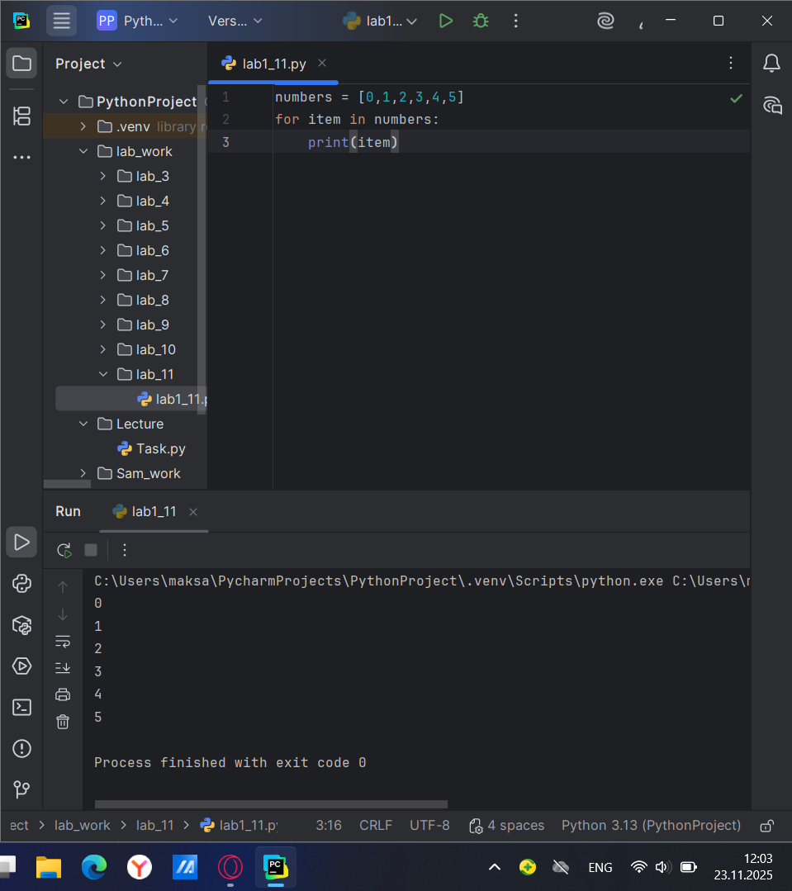
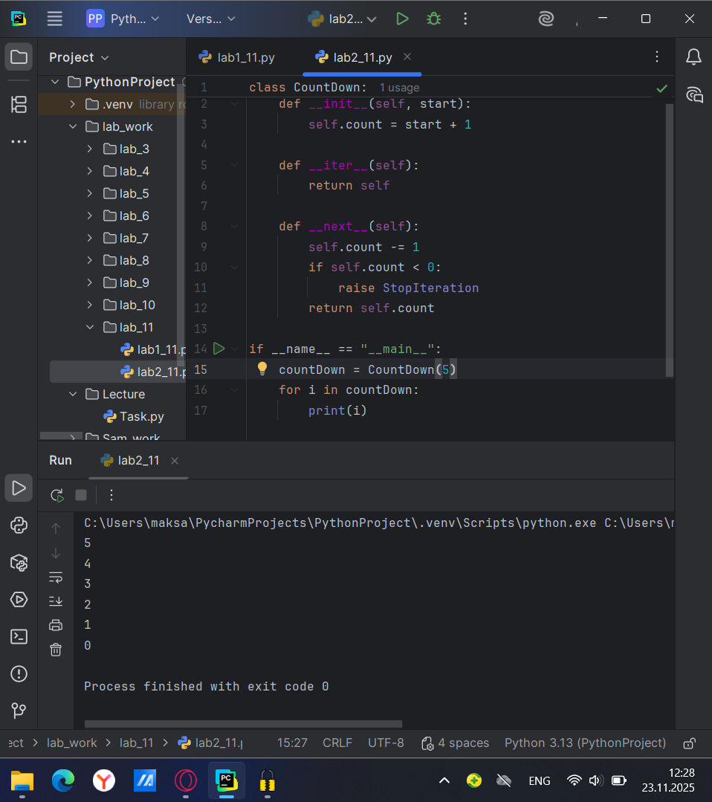
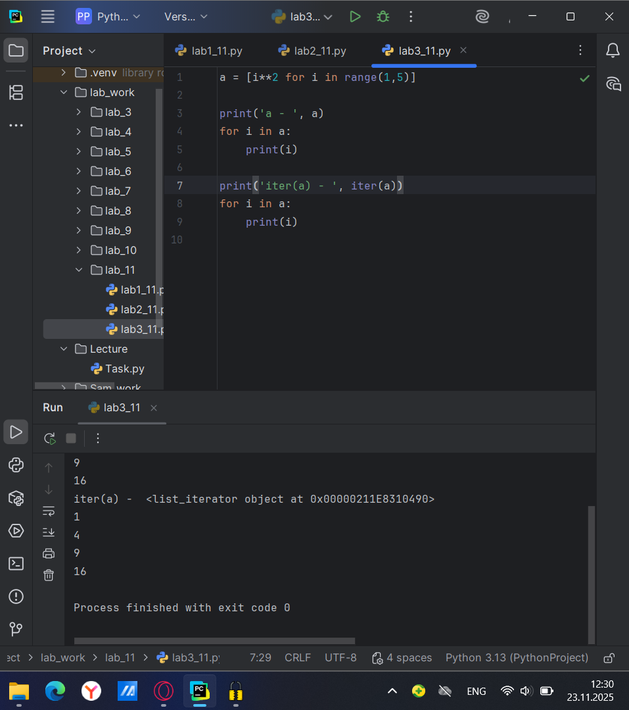
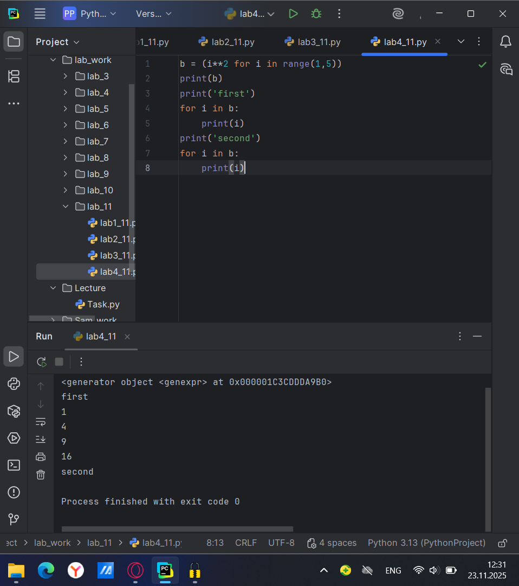
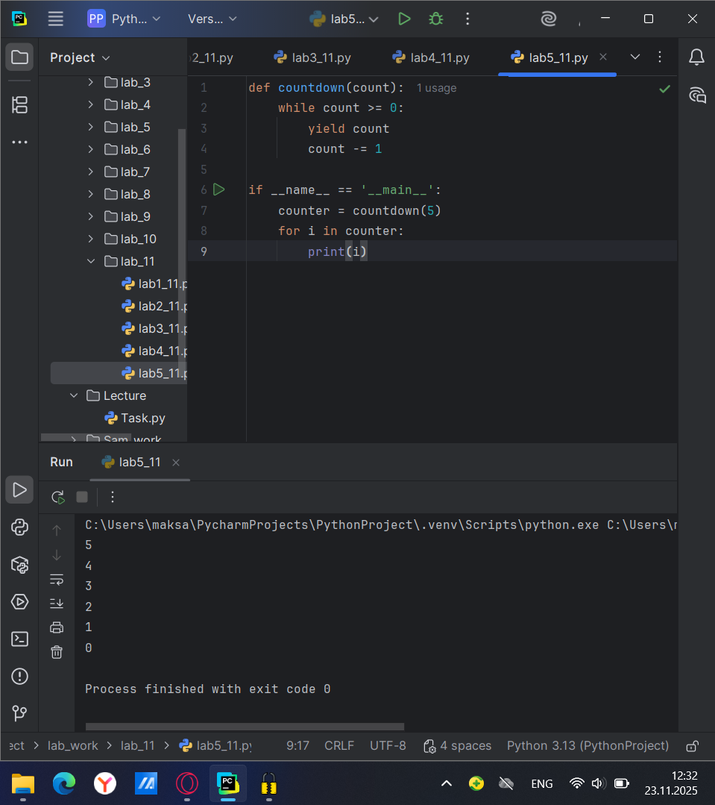
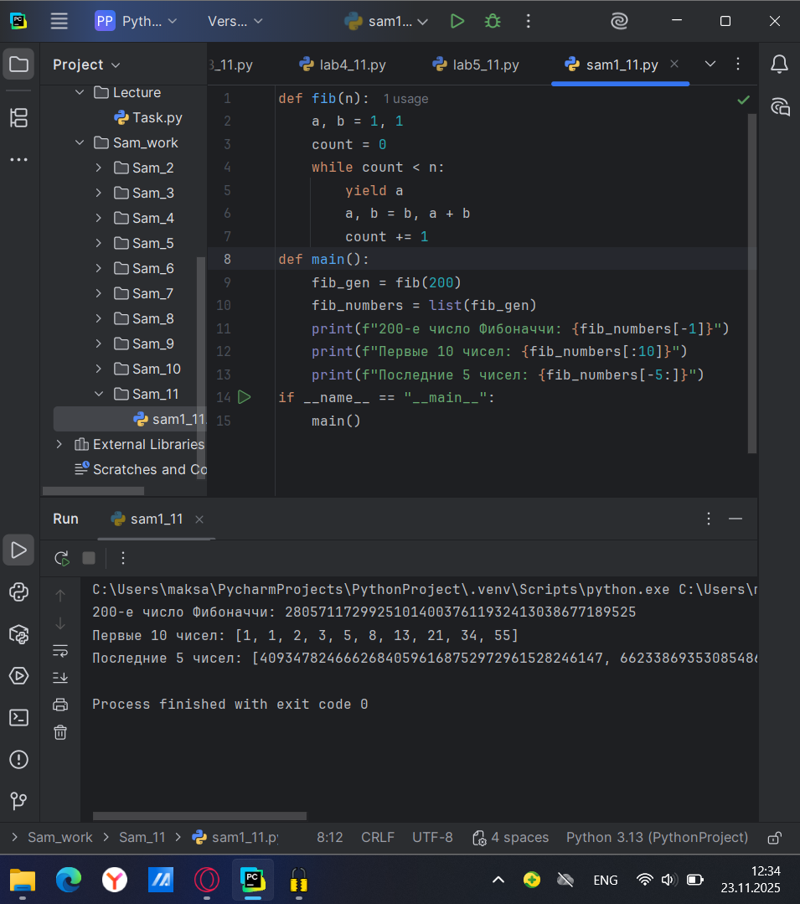
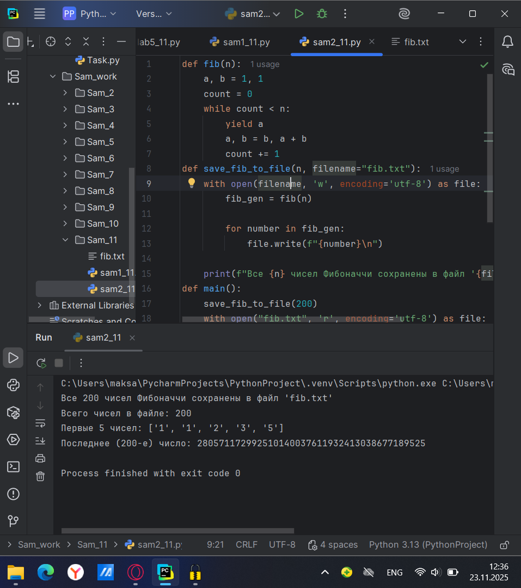

# Тема 11. Итераторы и генераторы.
Отчет по Теме #11 выполнил:
- Атаманов Максим Денисович
- ИВТ-23-1

| Задание | Лаб_раб | Сам_раб |
| ------ | ------ | ------ |
| Задание 1 | + | + |
| Задание 2 | + | + |
| Задание 3 | + |
| Задание 4 | + |
| Задание 5 | + | 

знак "+" - задание выполнено; знак "-" - задание не выполнено;

Работу проверили:
- Ротенштрайх Т.В.

## Лабораторная работа №1
### Простой итератор, но у него нет гибкой настройки, например его нельзя развернуть. Он работает просто как next(), но нет prev(). 

```python
numbers = [0,1,2,3,4,5]
for item in numbers:
    print(item)
```

### Результат.


## Лабораторная работа №2
### Класс итератор с гибкой настройкой и удобными применением. 

```python
class CountDown:
    def __init__(self, start):
        self.count = start + 1

    def __iter__(self):
        return self

    def __next__(self):
        self.count -= 1
        if self.count < 0:
            raise StopIteration
        return self.count

if __name__ == "__main__":
    countDown = CountDown(5)
    for i in countDown:
        print(i)
```
### Результат


## Лабораторная работа №3
### Генератор списка

```python
a = [i**2 for i in range(1,5)]

print('a - ', a)
for i in a:
    print(i)

print('iter(a) - ', iter(a))
for i in a:
    print(i)
```


### Результат


## Лабораторная работа №4
### Выражения генераторы.

```python
b = (i**2 for i in range(1,5))
print(b)
print('first')
for i in b:
    print(i)
print('second')
for i in b:
    print(i)
```
### Результат

   
## Лабораторная работа №5
### Такой же счетчик, как и в первом задании, только это генератор и использует yield.

```python
def countdown(count):
    while count >= 0:
        yield count
        count -= 1

if __name__ == '__main__':
    counter = countdown(5)
    for i in counter:
        print(i)
```
### Результат


## Самостоятельная работа №1
### Вас никак не могут оставить числа Фибоначчи, очень уж они вас заинтересовали. Изучив новые возможности Python вы решили реализовать программу, которая считает числа Фибоначчи при помощи итераторов. Расчет начинается с чисел 1 и 1. Создайте функцию fib(n), генерирующую n чисел Фибоначчи с минимальными затратами ресурсов. Для реализации этой функции потребуется обратиться к инструкции yield (Она не сохраняет в оперативной памяти огромную последовательность, а дает возможность “доставать” промежуточные результаты по одному). Результатом решения задачи будет листинг кода и вывод в консоль с числом Фибоначчи от 200).

```python
def fib(n):
    a, b = 1, 1
    count = 0
    while count < n:
        yield a
        a, b = b, a + b
        count += 1
def main():
    fib_gen = fib(200)
    fib_numbers = list(fib_gen)
    print(f"200-е число Фибоначчи: {fib_numbers[-1]}")
    print(f"Первые 10 чисел: {fib_numbers[:10]}")
    print(f"Последние 5 чисел: {fib_numbers[-5:]}")
if __name__ == "__main__":
    main()
```

### Результат 


## Самостоятельная работа №2
### К коду предыдущей задачи добавьте запоминание каждого числа Фибоначчи в файл “fib.txt”, при этом каждое число должно находиться на отдельной строчке. Результатом выполнения задачи будет листинг кода и скриншот получившегося файла.

```python
def fib(n):
    a, b = 1, 1
    count = 0
    while count < n:
        yield a
        a, b = b, a + b
        count += 1
def save_fib_to_file(n, filename="fib.txt"):
    with open(filename, 'w', encoding='utf-8') as file:
        fib_gen = fib(n)

        for number in fib_gen:
            file.write(f"{number}\n")

    print(f"Все {n} чисел Фибоначчи сохранены в файл '{filename}'")
def main():
    save_fib_to_file(200)
    with open("fib.txt", 'r', encoding='utf-8') as file:
        lines = file.readlines()
        print(f"Всего чисел в файле: {len(lines)}")
        print(f"Первые 5 чисел: {[line.strip() for line in lines[:5]]}")
        print(f"Последнее (200-е) число: {lines[-1].strip()}")
if __name__ == "__main__":
    main()
```

### Результат 


### Общий вывод по теме:
В работе успешно реализованы генераторы чисел Фибоначчи с использованием yield. Показано ключевое преимущество генераторов - эффективное использование памяти за счет ленивых вычислений. Числа генерируются по требованию без хранения всей последовательности. Добавлена функция сохранения результатов в файл. Генераторы полезны для работы с большими данными и потоковой обработки.
