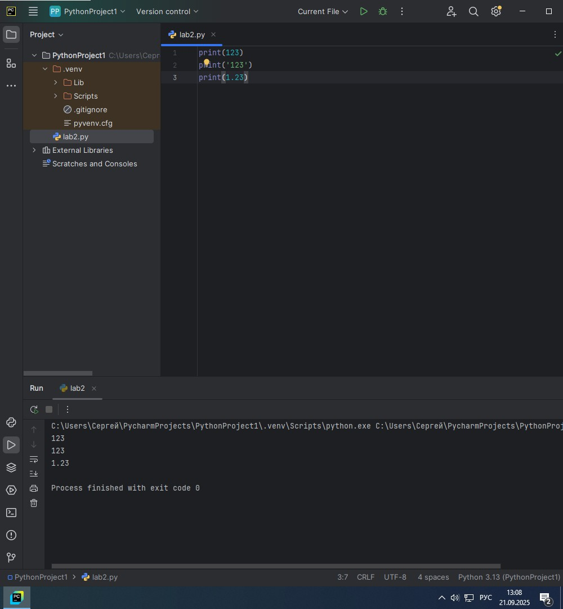
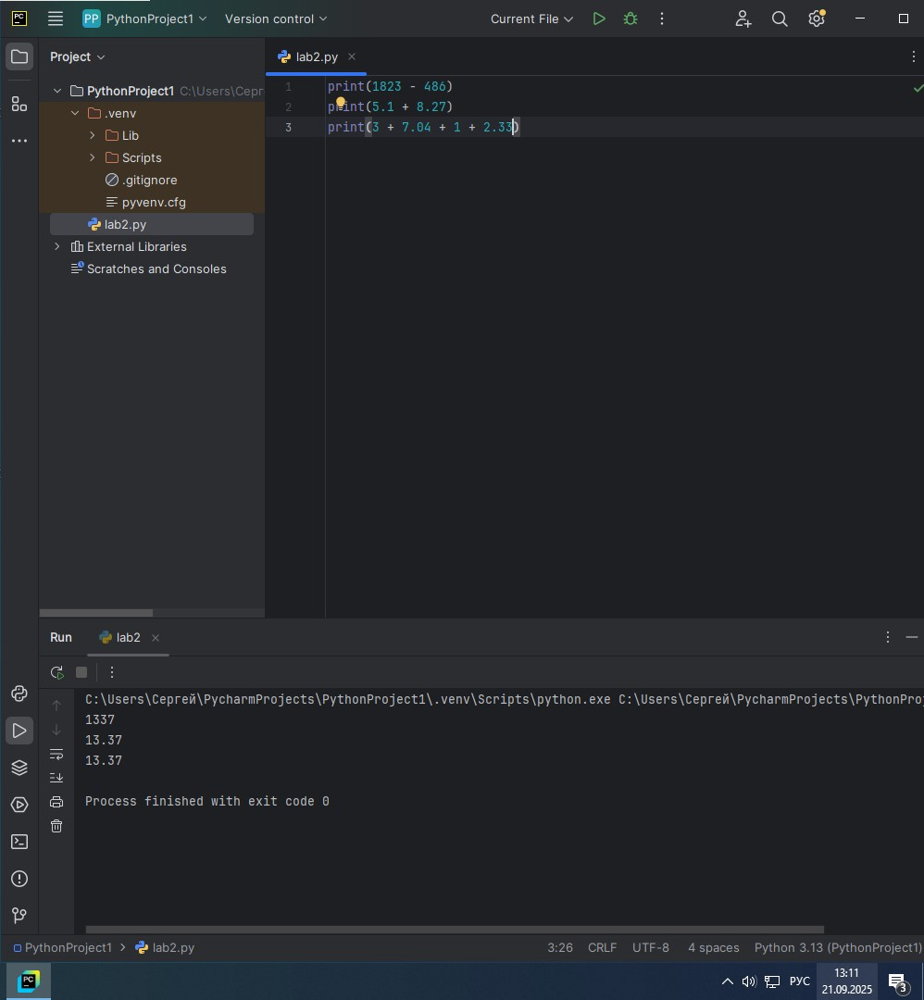
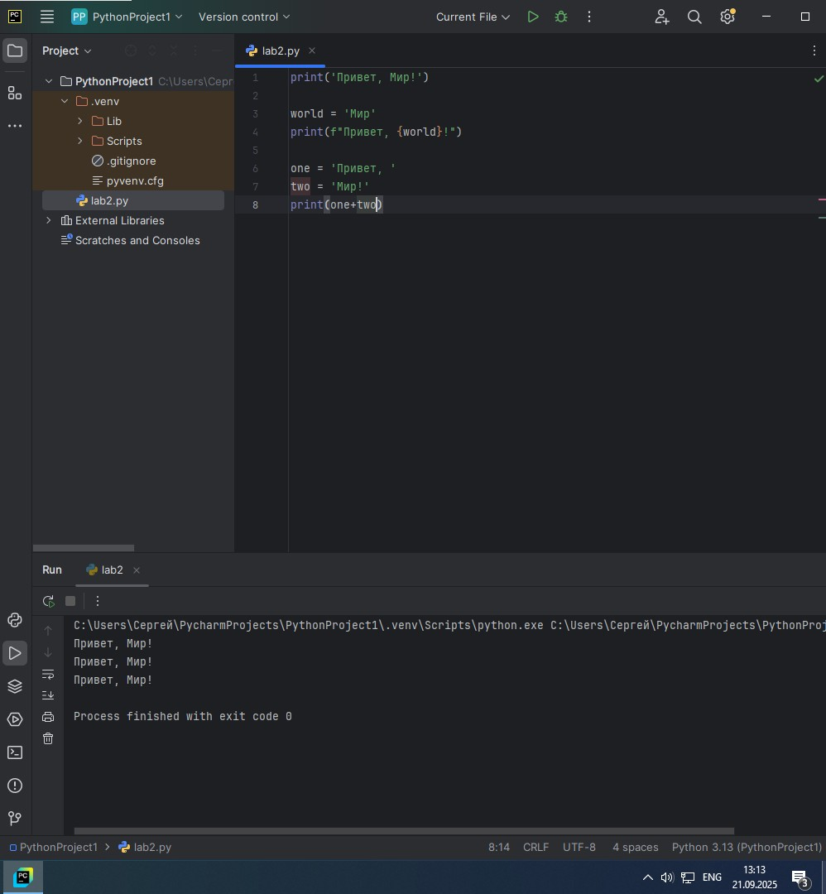
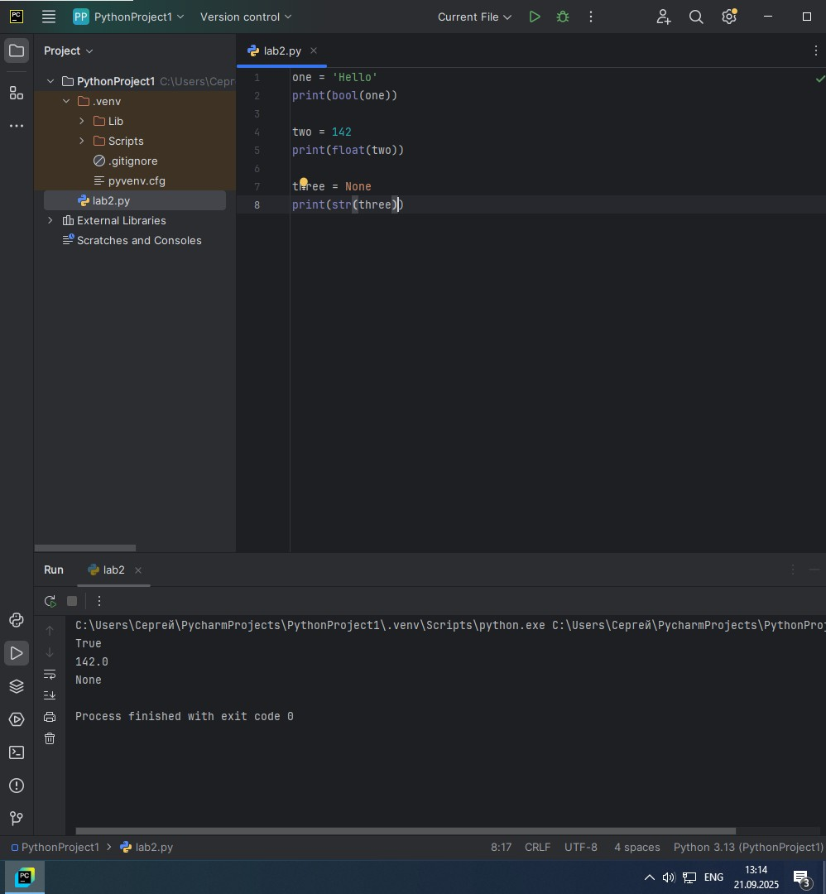
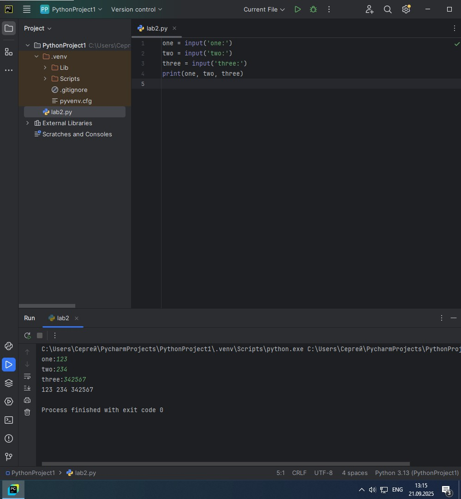
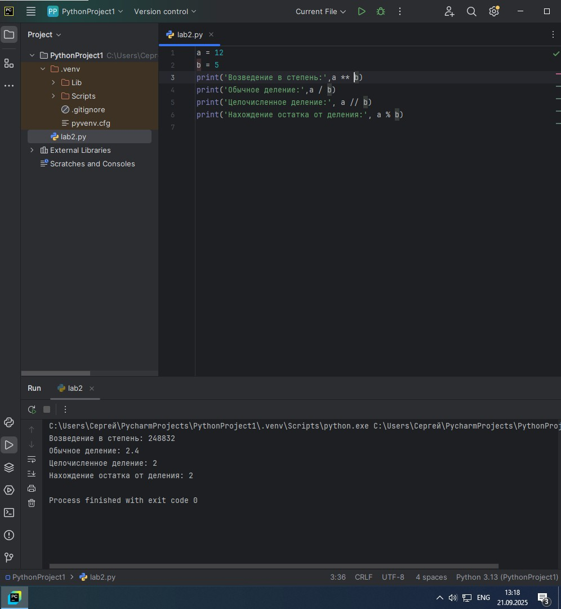
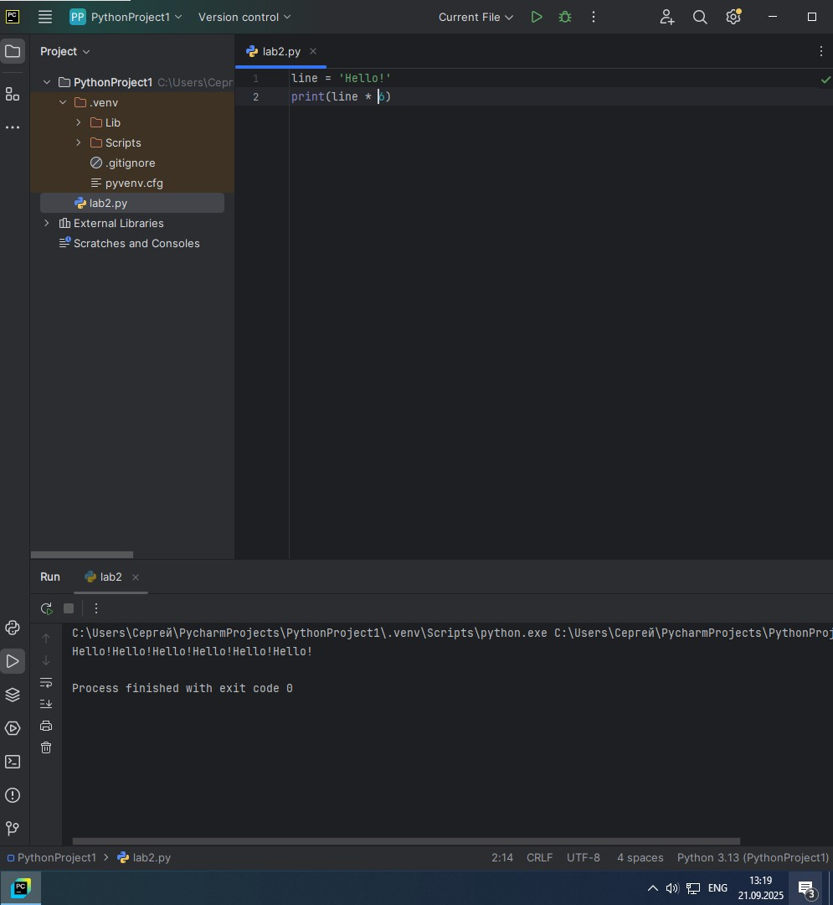
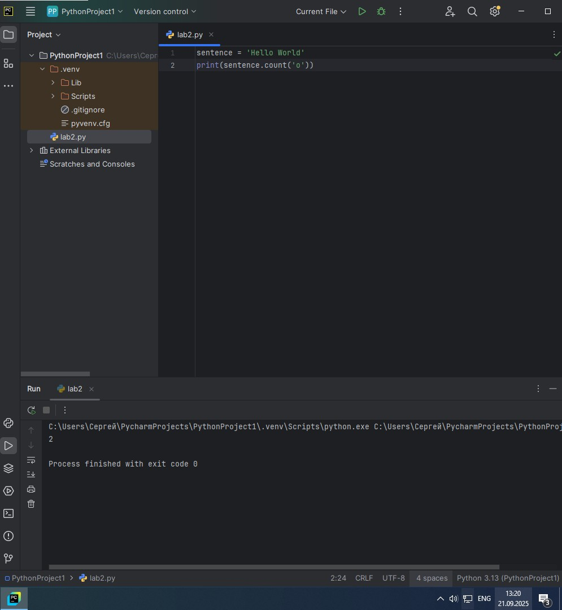
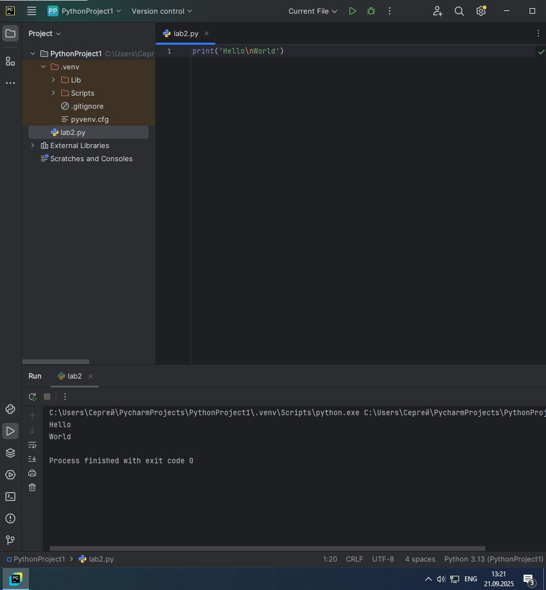
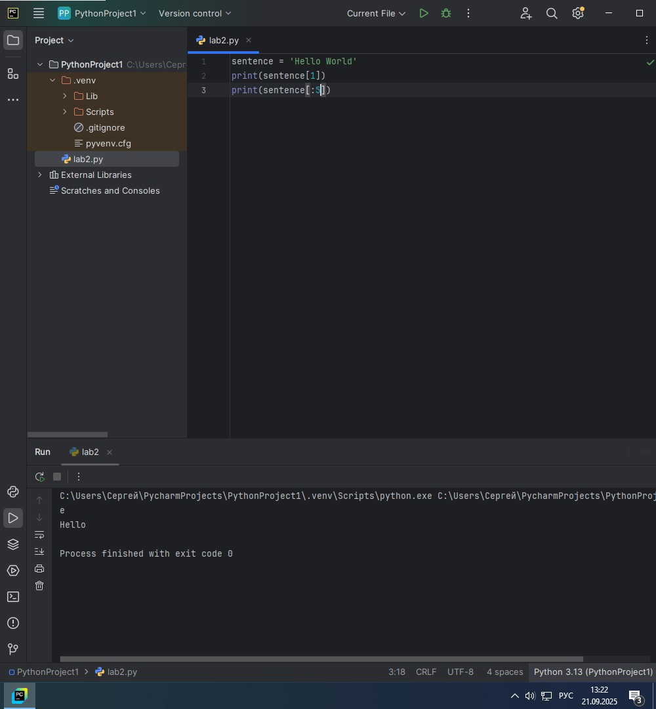

# Тема 2. Операторы, условия, циклы.
Отчет по Теме #3 выполнил:
- Атаманов Максим Денисович
- ИВТ-23-1

| Задание | Лаб_раб | Сам_раб |
| ------ | ------ | ------ |
| Задание 1 | + | + |
| Задание 2 | + | + |
| Задание 3 | + | + |
| Задание 4 | + | + |
| Задание 5 | + | + |
| Задание 6 | + |
| Задание 7 | + |
| Задание 8 | + |
| Задание 9 | + |
| Задание 10 | + |

знак "+" - задание выполнено; знак "-" - задание не выполнено;

Работу проверили:
- Ротенштрайх Т.В.

## Лабораторная работа №1
### Выведите в консоль три строки. Первая – любое число. Вторая – любое число в виде строки. Третья – любое число с плавающей точкой.

```python
print(123)
print('123')
print(1.23)
```
### Результат.


## Лабораторная работа №2
### Выведите в консоль три строки. Первая - результат сложения или вычитания минимум двух переменных типа int. Вторая - результат сложения или вычитания минимум двух переменных типа float. Третья - результат сложения или вычитания минимум двух переменных типа int и float

```python
print(1823 - 486)
print(5.1 + 8.27)
print(3 + 7.04 + 1 + 2.33)
```
### Результат


## Лабораторная работа №3
### Выведите в консоль три строки. Первая – обычная строка. Вторая – F строка с использованием заранее объявленной переменной. Третья – сложите две или более строк в одну.

```python
print('Привет, Мир!')

world = 'Мир'
print(f"Привет, {world}!")

one = 'Привет, '
two = 'Мир!'
print(one+two)
```
### Результат


## Лабораторная работа №4
### Выведите в консоль три строки. Первая – трансформация любого типа переменной в bool. Вторая – трансформация любого типа переменной в float или int. Третья – трансформация любого типа переменной в str.

```python
one = 'Hello'
print(bool(one))

two = 142
print(float(two))

three = None
print(str(three))
```
### Результат

   
## Лабораторная работа №5
### Присвойте трем переменным различные значения, воспользовавшись функцией input().
```python
one = input('one:')
two = input('two:')
three = input('three:')
print(one, two, three)
```
### Результат


## Лабораторная работа №6
### Создайте две любые числовые переменные и выполните над ними несколько математическихопераций: возведение в степень, обычное деление, целочисленное деление, нахождение остатка от деления. 
```python
a = 12
b = 5
print('Возведение в степень:',a ** b)
print('Обычное деление:',a / b)
print('Целочисленное деление:', a // b)
print('Нахождение остатка от деления:', a % b)
```

### Результат


## Лабораторная работа №7
### Создайте любую строковую переменную и произведите над ней математическое действие умножение на любое число.

```python
line = 'Hello!'
print(line * 6)
```

### Результат


## Лабораторная работа №8
### Посчитайте сколько раз символ ‘o’ встречается в строке 'Hello World'.

```python
sentence = 'Hello World'
print(sentence.count('o'))
```

### Результат


## Лабораторная работа №9
### Напишите предложение ‘Hello World’ в две строки. Написанная программа должна занимать одну строку в редакторе кода.

```python
print('Hello\nWorld')
```

### Результат


## Лабораторная работа №10
### Из предложения 'Hello World' выведите в консоль только 2 символ, а затем выведите слово 'Hello'

```python
sentence = 'Hello World'
print(sentence[1])
print(sentence[:5])
```

### Результат


## Самостоятельная работа №1
### Выведите в консоль булевую переменную False, не используя слово False в строке или изначально присвоенную булевую переменную. Программа должна занимать не более двух строк редактора кода. 

```python
a = bool(0)
print(a)
```

### Результат

  
## Самостоятельная работа №2
### Присвоить значения трем переменным и вывести их в консоль, используя только две строки редактора кода.

```python
a, b, c = 1, 2, 3
print('values:',a,b,c)
```

### Результат


## Самостоятельная работа №3
### Реализуйте ввод данных в программу, через консоль, в виде только целых чисел (тип данных int). То есть при вводе буквенных символов в консоль, программа не должна работать. Программа должна занимать не более двух строк редактора кода.

```python
a = int(input('Введите цифру: '))
```

### Результат


## Самостоятельная работа №4
### Создайте только одну строковую переменную. Длина строки должна не превышать 5 символов. На выходе мы должны получить строку длиной не менее 16 символов. Программа должна занимать не более двух строк редактора кода.

```python
str = 'Hello'
print(str*4)
```

### Результат


## Самостоятельная работа №5
### Создайте три переменные: день (тип данных - числовой), месяц (тип данных - строка), год (тип данных - числовой) и выведите в консоль текущую дату в формате: “Сегодня день месяц год. Всего хорошего!” используя F строку и оператор end внутри print(), в котором вы должны написать фразу “Всего хорошего!”. Программа должна занимать не более двух строк редактора кода. 

```python
day, month, year = 21, 'September', 2025
print(f'Сегодня {day} {month} {year}. ',end="Всего хорошего!")
```

### Результат


## Самостоятельная работа №6
### В предложении ‘Hello World’ вставьте ‘my’ между двумя словами. Выведите полученное предложение в консоль в одну строку. Программа должна занимать не более двух строк редактора кода. 

```python
str = 'my'
print('Hello',str,'World')
```

### Результат


## Самостоятельная работа №7
### Узнайте длину предложения ‘Hello World’, результат выведите в консоль. Программа должна занимать не более двух строк редактора кода.

```python
str = 'Hello World'
print(len(str))
```

### Результат

  
## Самостоятельная работа №8
### Переведите предложение ‘HELLO WORLD’ в нижний регистр. Программа должна занимать не более двух строк редактора кода.

```python
str = 'HELLO WORLD'
print(str.lower())
```

### Результат

  
## Самостоятельная работа №9
### Самостоятельно придумайте задачу по проходимой теме и решите ее. Задача должна быть связанна со взаимодействием с числовыми значениями.

```python
a = 10
b = 30
c = 30
print('Среднее арифметическое трех чисел:', (a + b + c) / 3)
```

### Результат

  
## Самостоятельная работа №10
###  Самостоятельно придумайте задачу по проходимой теме и решите ее. Задача должна быть связанна со взаимодействием со строковыми значениями.

```python
str = 'Hello world'
print(str[:5])
```

### Результат


## Общие выводы по теме
Лабораторные и самостоятельные задания в данной теме способствуют закреплению основных операций в Python, таких как работа с переменными, ввод данных от пользователя и обработка типов. Важно помнить, что оптимизация кода и применение готовых функций значительно повышают читаемость и производительность программы.
