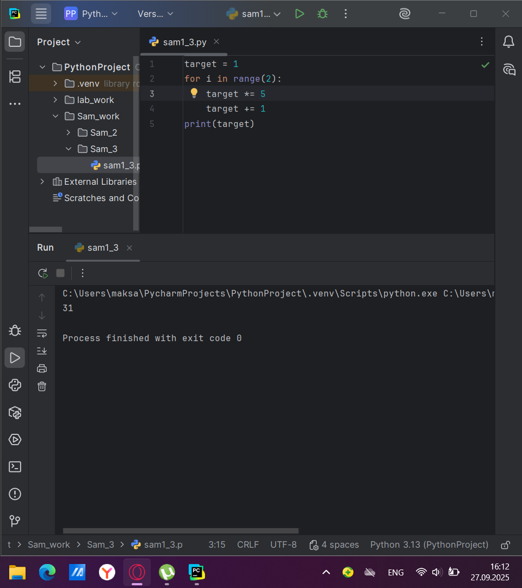
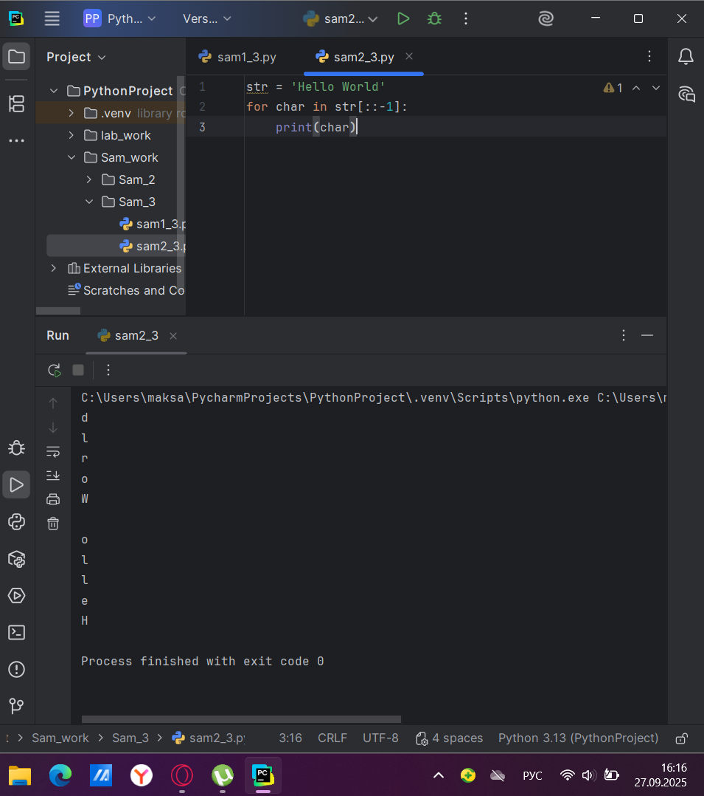

# Тема 3. Операторы, условия, циклы.
Отчет по Теме #3 выполнил:
- Атаманов Максим Денисович
- ИВТ-23-1

| Задание | Лаб_раб | Сам_раб |
| ------ | ------ | ------ |
| Задание 1 | + | + |
| Задание 2 | + | + |
| Задание 3 | + | + |
| Задание 4 | + | + |
| Задание 5 | + | + |
| Задание 6 | + |
| Задание 7 | + |
| Задание 8 | + |
| Задание 9 | + |
| Задание 10 | + |

знак "+" - задание выполнено; знак "-" - задание не выполнено;

Работу проверили:
- Ротенштрайх Т.В.

## Лабораторная работа №1
### Создайте две переменные, значение которых будете вводить через консоль. Также составьте условие, в котором созданные ранее переменные будут сравниваться, если условие выполняется, то выведете в консоль «Выполняется», если нет, то «Не выполняется».

```python
one = int(input('Введите значение первой переменной: '))
two = int(input('Введите значение второй переменной: '))
if one >= two:
    print('Выполняется')
else:
    print('Не выполняется')
```
### Результат.


## Лабораторная работа №2
### Напишите программу, которая будет определять значения переменной меньше 0, больше 0 и меньше 10 или больше 10. Это нужно реализовать при помощи одной переменной, значение которой будет вводится через консоль, а также при помощи конструкций if, elif, else.

```python
one = int(input('Введите значение переменной: '))
if one < 0:
    print('Переменная меньше 0')
elif 0 < one < 10:
    print('Переменная больше 0 и меньше 10')
else:
    print('Переменная больше 10')
```
### Результат


## Лабораторная работа №3
### Напишите программу, в которой будет проверяться есть ли переменная в указанном массиве используя логический оператор in. Самостоятельно посмотрите, как работает программа со значениями которых нет в массиве numbers.

```python
numbers = {1,3,4,6,8,9}
values = int(input('Введите значение переменной: '))
if 1 in numbers:
    print('Переменная есть в данном массиве')
else:
    print('Переменной нет в этом массиве')
```
### Результат


## Лабораторная работа №4
### Напишите программу, которая будет определять находится ли переменная в указанном массиве и если да, то проверьте четная она или нет. Самостоятельно протестируйте данную программу с разными значениями переменной value.

```python
numbers = {1, 3, 4, 6, 8, 9, 15, 16, 73, 321, 322}
value = int(input('Введите значение переменной: '))
if value in numbers:
    if value % 2 == 0:
        print('Переменная четная и есть в массиве numbers')
    else:
        print('Переменная нечетная и есть в массиве numbers')
else:
    print(f"Переменной нет в массиве numbers и она равна {value}")
```
### Результат

   
## Лабораторная работа №5
### Напишите программу, в которой циклом for значения переменной i будут меняться от 0 до 10 и посмотрите, как разные виды сравнений и операций работают в цикле.
```python
for i in range(10):
    print('i = ',i)
    if i == 0:
        i += 2
    if i == 1:
        continue
    if i == 2 or i == 3:
        print('Переменная равна 2 или 3')
    elif i in [4, 5, 6]:
        print('Переменная равна 4,5 или 6')
    else:
        break
```
### Результат


## Лабораторная работа №6
### Напишите программу, в которой при помощи цикла for определяется есть ли переменная value в строке string и посмотрите, как работает оператор else для циклов. Самостоятельно посмотрите, что выведет программа, если значение переменной value оказалось в строке string. 
```python
string = 'Привет всем изучающим Python!'
value = input()
for i in string:
    if i == value:
        index = string.find(value)
        print(f"Буква '{value}' есть в строке под {index} индексом")
        break
else:
    print(f"Буквы {value} нет в указанной строке")
```

### Результат


## Лабораторная работа №7
### Напишите программу, в которой вы наглядно посмотрите, как работает цикл for проходя в обратном порядке, то есть, к примеру не от 0 до 10, а от 10 до 0. В уже готовой программе показано вычитание из 100, а вам во время реализации программы будет необходимо придумать свой вариант применения обратного цикла.

```python
string = 'Hello world'
for i in range(11,-1,-1):
    string = string[:i]
    print(i,string)
```

### Результат


## Лабораторная работа №8
### Напишите программу используя цикл while, внутри которого есть какие-либо проверки, но быть осторожным, поскольку циклы while при неправильно написанных условиях могут становится бесконечными, как указано в примере далее.

```python
value = 0
while value < 100:
    if value == 0:
        value += 10
    elif value // 5 > 1:
        value *= 5
    else:
        value -= 5
    print(value)
```

### Результат


## Лабораторная работа №9
### Напишите программу с использованием вложенных циклов и одной проверкой внутри них. Самое главное, не забудьте, что нельзя использовать одинаковые имена итерируемых переменных, когда вы используете вложенные циклы.

```python
value = 0
for i in range(10):
    for j in range(10):
        if i != j:
            value += j
        else:
            pass
print(value)
```

### Результат


## Лабораторная работа №10
### Напишите программу с использованием flag, которое будет определять есть ли нечетное число в массиве. В данной задаче flag выступает в роли индикатора встречи нечетного числа в исходном массиве, четных чисел.

```python
even_array = [2, 4, 6, 8, 9]
flag = False
for value in even_array:
    if value % 2 == 1:
        flag = True

if flag:
    print('В массиве есть нечетное число')
```

### Результат


## Самостоятельная работа №1
### Напишите программу, которая преобразует 1 в 31. Для выполнения поставленной задачи необходимо обязательно и только один раз использовать: 
• Цикл for 
• *= 5 
• += 1 
Никаких других действий или циклов использовать нельзя. 

```python
target = 1
for i in range(2):
    target *= 5
    target += 1
print(target)
```

### Результат

  
## Самостоятельная работа №2
### Напишите программу, которая фразу «Hello World» выводит в обратном порядке, и каждая буква находится в одной строке консоли.

```python
str = 'Hello World'
for char in str[::-1]:
    print(char)
```

### Результат


## Самостоятельная работа №3
### Напишите программу, на вход которой поступает значение из консоли, оно должно быть числовым и в диапазоне от 0 до 10 включительно (это необходимо учесть в программе). Если вводимое число не подходит по требованиям, то необходимо вывести оповещение об этом в консоль и остановить программу. Код должен вычислять в каком диапазоне находится полученное число. Нужно учитывать три диапазона: 
• от 0 до 3 включительно.
• от 3 до 6.
• от 6 до 10 включительно

```python
target = int(input('Введите число: '))
if 0 <= target <= 10:
    if 0 <= target <= 3:
        print('Число находится в диапазоне от 0 до 3')
    elif 3 < target < 6:
        print('Число находится в диапазоне от 3 до 6')
    elif 6 <= target <= 10:
        print('Число находится в диапазоне от 6 до 10')
else:
    print('Некорректный ввод')
```

### Результат


## Самостоятельная работа №4
### Манипулирование строками. Напишите программу на Python, которая принимает предложение (на английском) в качестве входных данных от пользователя. Выполните следующие операции и отобразите результаты: 
• Выведите длину предложения. 
• Переведите предложение в нижний регистр. 
• Подсчитайте количество гласных (a, e, i, o, u) в предложении. 
• Замените все слова "ugly" на "beauty". 
• Проверьте, начинается ли предложение с "The" и заканчивается ли на "end".


```python
str = input('Введите строку: ').lower()
print('Длина предложения: ', len(str))
print('Предложение в нижнем регистре: ',str.lower())
print('Количество гласных: ',
      str.count('a')+
      str.count('e')+
      str.count('i')+
      str.count('o')+
      str.count('u'))
str = str.replace('ugly','beauty')
print('Предложение начинается на "The": ',str.startswith('the'))
print("Предложение заканчивается на 'end': ",str.endswith('end'))
print('Предложение после изменений: ',str)
```

### Результат


## Самостоятельная работа №5
### Составьте программу, результатом которой будет данный вывод в консоль. 

```python
counter = 0
while counter != 10:
    string = 'hello'
    values = [0, 2, 4, 6, 8, 10]
    memory = ' world'
    if counter in values:
        string = string + ' world'
    print(string)
    counter += 1
if (counter > 7):
    print(string + memory)
```

### Результат


## Общие выводы по теме
Лабораторные и самостоятельные задания в данной теме способствуют закреплению основных операций в Python, таких как работа с переменными, ввод данных от пользователя и обработка типов. Важно помнить, что оптимизация кода и применение готовых функций значительно повышают читаемость и производительность программы.
