# Тема 4. Функции и модули.
Отчет по Теме #4 выполнил:
- Атаманов Максим Денисович
- ИВТ-23-1

| Задание | Лаб_раб | Сам_раб |
| ------ | ------ | ------ |
| Задание 1 | + | + |
| Задание 2 | + | + |
| Задание 3 | + | + |
| Задание 4 | + | + |
| Задание 5 | + | + |
| Задание 6 | + |
| Задание 7 | + |
| Задание 8 | + |
| Задание 9 | + |
| Задание 10 | + |

знак "+" - задание выполнено; знак "-" - задание не выполнено;

Работу проверили:
- Ротенштрайх Т.В.

## Лабораторная работа №1
### Напишите функцию, которая выполняет любые арифметические действия и выводит результат в консоль. Вызовите функцию используя “точку входа”.

```python
def main():
    print(2+2)

if __name__ == '__main__':
    main()
```
### Результат.
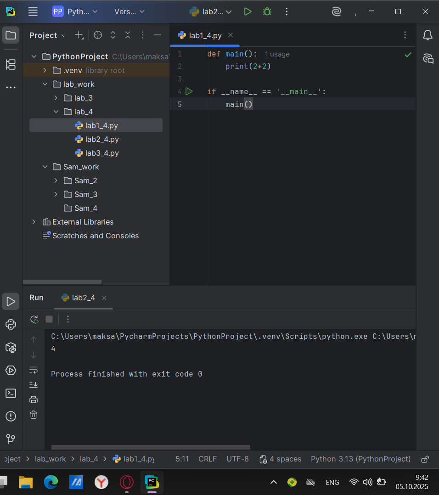

## Лабораторная работа №2
### Напишите функцию, которая выполняет любые арифметические действия, возвращает при помощи return значение в место, откуда вызывали функцию. Выведите результат в консоль. Вызовите функцию используя "точку входа".

```python
def main():
    return 2+2

if __name__ == '__main__':
    print(main())
```
### Результат
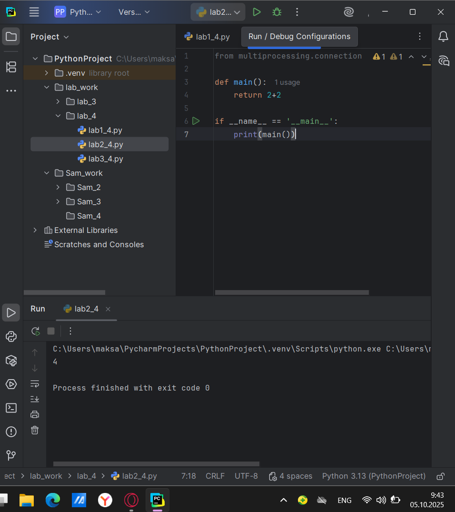

## Лабораторная работа №3
### Напишите функцию, в которую передаются два аргумента, над ними производится арифметическое действие, результат возвращается туда, откуда эту функцию вызывали. Выведите результат в консоль. Вызовите функцию в любом небольшом цикле.

```python
def main(one, two):
    result = one + two
    return result

for i in range(5):
    x = 1
    y = 10
    answer = main(x,y)
    print(answer)
```
### Результат
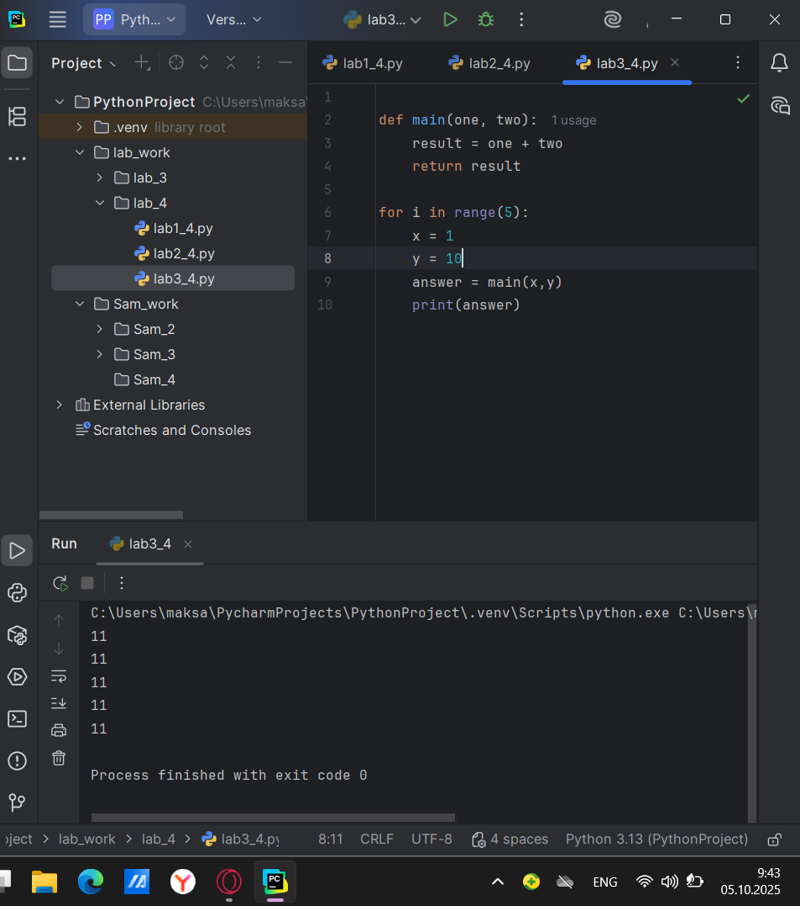

## Лабораторная работа №4
### Напишите функцию, на вход которой подается какое-то изначальное неизвестное количество аргументов, над которыми будет производится арифметические действия. Для выполнения задания необходимо использовать кортеж “*args”. На скриншоте ниже приведен пример такой программы с комментариями.

```python
def main(x, *args):
    one = x
    two = sum(args)
    three = float(len(args))
    print(f"one={one}\ntwo={two}\nthree={three}")

    return x + sum(args) / float(len(args))

if __name__ == '__main__':
    result = main(10, 0, 1, 2, -1, 0, -1, 1, 2)
    print(f"\nresult={result}")
```
### Результат
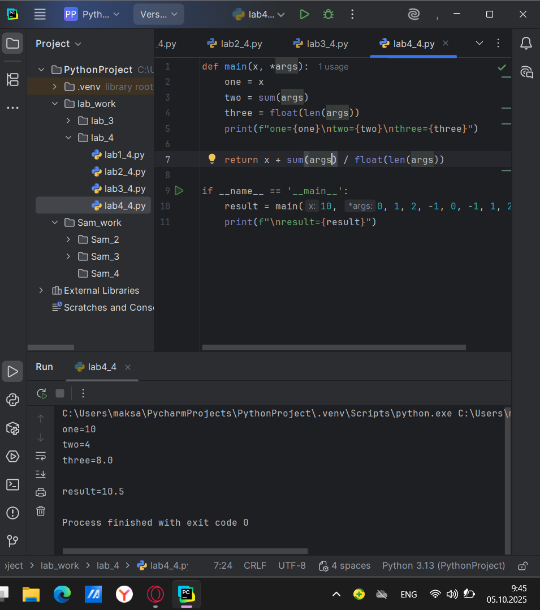
   
## Лабораторная работа №5
### Напишите функцию, которая на вход получает кортеж “**kwargs” и при помощи цикла выводит значения, поступившие в функцию. На скриншоте ниже указаны два варианта вызова функции с “**kwargs” и два варианта работы с данными, поступившими в эту функцию. Комментарии в коде и теоретическая часть помогут вам разобраться в этом нелегком аспекте. Вызовите функцию используя “точку входа”.
```python
def main(**kwargs):
    for i in kwargs.items():
        print(i[0], i[1])

    print()

    for key in kwargs:
        print(f"{key} = {kwargs[key]}")

if __name__ == '__main__':
    main(x=[1, 2, 3], y =[3, 3, 0], z = [2, 3, 0], q = [3, 3, 0], w = [3, 3, 0])
    print()
    main(**{'x': [1,2,3], 'y': [3, 3, 0]})
```
### Результат
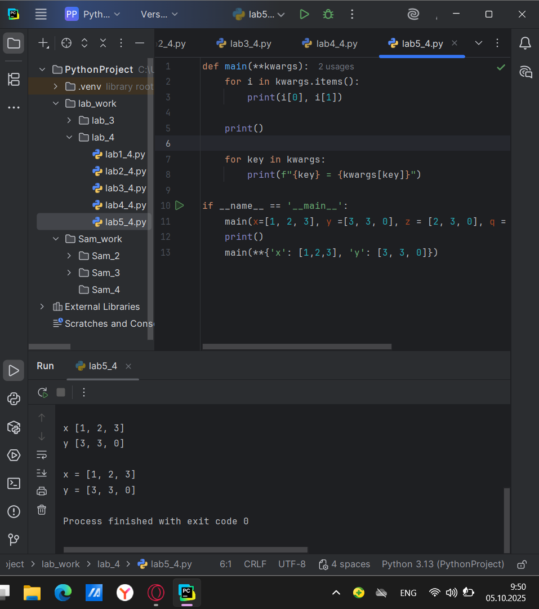

## Лабораторная работа №6
### Напишите две функции. Первая – получает в виде параметра “**kwargs”. Вторая считает среднее арифметическое из значений первой функции. Вызовите первую функцию используя “точку входа” и минимум 4 аргумента. 
```python
def main(**kwargs):
    for i,j in kwargs.items():
        print(f"{i}. Mean = {mean(j)}")

        
def mean(data):
    return sum(data) / float(len(data))

if __name__ == '__main__':
    main(x = [1, 2, 3], y = [3, 3, 0])
```

### Результат
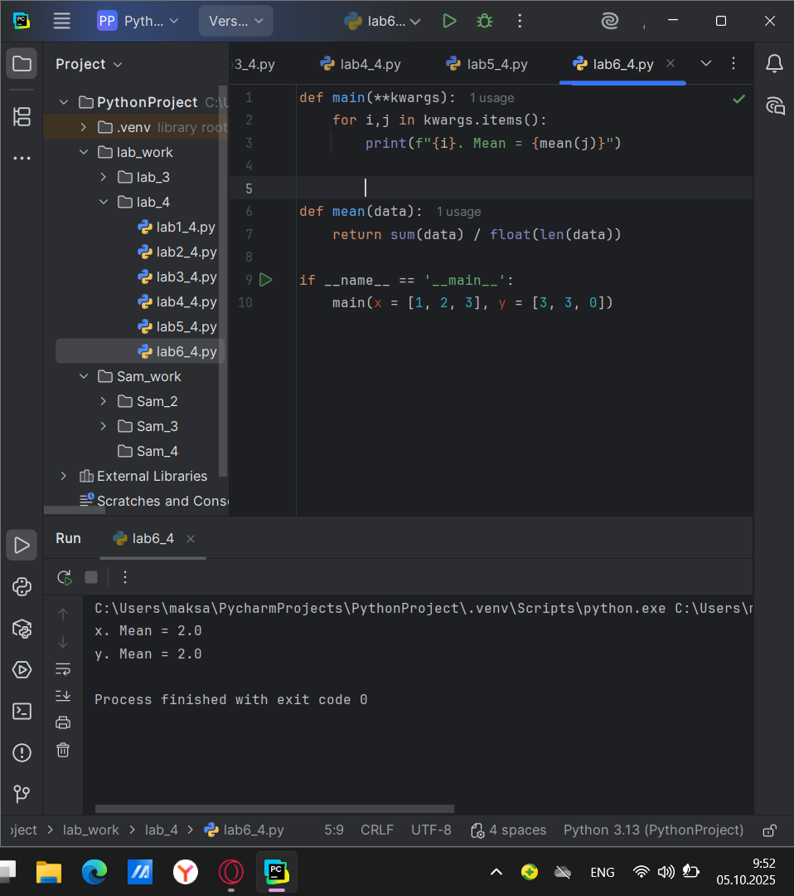

## Лабораторная работа №7
### Создайте дополнительный файл .py. Напишите в нем любую функцию, которая будет что угодно выводить в консоль, но не вызывайте ее в нем. Откройте файл main.py, импортируйте в него функцию из нового файла и при помощи “точки входа” вызовите эту функцию.

```python
from for_import import say_hello

if __name__ == "__main__":
    say_hello()
```

### Результат
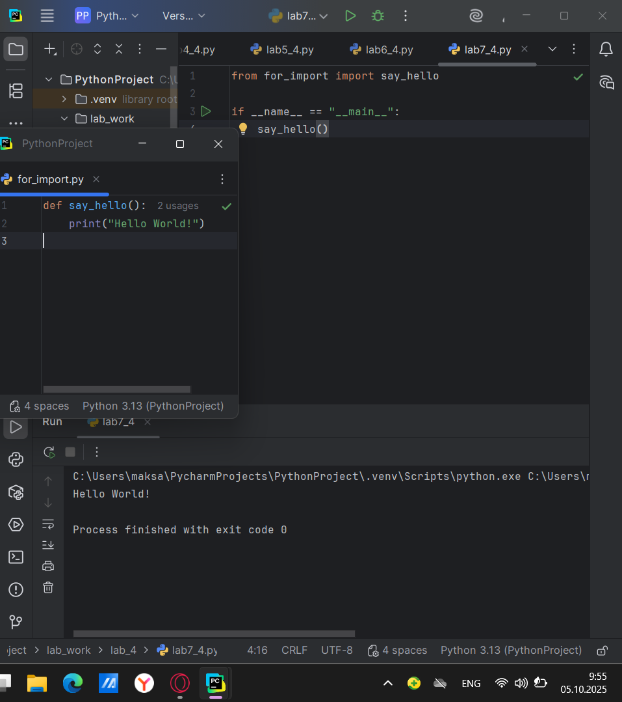

## Лабораторная работа №8
### Напишите программу, которая будет выводить корень, синус, косинус полученного от пользователя числа.

```python
import math

def main():
    value = int(input('Введите значение: '))
    print(math.sqrt(value))
    print(math.sin(value))
    print(math.cos(value))

if __name__ == '__main__':
    main()
```

### Результат
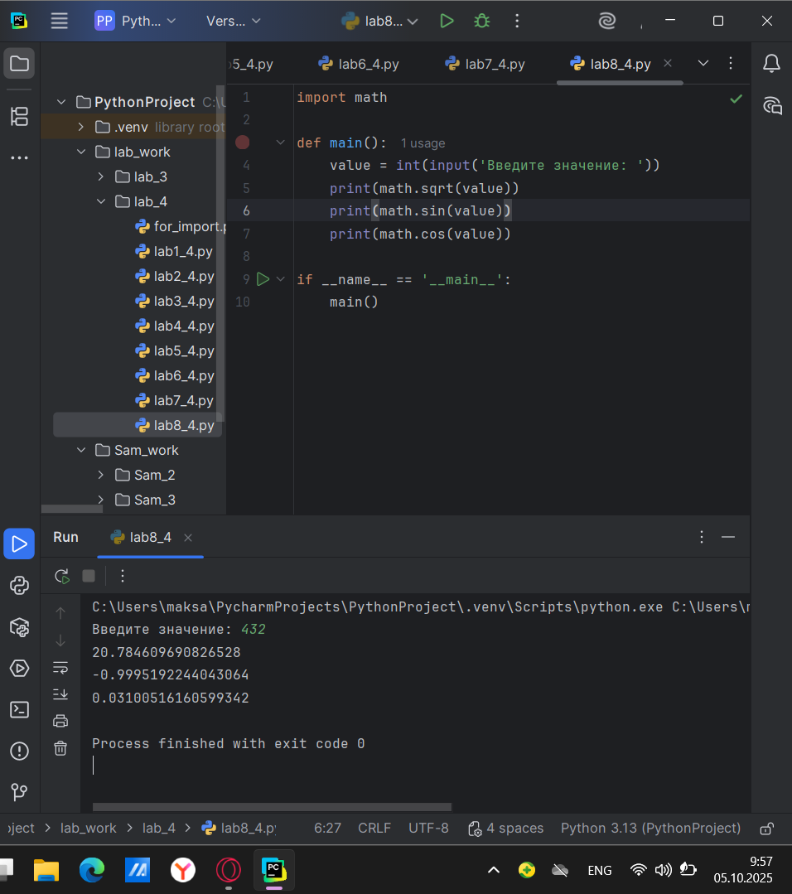

## Лабораторная работа №9
### Напишите программу, которая будет рассчитывать какой день недели будет через n-нное количество дней, которые укажет пользователь.

```python
from datetime import datetime as dt
from datetime import timedelta as td

def main():
    print(
        f"Сегодня {dt.today().date()}."
        f"День недели - {dt.today().isoweekday()}."
    )
    n = int(input('Введите количество дней: '))
    today = dt.today()
    result = today + td(days = n)
    print(
        f"Через {n} дней будет {result.date()}"
        f"День недели - {result.isoweekday()}."
    )

if __name__ == '__main__':
    main()
```

### Результат
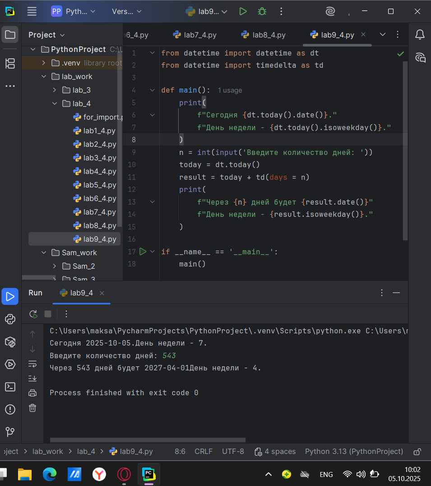

## Лабораторная работа №10
### Напишите программу с использованием глобальных переменных, которая будет считать площадь треугольника или прямоугольника в зависимости от того, что выберет пользователь. Получение всей необходимой информации реализовать через input(), а подсчет площадей выполнить при помощи функций. Результатом программы будет число, равное площади, необходимой фигуры.

```python
global result

def rectangle():
    a = float(input("Ширина: "))
    b = float(input("Высота: "))
    global result
    result = a * b

def triangle():
    a = float(input("Основание: "))
    h = float(input("Высота: "))
    global result
    result = 0.5 * a * h

figure = input("1 - прямоугольник, 2 - треугольник: ")

if figure == "1":
    rectangle()
elif figure == "2":
    triangle()

print(f"Площадь: {result}")
```

### Результат
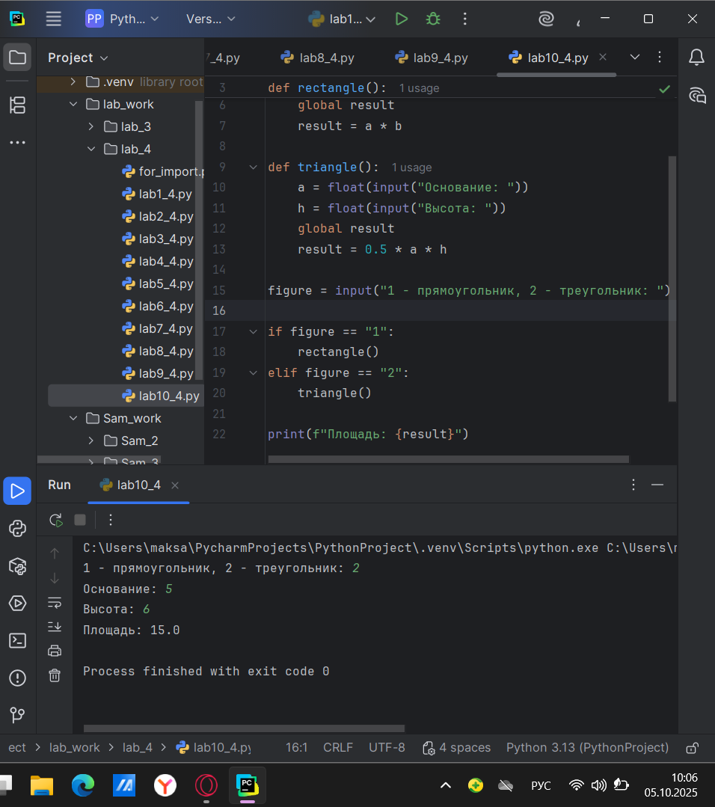

## Самостоятельная работа №1
### Напишите программу, которая преобразует 1 в 31. Для выполнения поставленной задачи необходимо обязательно и только один раз использовать: 
• Цикл for 
• *= 5 
• += 1 
Никаких других действий или циклов использовать нельзя. 

```python
target = 1
for i in range(2):
    target *= 5
    target += 1
print(target)
```

### Результат
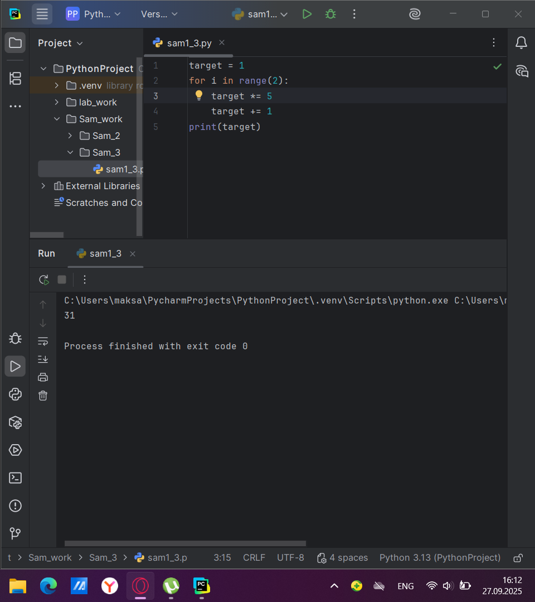
  
## Самостоятельная работа №2
### Напишите программу, которая фразу «Hello World» выводит в обратном порядке, и каждая буква находится в одной строке консоли.

```python
str = 'Hello World'
for char in str[::-1]:
    print(char)
```

### Результат
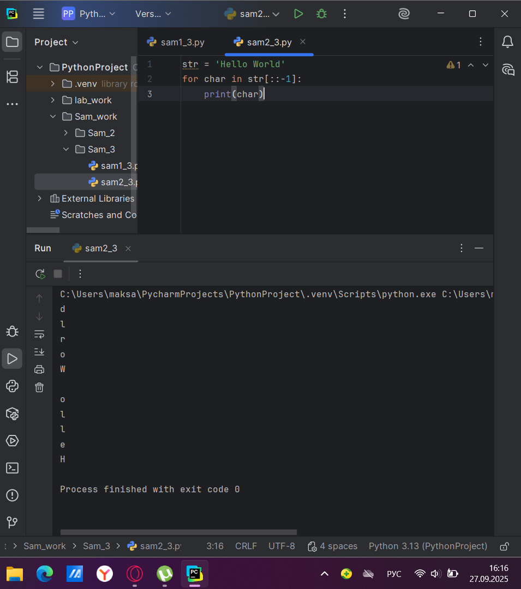

## Самостоятельная работа №3
### Напишите программу, на вход которой поступает значение из консоли, оно должно быть числовым и в диапазоне от 0 до 10 включительно (это необходимо учесть в программе). Если вводимое число не подходит по требованиям, то необходимо вывести оповещение об этом в консоль и остановить программу. Код должен вычислять в каком диапазоне находится полученное число. Нужно учитывать три диапазона: 
• от 0 до 3 включительно.
• от 3 до 6.
• от 6 до 10 включительно

```python
target = int(input('Введите число: '))
if 0 <= target <= 10:
    if 0 <= target <= 3:
        print('Число находится в диапазоне от 0 до 3')
    elif 3 < target < 6:
        print('Число находится в диапазоне от 3 до 6')
    elif 6 <= target <= 10:
        print('Число находится в диапазоне от 6 до 10')
else:
    print('Некорректный ввод')
```

### Результат
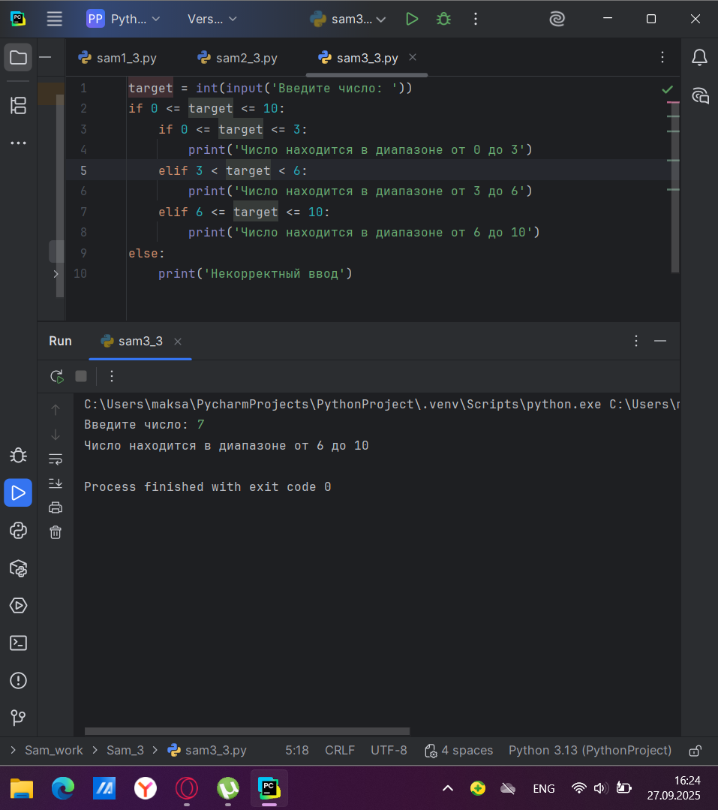

## Самостоятельная работа №4
### Манипулирование строками. Напишите программу на Python, которая принимает предложение (на английском) в качестве входных данных от пользователя. Выполните следующие операции и отобразите результаты: 
• Выведите длину предложения. 
• Переведите предложение в нижний регистр. 
• Подсчитайте количество гласных (a, e, i, o, u) в предложении. 
• Замените все слова "ugly" на "beauty". 
• Проверьте, начинается ли предложение с "The" и заканчивается ли на "end".


```python
str = input('Введите строку: ').lower()
print('Длина предложения: ', len(str))
print('Предложение в нижнем регистре: ',str.lower())
print('Количество гласных: ',
      str.count('a')+
      str.count('e')+
      str.count('i')+
      str.count('o')+
      str.count('u'))
str = str.replace('ugly','beauty')
print('Предложение начинается на "The": ',str.startswith('the'))
print("Предложение заканчивается на 'end': ",str.endswith('end'))
print('Предложение после изменений: ',str)
```

### Результат
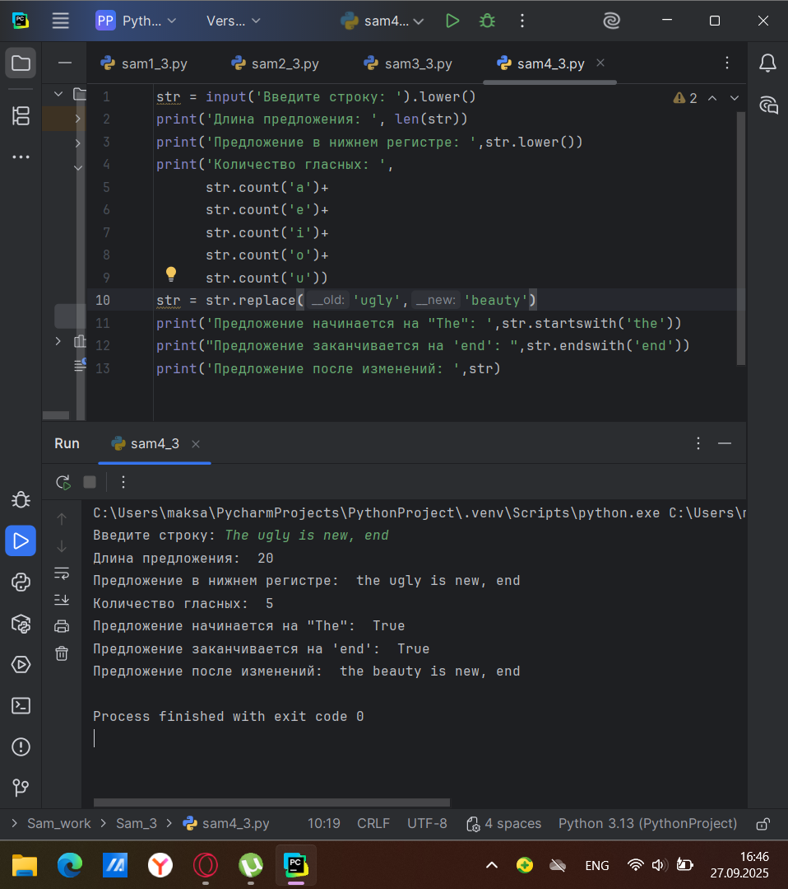

## Самостоятельная работа №5
### Составьте программу, результатом которой будет данный вывод в консоль. 

```python
counter = 0
while counter != 10:
    string = 'hello'
    values = [0, 2, 4, 6, 8, 10]
    memory = ' world'
    if counter in values:
        string = string + ' world'
    print(string)
    counter += 1
if (counter > 7):
    print(string + memory)
```

### Результат
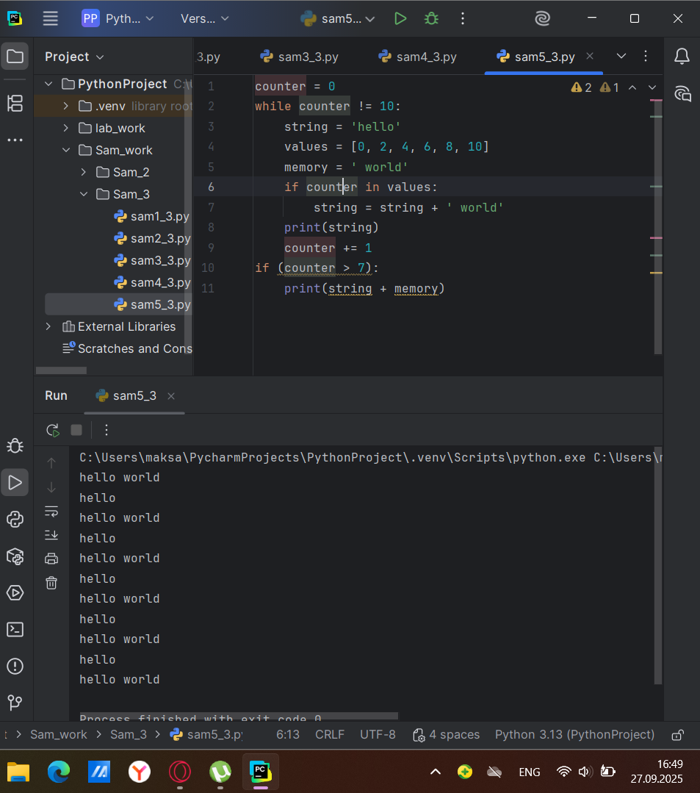

## Общие выводы по теме
В ходе лабораторной и самостоятельной работы были изучены и применены на практических заданиях базовые конструкции языка Python. Успешно написаны программы, использующие арифметические, логические операторы и операторы сравнения для реализации алгоритмов ветвления (условные операторы if, elif, else) и повторения (циклы while и for). Работа позволила наглядно убедиться в важности правильного оформления кода с помощью отступов.
