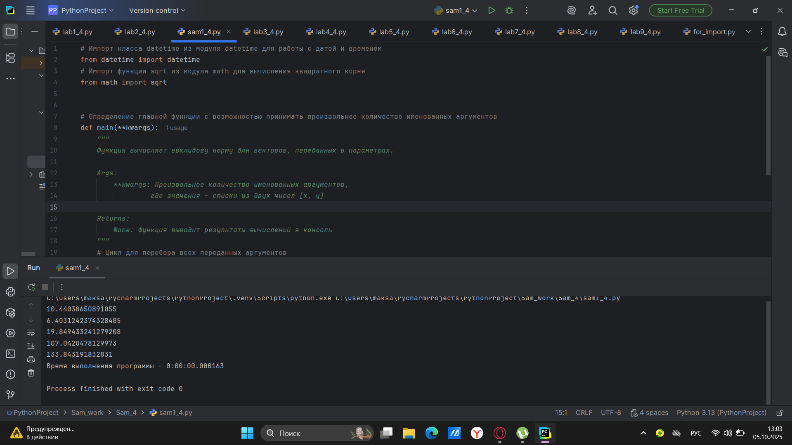
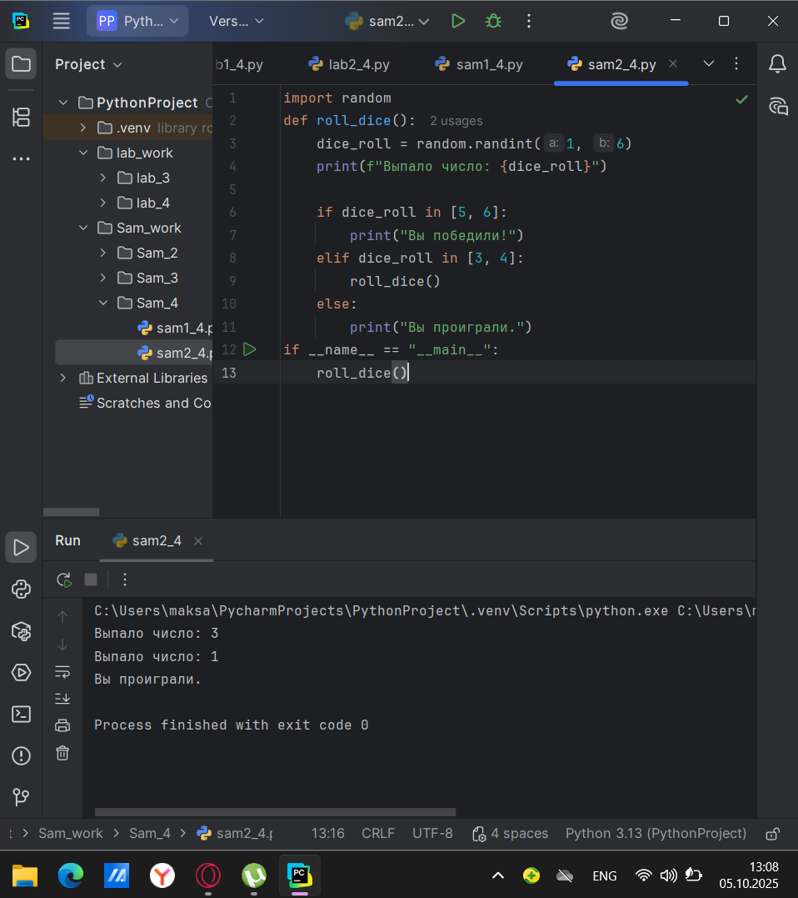
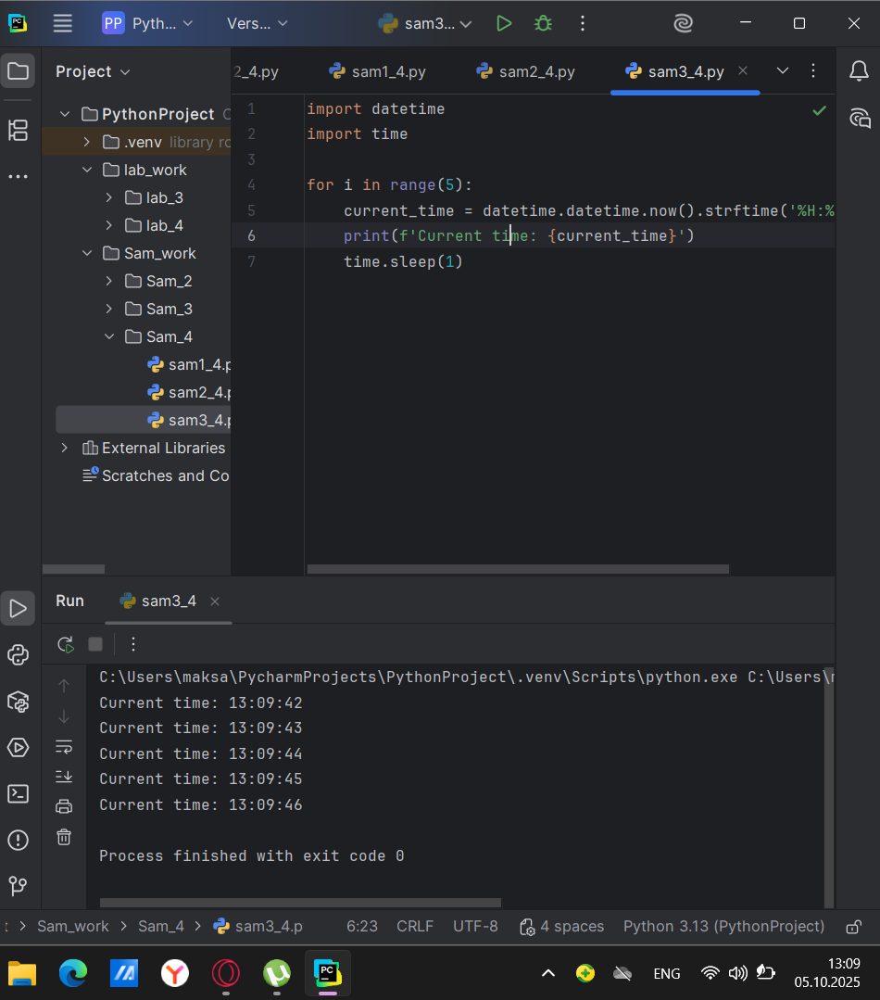
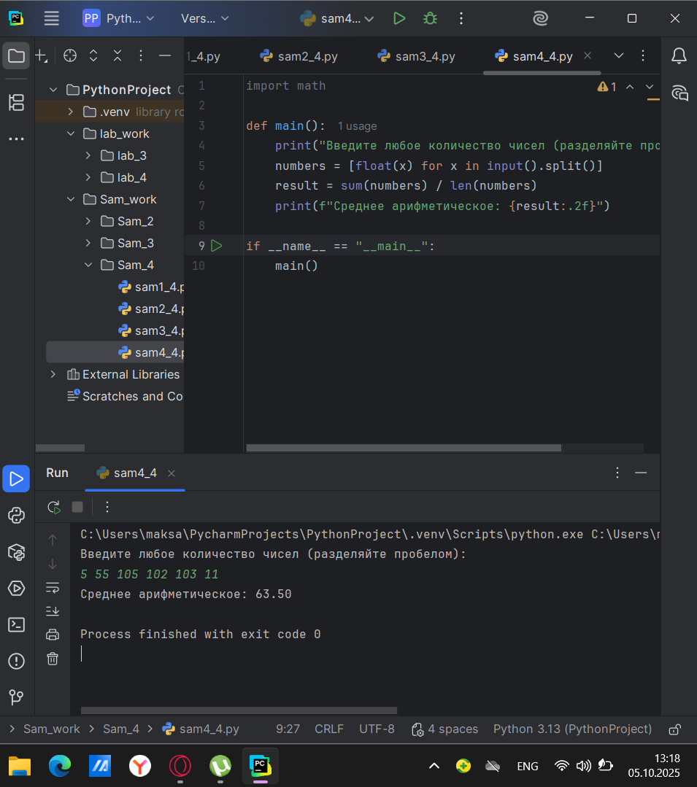
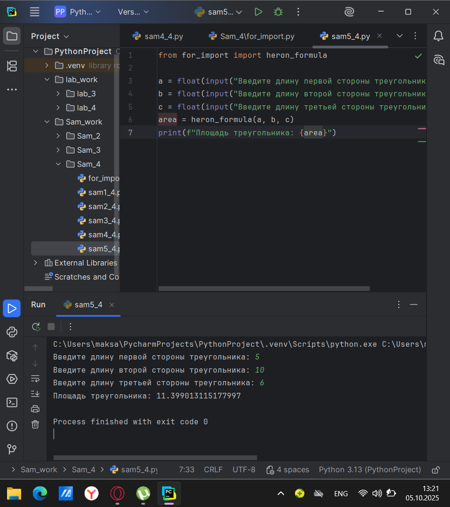

# Тема 4. Функции и модули.
Отчет по Теме #4 выполнил:
- Атаманов Максим Денисович
- ИВТ-23-1

| Задание | Лаб_раб | Сам_раб |
| ------ | ------ | ------ |
| Задание 1 | + | + |
| Задание 2 | + | + |
| Задание 3 | + | + |
| Задание 4 | + | + |
| Задание 5 | + | + |
| Задание 6 | + |
| Задание 7 | + |
| Задание 8 | + |
| Задание 9 | + |
| Задание 10 | + |

знак "+" - задание выполнено; знак "-" - задание не выполнено;

Работу проверили:
- Ротенштрайх Т.В.

## Лабораторная работа №1
### Напишите функцию, которая выполняет любые арифметические действия и выводит результат в консоль. Вызовите функцию используя “точку входа”.

```python
def main():
    print(2+2)

if __name__ == '__main__':
    main()
```
### Результат.


## Лабораторная работа №2
### Напишите функцию, которая выполняет любые арифметические действия, возвращает при помощи return значение в место, откуда вызывали функцию. Выведите результат в консоль. Вызовите функцию используя "точку входа".

```python
def main():
    return 2+2

if __name__ == '__main__':
    print(main())
```
### Результат


## Лабораторная работа №3
### Напишите функцию, в которую передаются два аргумента, над ними производится арифметическое действие, результат возвращается туда, откуда эту функцию вызывали. Выведите результат в консоль. Вызовите функцию в любом небольшом цикле.

```python
def main(one, two):
    result = one + two
    return result

for i in range(5):
    x = 1
    y = 10
    answer = main(x,y)
    print(answer)
```
### Результат


## Лабораторная работа №4
### Напишите функцию, на вход которой подается какое-то изначальное неизвестное количество аргументов, над которыми будет производится арифметические действия. Для выполнения задания необходимо использовать кортеж “*args”. На скриншоте ниже приведен пример такой программы с комментариями.

```python
def main(x, *args):
    one = x
    two = sum(args)
    three = float(len(args))
    print(f"one={one}\ntwo={two}\nthree={three}")

    return x + sum(args) / float(len(args))

if __name__ == '__main__':
    result = main(10, 0, 1, 2, -1, 0, -1, 1, 2)
    print(f"\nresult={result}")
```
### Результат

   
## Лабораторная работа №5
### Напишите функцию, которая на вход получает кортеж “**kwargs” и при помощи цикла выводит значения, поступившие в функцию. На скриншоте ниже указаны два варианта вызова функции с “**kwargs” и два варианта работы с данными, поступившими в эту функцию. Комментарии в коде и теоретическая часть помогут вам разобраться в этом нелегком аспекте. Вызовите функцию используя “точку входа”.
```python
def main(**kwargs):
    for i in kwargs.items():
        print(i[0], i[1])

    print()

    for key in kwargs:
        print(f"{key} = {kwargs[key]}")

if __name__ == '__main__':
    main(x=[1, 2, 3], y =[3, 3, 0], z = [2, 3, 0], q = [3, 3, 0], w = [3, 3, 0])
    print()
    main(**{'x': [1,2,3], 'y': [3, 3, 0]})
```
### Результат


## Лабораторная работа №6
### Напишите две функции. Первая – получает в виде параметра “**kwargs”. Вторая считает среднее арифметическое из значений первой функции. Вызовите первую функцию используя “точку входа” и минимум 4 аргумента. 
```python
def main(**kwargs):
    for i,j in kwargs.items():
        print(f"{i}. Mean = {mean(j)}")

        
def mean(data):
    return sum(data) / float(len(data))

if __name__ == '__main__':
    main(x = [1, 2, 3], y = [3, 3, 0])
```

### Результат


## Лабораторная работа №7
### Создайте дополнительный файл .py. Напишите в нем любую функцию, которая будет что угодно выводить в консоль, но не вызывайте ее в нем. Откройте файл main.py, импортируйте в него функцию из нового файла и при помощи “точки входа” вызовите эту функцию.

```python
from for_import import say_hello

if __name__ == "__main__":
    say_hello()
```

### Результат


## Лабораторная работа №8
### Напишите программу, которая будет выводить корень, синус, косинус полученного от пользователя числа.

```python
import math

def main():
    value = int(input('Введите значение: '))
    print(math.sqrt(value))
    print(math.sin(value))
    print(math.cos(value))

if __name__ == '__main__':
    main()
```

### Результат


## Лабораторная работа №9
### Напишите программу, которая будет рассчитывать какой день недели будет через n-нное количество дней, которые укажет пользователь.

```python
from datetime import datetime as dt
from datetime import timedelta as td

def main():
    print(
        f"Сегодня {dt.today().date()}."
        f"День недели - {dt.today().isoweekday()}."
    )
    n = int(input('Введите количество дней: '))
    today = dt.today()
    result = today + td(days = n)
    print(
        f"Через {n} дней будет {result.date()}"
        f"День недели - {result.isoweekday()}."
    )

if __name__ == '__main__':
    main()
```

### Результат


## Лабораторная работа №10
### Напишите программу с использованием глобальных переменных, которая будет считать площадь треугольника или прямоугольника в зависимости от того, что выберет пользователь. Получение всей необходимой информации реализовать через input(), а подсчет площадей выполнить при помощи функций. Результатом программы будет число, равное площади, необходимой фигуры.

```python
global result

def rectangle():
    a = float(input("Ширина: "))
    b = float(input("Высота: "))
    global result
    result = a * b

def triangle():
    a = float(input("Основание: "))
    h = float(input("Высота: "))
    global result
    result = 0.5 * a * h

figure = input("1 - прямоугольник, 2 - треугольник: ")

if figure == "1":
    rectangle()
elif figure == "2":
    triangle()

print(f"Площадь: {result}")
```

### Результат


## Самостоятельная работа №1
### Дайте подробный комментарий для кода, написанного ниже. Комментарий нужен для каждой строчки кода, нужно описать что она делает. Не забудьте, что функции комментируются по-особенному. 

```python
# Импорт класса datetime из модуля datetime для работы с датой и временем
from datetime import datetime
# Импорт функции sqrt из модуля math для вычисления квадратного корня
from math import sqrt


# Определение главной функции с возможностью принимать произвольное количество именованных аргументов
def main(**kwargs):
    """
    Функция вычисляет евклидову норму для векторов, переданных в параметрах.

    Args:
        **kwargs: Произвольное количество именованных аргументов,
                 где значения - списки из двух чисел [x, y]

    Returns:
        None: Функция выводит результаты вычислений в консоль
    """
    # Цикл для перебора всех переданных аргументов
    # Метод items() возвращает пары (ключ, значение) для каждого аргумента
    for key in kwargs.items():
        # Вычисление евклидовой нормы (длины вектора) по формуле sqrt(x² + y²)
        # key[1][0] - первый элемент списка-значения (x)
        # key[1][1] - второй элемент списка-значения (y)
        result = sqrt(key[1][0] ** 2 + key[1][1] ** 2)
        # Вывод вычисленного результата в консоль
        print(result)


# Проверка, запущен ли скрипт напрямую (а не импортирован как модуль)
if __name__ == '__main__':
    # Запись текущего времени в переменную start_time (время начала выполнения)
    start_time = datetime.now()

    # Вызов функции main с передачей пяти именованных аргументов
    # Каждый аргумент - список из двух чисел, представляющих координаты вектора
    main(
        one=[10, 3],  # Вектор с координатами (10, 3)
        two=[5, 4],  # Вектор с координатами (5, 4)
        three=[15, 13],  # Вектор с координатами (15, 13)
        four=[93, 53],  # Вектор с координатами (93, 53)
        five=[133, 15]  # Вектор с координатами (133, 15)
    )

    # Вычисление времени выполнения программы как разницы между текущим временем и временем начала
    time_costs = datetime.now() - start_time

    # Вывод времени выполнения программы в консоль
    # f-строка форматирует вывод, подставляя значение переменной time_costs
    print(f"Время выполнения программы - {time_costs}")
```

### Результат

  
## Самостоятельная работа №2
### Напишите программу, которая будет заменять игральную кость с 6 гранями. Если значение равно 5 или 6, то в консоль выводится «Вы победили», если значения 3 или 4, то вы рекурсивно должны вызвать эту же функцию, если значение 1 или 2, то в консоль выводится «Вы проиграли». При этом каждый вызов функции необходимо выводить в консоль значение “кубика”.

```python
import random
def roll_dice():
    dice_roll = random.randint(1, 6)
    print(f"Выпало число: {dice_roll}")

    if dice_roll in [5, 6]:
        print("Вы победили!")
    elif dice_roll in [3, 4]:
        roll_dice()
    else:
        print("Вы проиграли.")
if __name__ == "__main__":
    roll_dice()
```

### Результат


## Самостоятельная работа №3
### Напишите программу, которая будет выводить текущее время, с точностью до секунд на протяжении 5 секунд. Программу нужно написать с использованием цикла. Подсказка: необходимо использовать модуль datetime и time, а также вам необходимо как-то “усыплять” программу на 1 секунду.

```python
import datetime
import time

for i in range(5):
    current_time = datetime.datetime.now().strftime('%H:%M:%S')
    print(f'Current time: {current_time}')
    time.sleep(1)
```

### Результат


## Самостоятельная работа №4
### Напишите программу, которая считает среднее арифметическое от аргументов вызываемое функции, с условием того, что изначальное количество этих аргументов неизвестно. Программу необходимо реализовать используя одну функцию и “точку входа”.


```python
def main():
    print("Введите любое количество чисел (разделяйте пробелом):")
    numbers = [float(x) for x in input().split()]
    result = sum(numbers) / len(numbers)
    print(f"Среднее арифметическое: {result:.2f}")

if __name__ == "__main__":
    main()
```

### Результат


## Самостоятельная работа №5
### Создайте два Python файла, в одном будет выполняться вычисление площади треугольника при помощи формулы Герона (необходимо реализовать через функцию), а во втором будет происходить взаимодействие с пользователем (получение всей необходимой информации и вывод результатов). Напишите эту программу и выведите в консоль полученную площадь. 

Первый файл 
```python
def heron_formula(a, b, c):
    s = (a + b + c) / 2
    area = (s * (s - a) * (s - b) * (s - c)) ** 0.5
    return area
```

Второй файл 
```python
from for_import import heron_formula

a = float(input("Введите длину первой стороны треугольника: "))
b = float(input("Введите длину второй стороны треугольника: "))
c = float(input("Введите длину третьей стороны треугольника: "))
area = heron_formula(a, b, c)
print(f"Площадь треугольника: {area}")
```

### Результат


## Общие выводы по теме
В ходе выполнения лабораторной работы «Функции и стандартные модули» были приобретены практические навыки работы с функциями и модулями в Python. Основные результаты:
- Освоено создание пользовательских функций с различными типами параметров
- Изучены возможности стандартных модулей Python для решения common tasks
- Практиковано использование `if __name__ == "__main__"` для контроля выполнения кода
- Разработаны программы с четкой структурой и документированными функциями
