# Тема 5. Базовые коллекции: множества и списки.
Отчет по Теме #5 выполнил:
- Атаманов Максим Денисович
- ИВТ-23-1

| Задание | Лаб_раб | Сам_раб |
| ------ | ------ | ------ |
| Задание 1 | + | + |
| Задание 2 | + | + |
| Задание 3 | + | + |
| Задание 4 | + | + |
| Задание 5 | + | + |
| Задание 6 | + |
| Задание 7 | + |
| Задание 8 | + |
| Задание 9 | + |
| Задание 10 | + |

знак "+" - задание выполнено; знак "-" - задание не выполнено;

Работу проверили:
- Ротенштрайх Т.В.

## Лабораторная работа №1
### Друзья предложили вам поиграть в игру “найди отличия и убери повторения (версия для программистов)”. Суть игры состоит в том, что на вход программы поступает два множества, а ваша задача вывести все элементы первого, которых нет во втором. А вы как раз недавно прошли множества и знаете их возможности, поэтому это не составит для вас труда. 

```python
set_1 = {'White', 'Black', 'Red', 'Pink'}
set_2 = {'Red', 'Green', 'Blue', 'Red'}

print(set_1 - set_2)
```
### Результат.
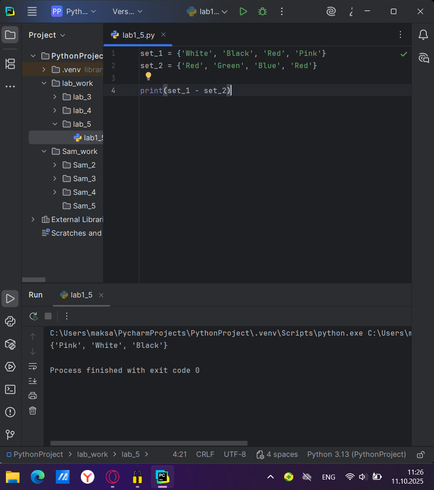

## Лабораторная работа №2
### Напишите две одинаковые программы, только одна будет использовать set(), а вторая frozenset() и попробуйте к исходному множеству добавить несколько элементов, например, через цикл.

```python
a = set('abcdefg')
print(a)
for i in range(1,5):
    a.add(i)
print(a)
```
### Результат
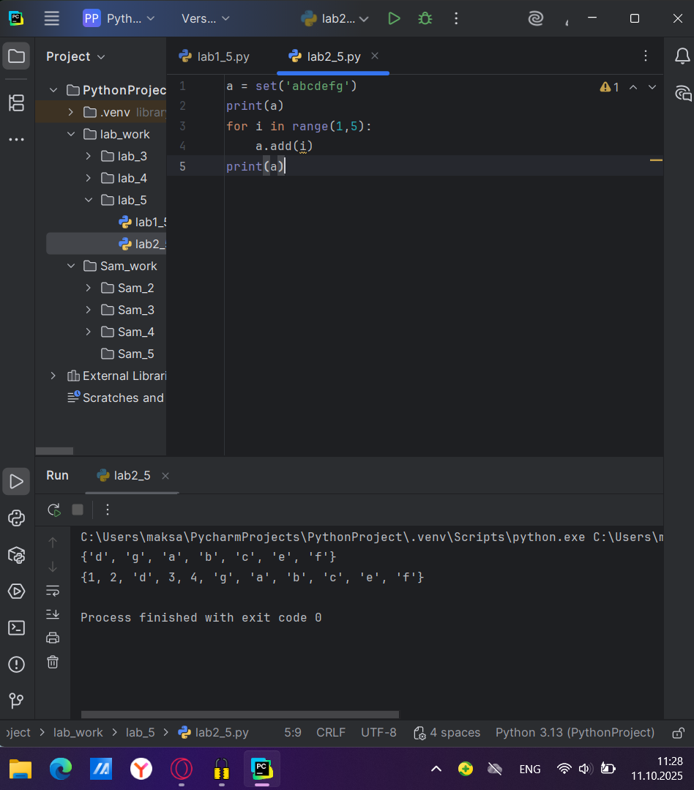

## Лабораторная работа №3
### На вход в программу поступает список (минимальной длиной 2 символа). Напишите программу, которая будет менять первый и последний элемент списка.

```python
def replace(input_list):
    memory = input_list[0]
    input_list[0] = input_list[-1]
    input_list[-1] = memory

    return input_list

print(replace([1,2,3,4,5]))
```
### Результат
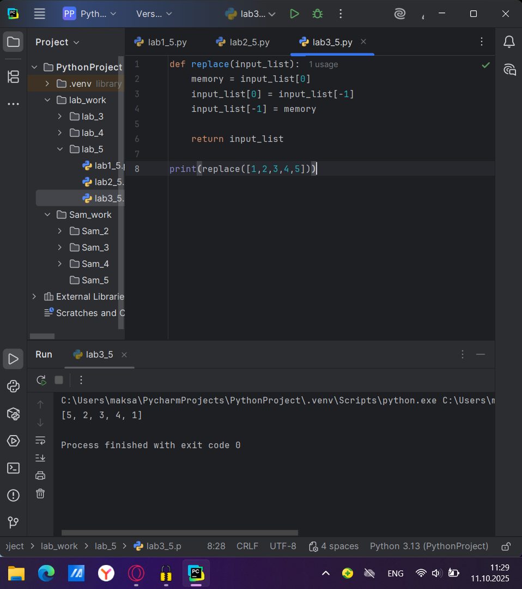

## Лабораторная работа №4
### На вход в программу поступает список (минимальной длиной 10 символов). Напишите программу, которая выводит элементы с индексами от 2 до 6. В программе необходимо использовать “срез”.

```python
a = [12, 54, 32, 56, 843, 2346, 765, 25, 75, 234, 756, 23]
print(a[2:6])
```
### Результат
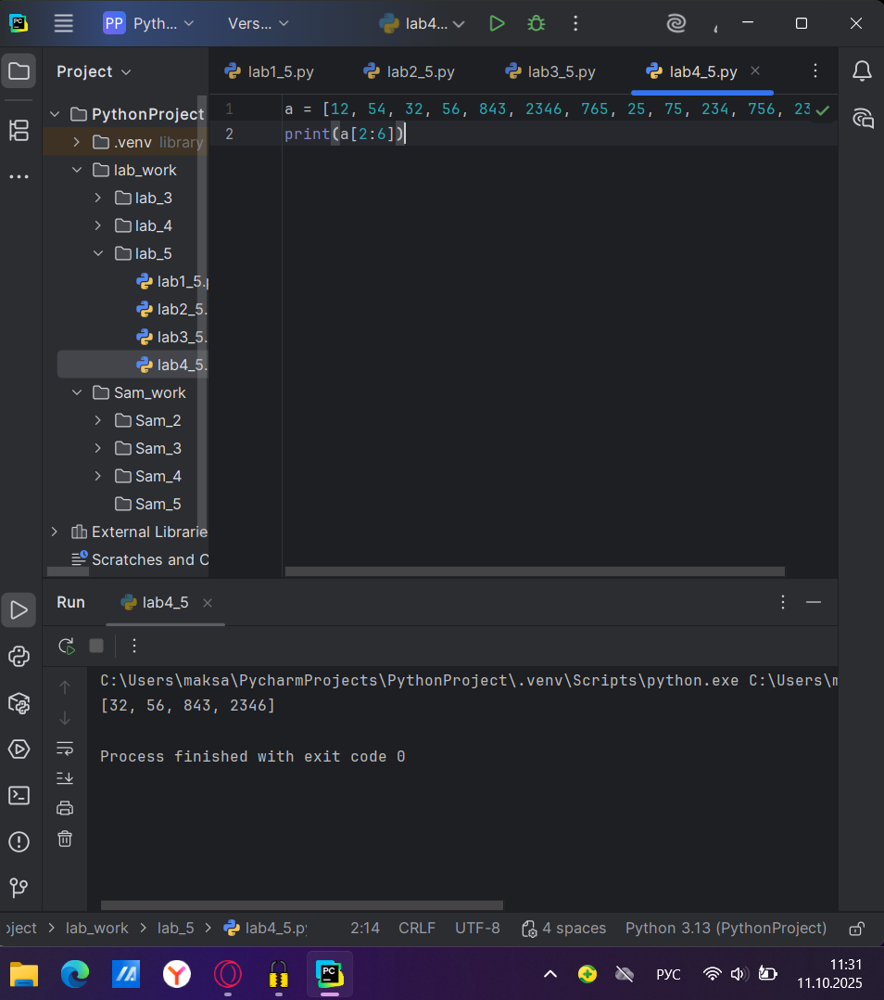
   
## Лабораторная работа №5
### Иван задумался о поиске «бесполезного» числа, полученного из списка. Суть поиска в следующем: он берет произвольный список чисел, находит самое большое из них, а затем делит его на длину списка. Студент пока не придумал, где может пригодиться подобное значение, но ищет у вас помощи в реализации такой функции useless()”.
```python
def useless(lst):
    return max(lst) / len(lst)

print(useless([3,5,6,7,33]))
print(useless([-12.5, 54, 77.3, 0, -36, -63, 32.5, -89.6]))
print(useless([0, -91.5, 43, -56, 86, -7]))
```
### Результат
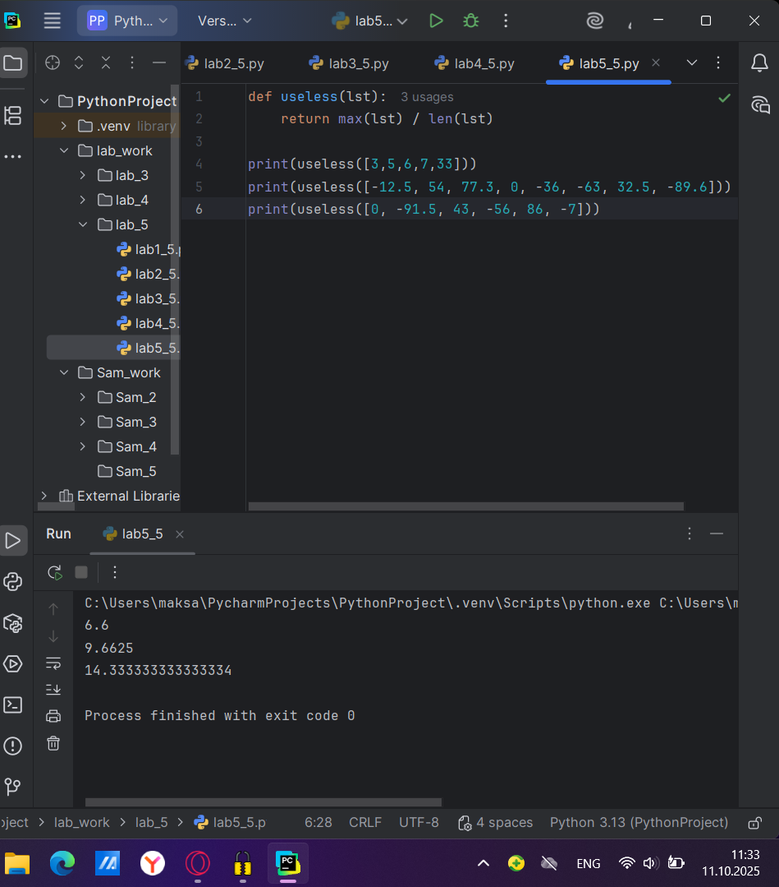

## Лабораторная работа №6
### Ребята не могут определится каким супергероем они хотят стать. У них есть случайно составленный список супергероев, и вы должны определить кто из ребят будет каким супергероем. Необходимо использовать разделение списков. 
```python
superheroes = ['superman', 'spiderman', 'batman']

nikolay, vasiliy, ivan = superheroes

print('Николай - ', nikolay)
print('Василий - ', vasiliy)
print('Иван - ', ivan)
```

### Результат
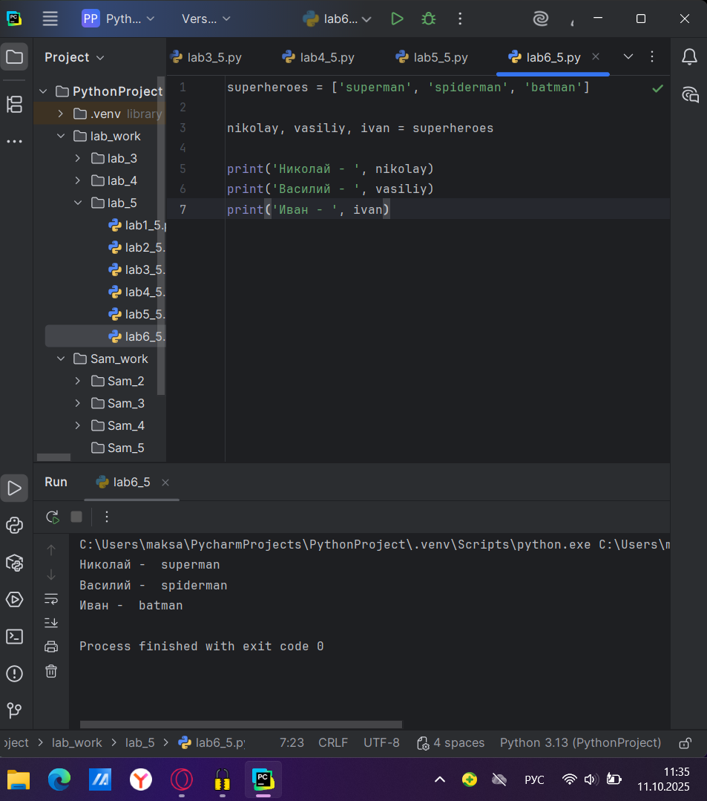

## Лабораторная работа №7
### Вовочка, насмотревшись передачи “Слабое звено” решил написать программу, которая также будет находить самое слабое звено (минимальный элемент) и удалять его, только делать он это хочет не с людьми, а со списком. Помогите Вовочке с реализацией программы.

```python
a = [-25.7, 86, 12.5, -56, 73.2, 0, 43, -91.5, 65.9, -7]
a.sort()
print('Отсортированный список: \n', a)
a.pop(0)
print('Отсортированный список без наименьшого элемента: \n', a)
```

### Результат
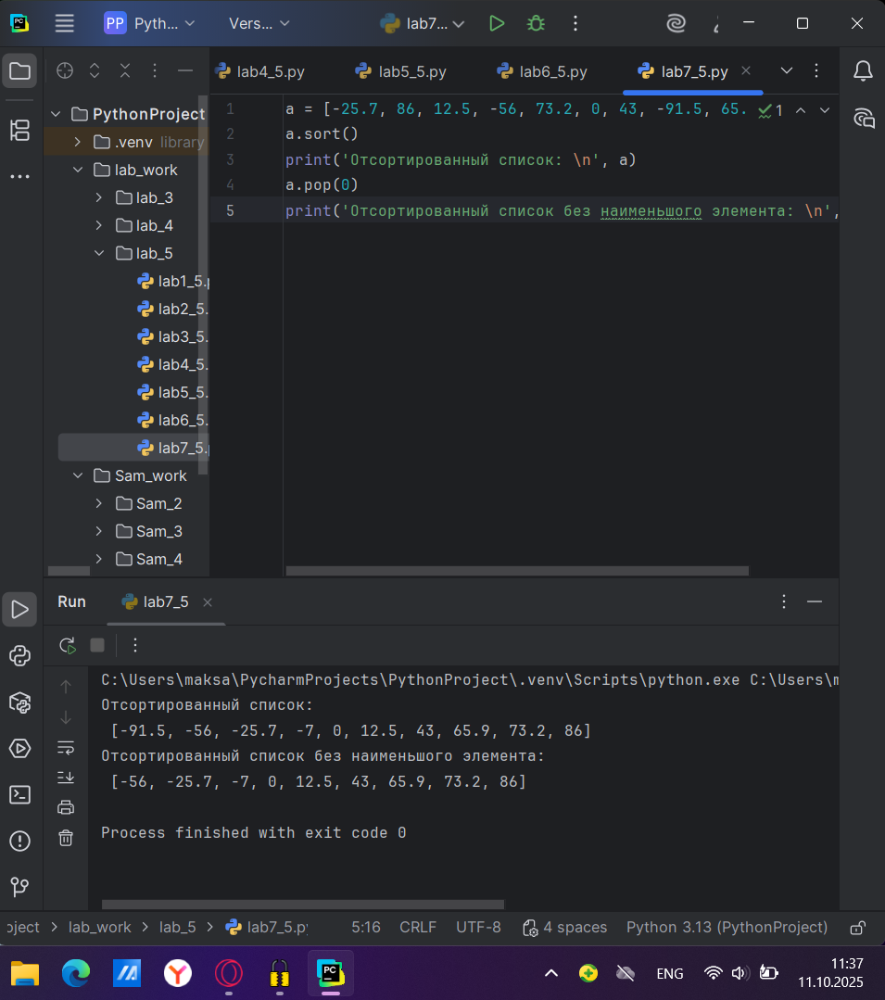

## Лабораторная работа №8
### Михаил решил создать большой n-мерный список, для этого он случайным образом создал несколько списков, состоящих минимум из 3, а максимум из 10 элементов и поместил их в один большой список. Он также как и Иван не знает зачем ему это сейчас нужно, но надеется на то, что это пригодится ему в будущем..

```python
from random import randint

def list_maker():
    a = [randint(1,100)] * randint(3,10)
    return a

if __name__ == '__main__':
    result = []
    for i in range(randint(1,5)):
        result.append(list_maker())

    print(result)
```

### Результат
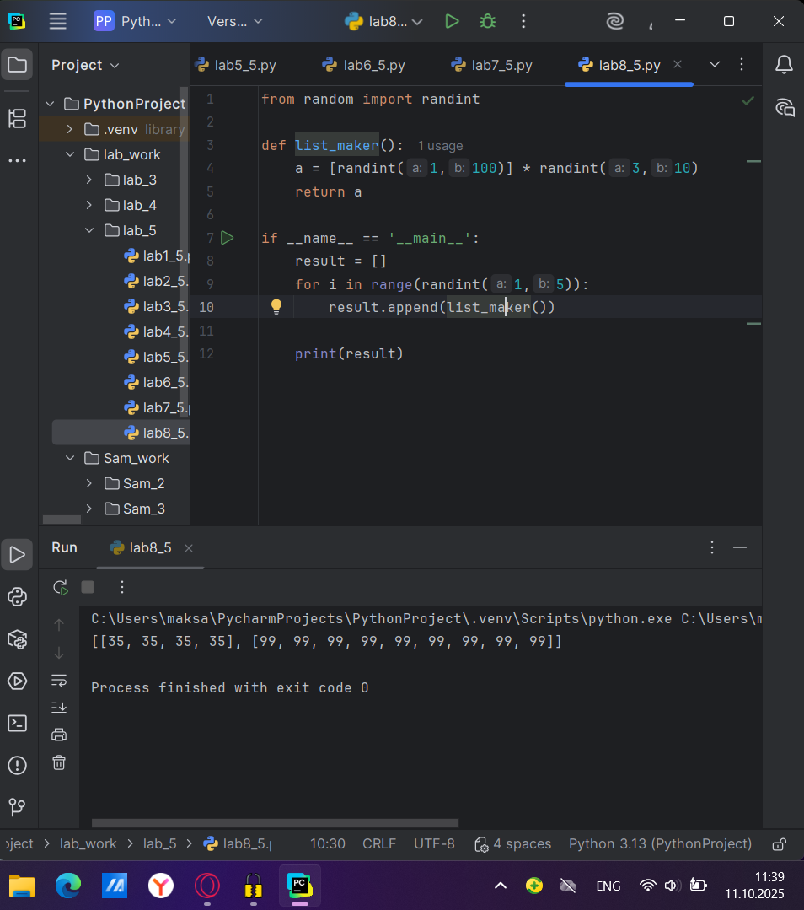

## Лабораторная работа №9
### Вы работаете в ресторане и отвечает за статистику покупок, ваша задача сравнить между собой заказы покупателей, которые указаны в разном порядке. Реализуйте функцию superset(), которая принимает 2 множества. Результат работы функции: вывод в консоль одного из сообщений в зависимости от ситуации.

```python
def superset(set_1, set_2):
    if set_1 > set_2:
        print(f'Объект {set_1} является чистым супермножеством')
    elif set_1 == set_2:
        print(f'Множества равны')
    elif set_1 < set_2:
        print(f'Объект {set_2} является чистым супермножеством')
    else:
        print('Супермножество не обнаружено')

if __name__ == '__main__':
    superset({1,8,3,5}, {3,5})
    superset({1,8,3,5}, {5,3,8,1})
    superset({3,5}, {5,3,8,1})
    superset({90,100}, {3,5})
```

### Результат
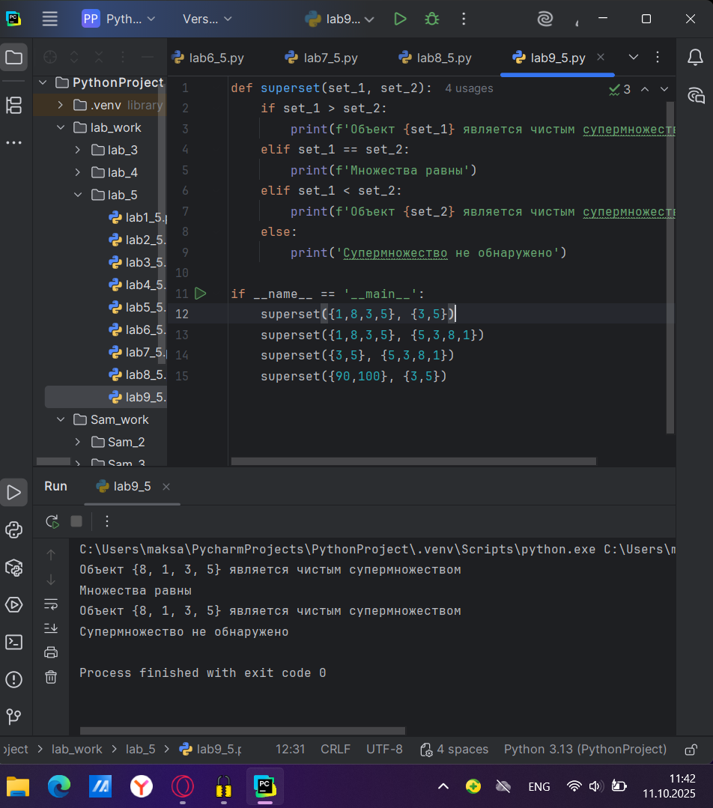

## Лабораторная работа №10
### Предположим, что вам нужно разобрать стопку бумаг, но нужно начать работу с нижней, “переверните стопку”. Вам дан произвольный список. Представьте его в обратном порядке. Программа должна занимать не более двух строк в редакторе кода..

```python
my_list = [2,5,8,3]
print(my_list[::-1])
```

### Результат
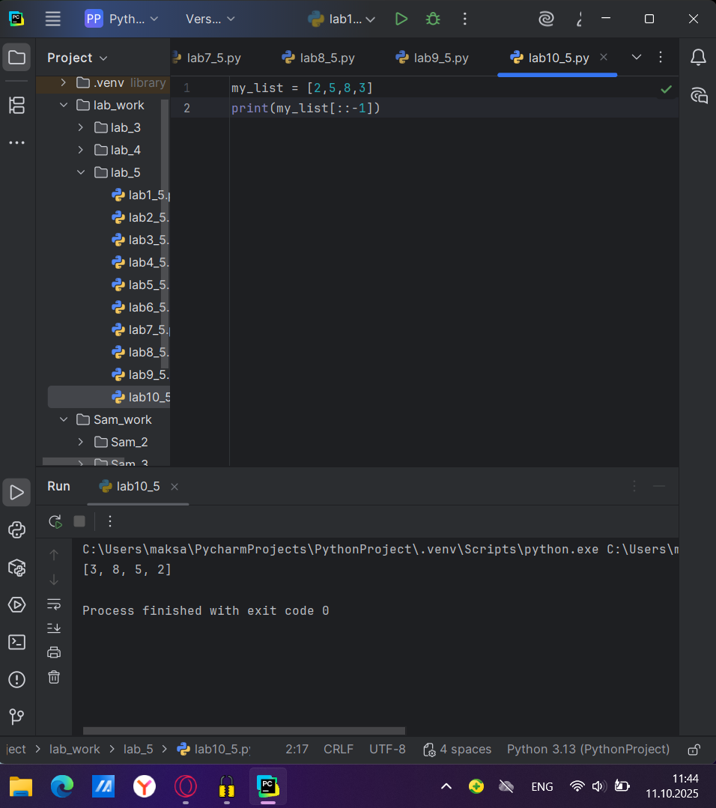

## Самостоятельная работа №1
### Ресторан на предприятии ведет учет посещений за неделю при помощи кода работника. У них есть список со всеми посещениями за неделю. Ваша задача почитать: 
• Сколько было выдано чеков 
• Сколько разных людей посетило ресторан 
• Какой работник посетил ресторан больше всех раз. 

```python
from collections import Counter
checks = [8734, 2345, 8201, 6621, 9999, 1234, 5678, 8201, 8888, 4321, 3365,
          1478, 9865, 5555, 7777, 9998, 1111, 2222, 3333, 4444, 5556, 6666,
          5410, 7778, 8889, 4445, 1439, 9604, 8201, 3365, 7502, 3016, 4928,
          5837, 8201, 2643, 5017, 9682, 8530, 3250, 7193, 9051, 4506, 1987,
          3365, 5410, 7168, 7777, 9865, 5678, 8201, 4445, 3016, 4506, 4506]

total_checks = len(checks)
print(f"1) Всего выдано чеков: {total_checks}")

unique_visitors = len(set(checks))
print(f"2) Уникальных посетителей: {unique_visitors}")

visitor_counts = Counter(checks)
most_frequent_visitor, max_visits = visitor_counts.most_common(1)[0]
print(f"3) Самый частый посетитель: {most_frequent_visitor}")
print(f"   Количество посещений: {max_visits}")
```

### Результат
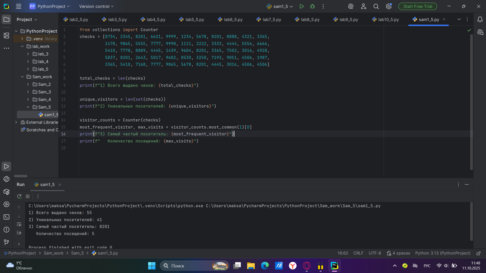
  
## Самостоятельная работа №2
### а физкультуре студенты сдавали бег, у преподавателя физкультуры есть список всех результатов, ему нужно узнать 
• Три лучшие результата 
• Три худшие результата 
• Все результаты начиная с 10 
Ваша задача помочь ему в этом.

```python
results = [10.2, 14.8, 19.3, 22.7, 12.5, 33.1, 38.9, 21.6, 26.4, 17.1,
           30.2, 35.7, 16.9, 27.8, 24.5, 16.3, 18.7, 31.9, 12.9, 37.4]
sorted_results = sorted(results)
print("1) Три лучших результата:")
for i, time in enumerate(sorted_results[:3], 1):
    print(f"   {i}. {time} сек")
print("\n2) Три худших результата:")
for i, time in enumerate(sorted_results[-3:][::-1], 1):
    print(f"   {i}. {time} сек")
print("\n3) Все результаты начиная с 10:")
results_from_10 = [time for time in sorted_results if time >= 10]
for i, time in enumerate(results_from_10, 1):
    print(f"   {i}. {time} сек")
```

### Результат
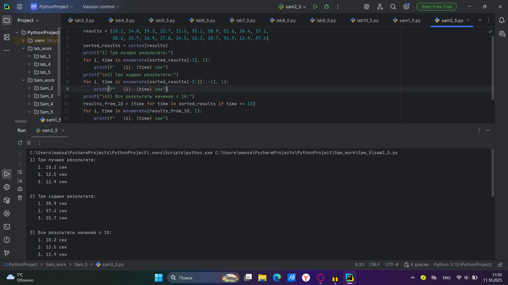

## Самостоятельная работа №3
###  Преподаватель по математике придумал странную задачку. У вас есть три списка с элементами, каждый элемент которых – длина стороны треугольника, ваша задача найти площади двух треугольников, составленные из максимальных и минимальных элементов полученных списков. Результатом выполнения задачи будет: листинг кода, и вывод в консоль, в котором будут указаны два этих значения.

```python
one = [12, 25, 3, 48, 71]
two = [5, 18, 40, 62, 98]
three = [4, 21, 37, 56, 84]

print("Исходные списки:")
print(f"one = {one}")
print(f"two = {two}")
print(f"three = {three}")
min_a = min(one)
min_b = min(two)
min_c = min(three)
max_a = max(one)
max_b = max(two)
max_c = max(three)

print(f"\nМинимальные элементы: {min_a}, {min_b}, {min_c}")
print(f"Максимальные элементы: {max_a}, {max_b}, {max_c}")

# Функция для проверки существования треугольника и вычисления площади
def calculate_triangle_area(a, b, c):
    if a + b > c and a + c > b and b + c > a:
        p = (a + b + c) / 2
        area = (p * (p - a) * (p - b) * (p - c)) ** 0.5
        return area
    else:
        return None

# Вычисляем площадь треугольника из минимальных элементов
area_min = calculate_triangle_area(min_a, min_b, min_c)

# Вычисляем площадь треугольника из максимальных элементов
area_max = calculate_triangle_area(max_a, max_b, max_c)

print("\nРезультаты:")
if area_min is not None:
    print(f"Площадь треугольника из минимальных элементов: {area_min:.2f}")
else:
    print("Из минимальных элементов нельзя составить треугольник")

if area_max is not None:
    print(f"Площадь треугольника из максимальных элементов: {area_max:.2f}")
else:
    print("Из максимальных элементов нельзя составить треугольник")
```

### Результат
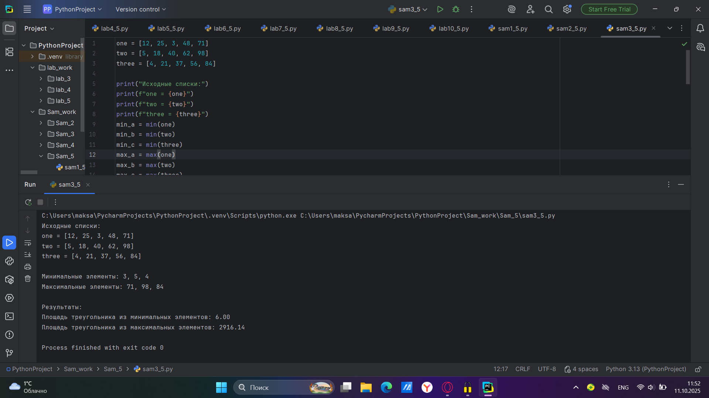

## Самостоятельная работа №4
### Никто не любит получать плохие оценки, поэтому Борис решил это исправить. Допустим, что все оценки студента за семестр хранятся в одном списке. Ваша задача удалить из этого списка все двойки, а все тройки заменить на четверки.


```python
def fix_grades(grades):
    fixed_grades = grades.copy()
    fixed_grades = [grade for grade in fixed_grades if grade != 2]
    fixed_grades = [4 if grade == 3 else grade for grade in fixed_grades]
    return fixed_grades

grades_list_1 = [2, 3, 4, 5, 3, 4, 5, 2, 2, 5, 3, 4, 3, 5, 4]
grades_list_2 = [4, 2, 3, 5, 3, 5, 4, 2, 2, 5, 4, 3, 5, 3, 4]
grades_list_3 = [5, 4, 3, 3, 4, 3, 3, 5, 5, 3, 3, 3, 3, 4, 4]

print("1-й список оценок:")
print(f"Исходный: {grades_list_1}")
fixed_1 = fix_grades(grades_list_1)
print(f"Исправленный: {fixed_1}")
print(f"Количество оценок: было {len(grades_list_1)}, стало {len(fixed_1)}")

print("\n2-й список оценок:")
print(f"Исходный: {grades_list_2}")
fixed_2 = fix_grades(grades_list_2)
print(f"Исправленный: {fixed_2}")
print(f"Количество оценок: было {len(grades_list_2)}, стало {len(fixed_2)}")

print("\n3-й список оценок:")
print(f"Исходный: {grades_list_3}")
fixed_3 = fix_grades(grades_list_3)
print(f"Исправленный: {fixed_3}")
print(f"Количество оценок: было {len(grades_list_3)}, стало {len(fixed_3)}")

```

### Результат
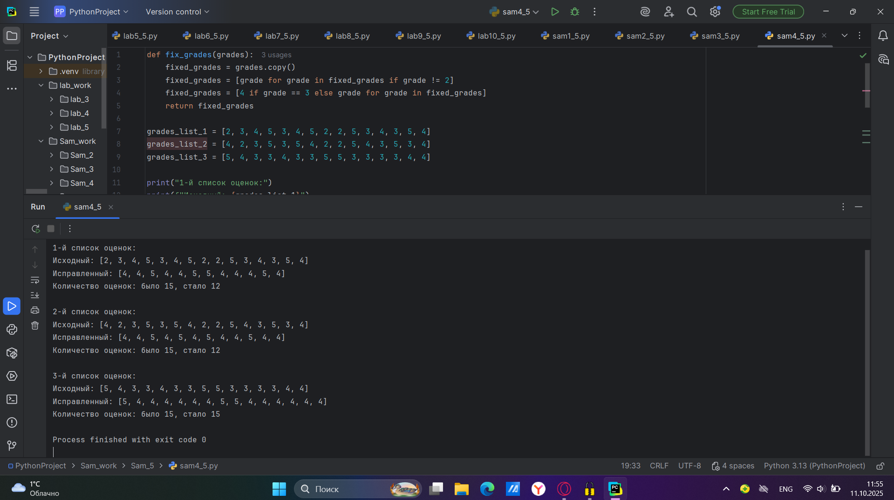

## Самостоятельная работа №5
### Вам предоставлены списки натуральных чисел, из них необходимо сформировать множества. При этом следует соблюдать это правило: если какое-либо число повторяется, то преобразовать его в строку по следующему образцу: например, если число 4 повторяется 3 раза, то в множестве будет следующая запись: само число 4, строка «44», строка «444».. 

```python
def create_special_set(numbers):
    result_set = set()
    from collections import Counter
    count_dict = Counter(numbers)
    for num, count in count_dict.items():
        result_set.add(num)
        if count > 1:
            for repeat_count in range(2, count + 1):
                str_representation = str(num) * repeat_count
                result_set.add(str_representation)

    return result_set

list_1 = [1, 1, 3, 3, 1]
list_2 = [5, 5, 5, 5, 5, 5, 5]
list_3 = [2, 2, 1, 2, 2, 5, 6, 7, 1, 3, 2, 2]

print("list_1 =", list_1)
set_1 = create_special_set(list_1)
print("Результат:", set_1)
print("\nlist_2 =", list_2)
set_2 = create_special_set(list_2)
print("Результат:", set_2)
print("\nlist_3 =", list_3)
set_3 = create_special_set(list_3)
print("Результат:", set_3)

```

### Результат
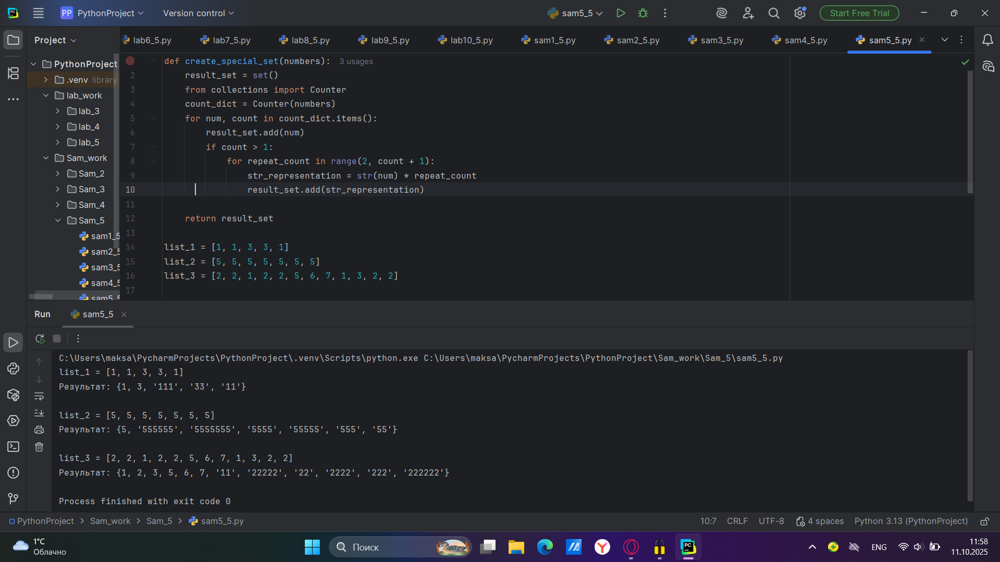

## Общие выводы по теме
В ходе работы были успешно решены разнообразные задачи: от статистического анализа посещений ресторана и обработки спортивных результатов до математических вычислений и преобразования учебных оценок. Особое внимание было уделено эффективному использованию встроенных функций Python для работы с коллекциями.
