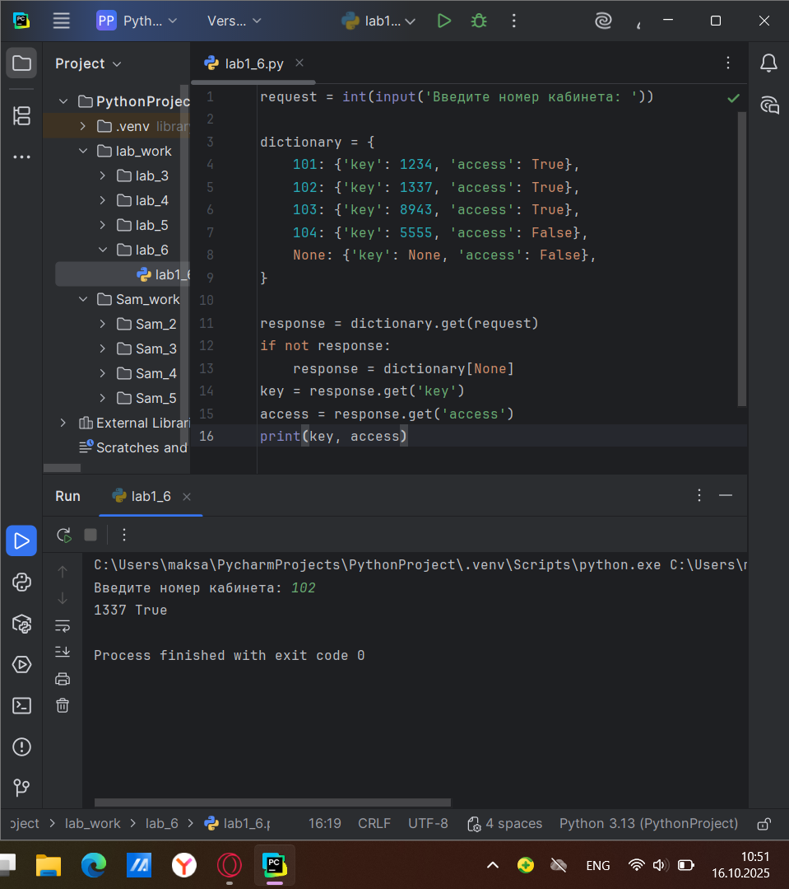
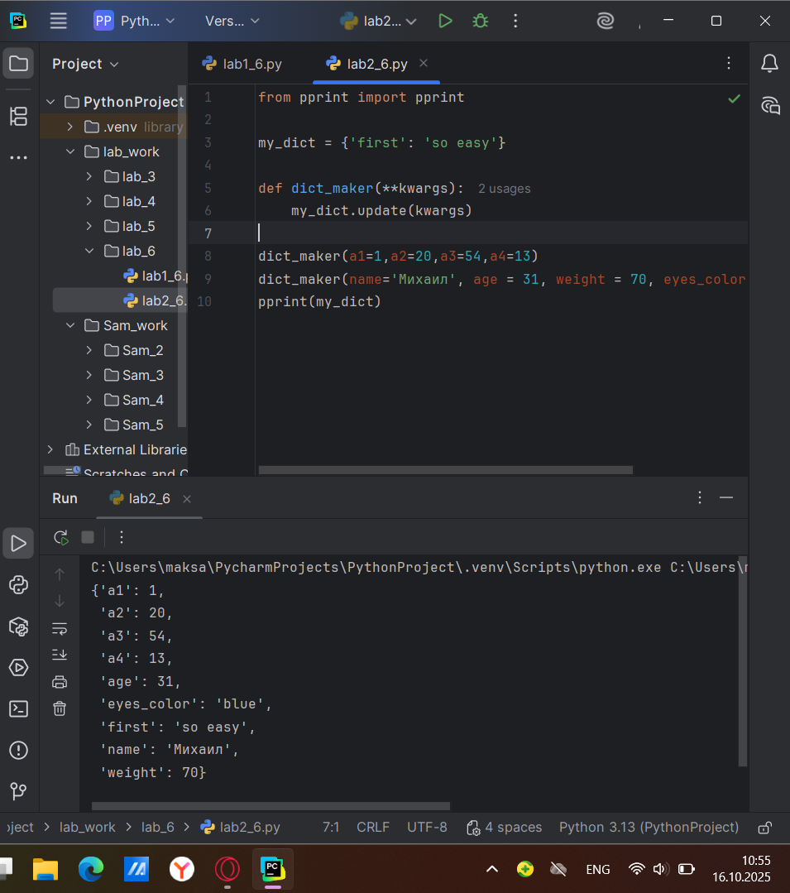
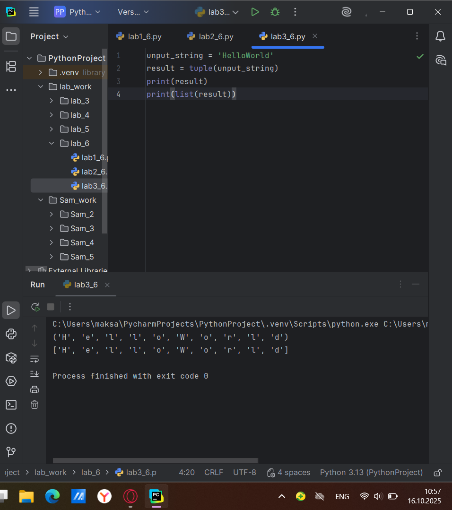
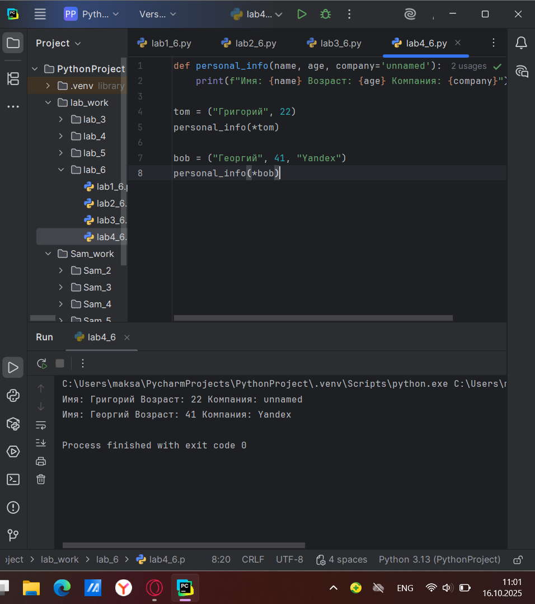
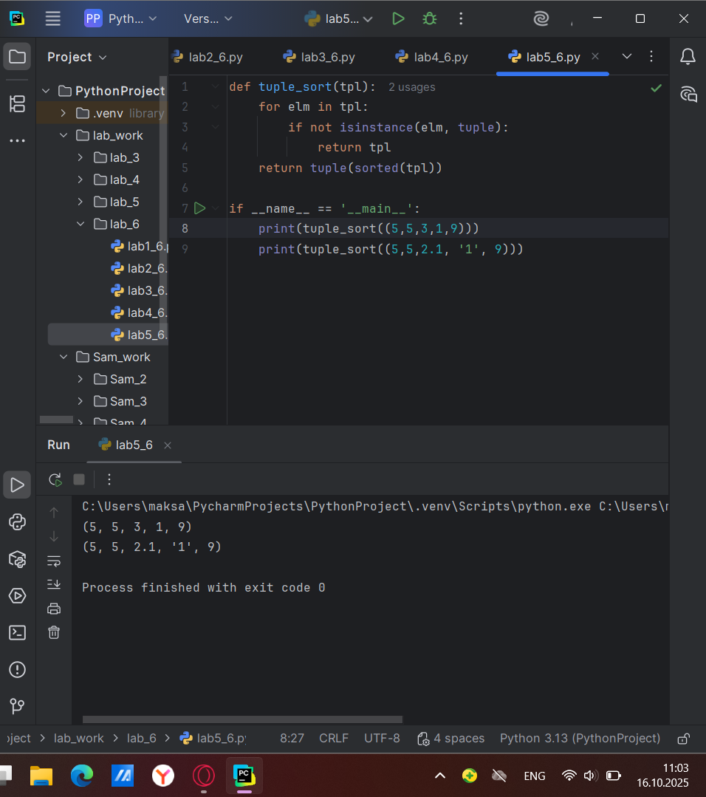
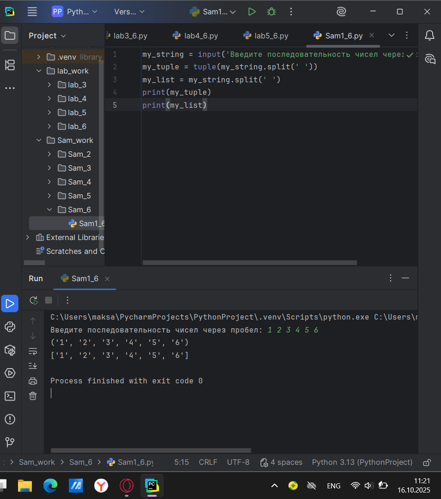
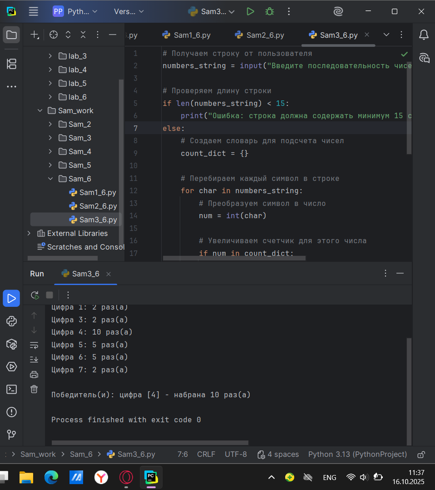
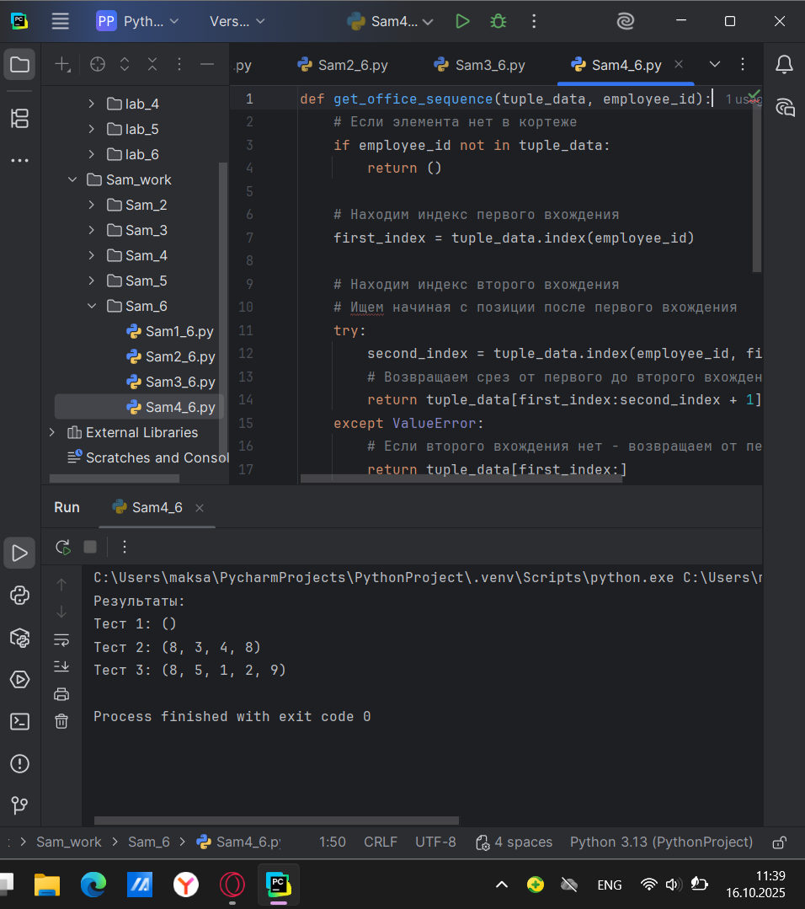

# Тема 6. Базовые коллекции: словари, кортежи.
Отчет по Теме #6 выполнил:
- Атаманов Максим Денисович
- ИВТ-23-1

| Задание | Лаб_раб | Сам_раб |
| ------ | ------ | ------ |
| Задание 1 | + | + |
| Задание 2 | + | + |
| Задание 3 | + | + |
| Задание 4 | + | + |
| Задание 5 | + | + |

знак "+" - задание выполнено; знак "-" - задание не выполнено;

Работу проверили:
- Ротенштрайх Т.В.

## Лабораторная работа №1
### В школе, где вы учились, узнали, что вы крутой программист и попросили написать программу для учителей, которая будет при вводе кабинета писать для него ключ доступа и статус, занят кабинет или нет. При написании программы необходимо использовать словарь (dict), который на вход получает номер кабинета, а выводит необходимую информацию. Если кабинета, который вы ввели нет в словаре, то в консоль в виде значения ключа нужно вывести “None” и виде статуса вывести “False”. 

```python
request = int(input('Введите номер кабинета: '))

dictionary = {
    101: {'key': 1234, 'access': True},
    102: {'key': 1337, 'access': True},
    103: {'key': 8943, 'access': True},
    104: {'key': 5555, 'access': False},
    None: {'key': None, 'access': False},
}

response = dictionary.get(request)
if not response:
    response = dictionary[None]
key = response.get('key')
access = response.get('access')
print(key, access)
```
### Результат.


## Лабораторная работа №2
### Алексей решил создать самый большой словарь в мире. Для этого он придумал функцию dict_maker (**kwargs), которая принимает неограниченное количество параметров «ключ: значение» и обновляет созданный им словарь my_dict, состоящий всего из одного элемента «first» со значением «so easy». Помогите Алексею создать данную функцию.

```python
from pprint import pprint

my_dict = {'first': 'so easy'}

def dict_maker(**kwargs):
    my_dict.update(kwargs)

dict_maker(a1=1,a2=20,a3=54,a4=13)
dict_maker(name='Михаил', age = 31, weight = 70, eyes_color = 'blue')
pprint(my_dict)
```
### Результат


## Лабораторная работа №3
### Для решения некоторых задач бывает необходимо разложить строку на отдельные символы. Мы знаем что это можно сделать при помощи split(), у которого более гибкая настройка для разделения для этого, но если нам нужно посимвольно разделить строку без всяких условий, то для этого мы можем использовать кортежи (tuple). Для этого напишем любую строку, которую будем делить и “обвернем” ее в tuple и и дальше мы можем как нам угодно с ней работать, например, сделать ее списком (тогда получится полный аналог split()) или же работать с ним дальше, как с кортежем.

```python
unput_string = 'HelloWorld'
result = tuple(unput_string)
print(result)
print(list(result))
```
### Результат


## Лабораторная работа №4
### Вовочка решил написать крутую функцию, которая будет писать имя, возраст и место работы, но при этом на вход этой функции будет поступать кортеж. Помогите Вовочке написать эту программу.

```python
def personal_info(name, age, company='unnamed'):
    print(f"Имя: {name} Возраст: {age} Компания: {company}")

tom = ("Григорий", 22)
personal_info(*tom)

bob = ("Георгий", 41, "Yandex")
personal_info(*bob)
```
### Результат

   
## Лабораторная работа №5
### Для сопровождения первых лиц государства X нужен кортеж, но никто не может определиться с порядком машин, поэтому вам нужно написать функцию, которая будет сортировать кортеж, состоящий из целых чисел по возрастанию, и возвращает его. Если хотя бы один элемент не является целым числом, то функция возвращает исходный кортеж.

```python
def tuple_sort(tpl):
    for elm in tpl:
        if not isinstance(elm, tuple):
            return tpl
    return tuple(sorted(tpl))

if __name__ == '__main__':
    print(tuple_sort((5,5,3,1,9)))
    print(tuple_sort((5,5,2.1, '1', 9)))
```
### Результат


## Самостоятельная работа №1
### При создании сайта у вас возникла потребность обрабатывать данные пользователя в странной форме, а потом переводить их в нужные вам форматы. Вы хотите принимать от пользователя последовательность чисел, разделенных пробелом, а после переформатировать эти данные в список и кортеж. Реализуйте вашу задумку. 

```python
my_string = input('Введите последовательность чисел через пробел: ')
my_tuple = tuple(my_string.split(' '))
my_list = my_string.split(' ')
print(my_tuple)
print(my_list)
```

### Результат

  
## Самостоятельная работа №2
### Николай знает, что кортежи являются неизменяемыми, но он очень упрямый и всегда хочет доказать, что он прав. Студент решил создать функцию, которая будет удалять первое появление определенного элемента из кортежа по значению и возвращать кортеж без него. Попробуйте повторить шедевр не признающего авторитеты начинающего программиста. Но учтите, что Николай не всегда уверен в наличии элемента в кортеже

```python
def remove_first_occurrence(tuple_data, element):
    temp_list = list(tuple_data)
    if element in temp_list:
        temp_list.remove(element)
    return tuple(temp_list)
test_cases = [
    ((1, 2, 3), 1),
    ((1, 2, 3, 1, 2, 3, 4, 5, 2, 3, 4, 2, 4, 2), 3),
    ((2, 4, 6, 6, 4, 2), 9)
]

print("Результаты:")
for i, (tpl, elem) in enumerate(test_cases, 1):
    result = remove_first_occurrence(tpl, elem)
    print(f"Тест {i}: {result}")
```

### Результат


## Самостоятельная работа №3
###  Ребята поспорили кто из них одним нажатием на numpad наберет больше повторяющихся цифр, но не понимают, как узнать победителя. Вам им нужно в этом помочь. Дана строка в виде случайной последовательности чисел от 0 до 9 (длина строки минимум 15 символов). Требуется создать словарь, который в качестве ключей будет принимать данные числа (т. е. ключи будут типом int), а в качестве значений – количество этих чисел в имеющейся последовательности.

```python
# Получаем строку от пользователя
numbers_string = input("Введите последовательность чисел (минимум 15 символов): ")

# Проверяем длину строки
if len(numbers_string) < 15:
    print("Ошибка: строка должна содержать минимум 15 символов!")
else:
    # Создаем словарь для подсчета чисел
    count_dict = {}

    # Перебираем каждый символ в строке
    for char in numbers_string:
        # Преобразуем символ в число
        num = int(char)

        # Увеличиваем счетчик для этого числа
        if num in count_dict:
            count_dict[num] += 1
        else:
            count_dict[num] = 1

    # Выводим результат
    print("Результат подсчета:")
    for number, count in sorted(count_dict.items()):
        print(f"Цифра {number}: {count} раз(а)")

    # Определяем победителя (цифра с максимальным количеством)
    max_count = max(count_dict.values())
    winning_numbers = [num for num, count in count_dict.items() if count == max_count]

    print(f"\nПобедитель(и): цифра {winning_numbers} - набрана {max_count} раз(а)")
```

### Результат


## Самостоятельная работа №4
### Ваш хороший друг владеет офисом со входом по электронным картам, ему нужно чтобы вы написали программу, которая показывала в каком порядке сотрудники входили и выходили из офиса. Определение сотрудника происходит по id. Напишите функцию, которая на вход принимает кортеж и случайный элемент (id), его можно придумать самостоятельно.

```python
def get_office_sequence(tuple_data, employee_id):
    # Если элемента нет в кортеже
    if employee_id not in tuple_data:
        return ()

    # Находим индекс первого вхождения
    first_index = tuple_data.index(employee_id)

    # Находим индекс второго вхождения
    # Ищем начиная с позиции после первого вхождения
    try:
        second_index = tuple_data.index(employee_id, first_index + 1)
        # Возвращаем срез от первого до второго вхождения включительно
        return tuple_data[first_index:second_index + 1]
    except ValueError:
        # Если второго вхождения нет - возвращаем от первого до конца
        return tuple_data[first_index:]


# Тестирование на примерах из задания
test_cases = [
    ((1, 2, 3), 8),
    ((1, 8, 3, 4, 8, 8, 9, 2), 8),
    ((1, 2, 8, 5, 1, 2, 9), 8)
]

print("Результаты:")
for i, (tpl, elem) in enumerate(test_cases, 1):
    result = get_office_sequence(tpl, elem)
    print(f"Тест {i}: {result}")
```

### Результат


## Самостоятельная работа №5
### Самостоятельно придумайте и решите задачу, в которой будут обязательно использоваться кортеж или список. Проведите минимум три теста для проверки работоспособности вашей задачи. 

```python
def calculate_average_grades(students_data):
    result = {}

    for student in students_data:
        name = student[0]
        grades = student[1]

        # Рассчитываем средний балл
        if grades:  # проверяем, что список оценок не пустой
            average = sum(grades) / len(grades)
        else:
            average = 0  # если нет оценок

        result[name] = round(average, 2)  # округляем до 2 знаков

    return result


# Тест 1: Обычный случай
print("Тест 1: Обычный случай")
students1 = (
    ("Анна", [4, 5, 5, 4, 3]),
    ("Иван", [3, 4, 5, 3, 4]),
    ("Мария", [5, 5, 5, 5, 5])
)
result1 = calculate_average_grades(students1)
print(f"Результат: {result1}")
print("Ожидаем: Анна - 4.2, Иван - 3.8, Мария - 5.0")
print()

# Тест 2: Студент без оценок
print("Тест 2: Студент без оценок")
students2 = (
    ("Петр", [4, 3, 5]),
    ("Ольга", []),  # нет оценок
    ("Сергей", [2, 3, 2, 4])
)
result2 = calculate_average_grades(students2)
print(f"Результат: {result2}")
print("Ожидаем: Петр - 4.0, Ольга - 0.0, Сергей - 2.75")
print()

# Тест 3: Один студент
print("Тест 3: Один студент")
students3 = (
    ("Алексей", [5, 4, 5, 3, 5, 4]),
)
result3 = calculate_average_grades(students3)
print(f"Результат: {result3}")
print("Ожидаем: Алексей - 4.33")
print()

# Дополнительный тест: Все студенты без оценок
print("Дополнительный тест: Все без оценок")
students4 = (
    ("Дмитрий", []),
    ("Елена", [])
)
result4 = calculate_average_grades(students4)
print(f"Результат: {result4}")
print("Ожидаем: Дмитрий - 0.0, Елена - 0.0")
```

### Результат


## Общие выводы по теме
Во всех задачах эффективно использовались встроенные функции Python для работы с коллекциями, обрабатывались различные сценарии входных данных и крайние случаи. Работа демонстрирует практическое применение основных структур данных Python для решения реальных задач.
