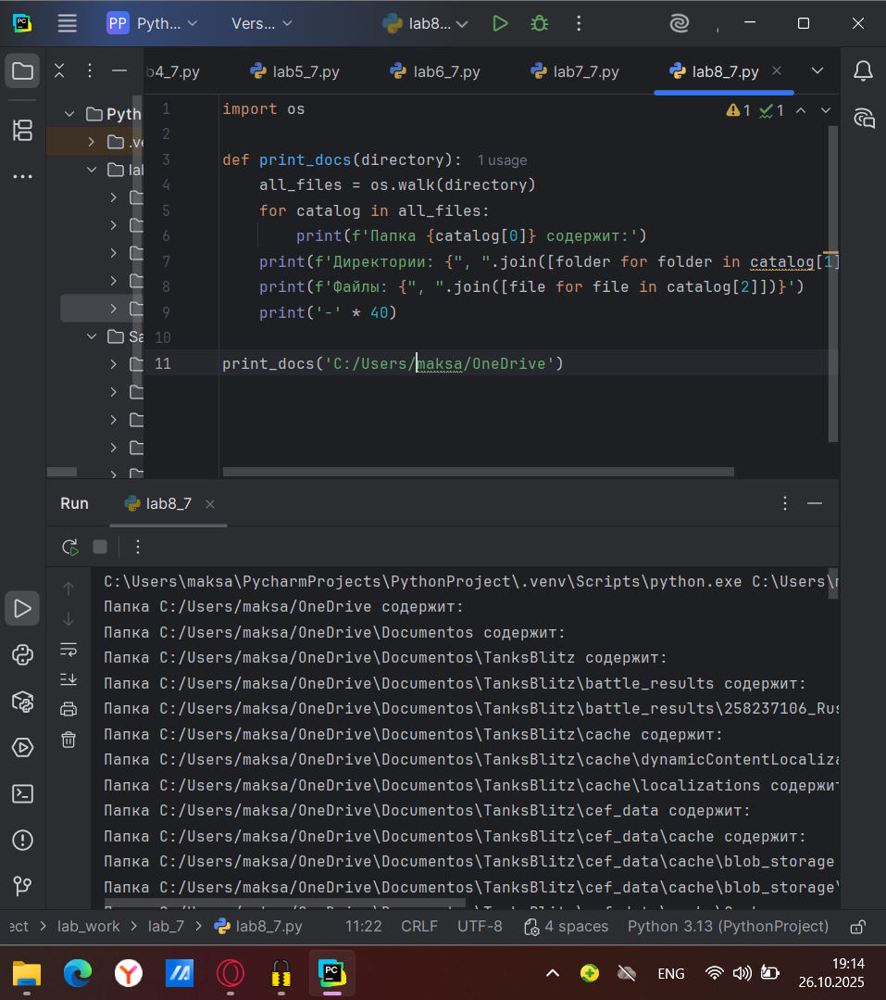

# Тема 7. Работа с файлами: ввод, вывод.
Отчет по Теме #7 выполнил:
- Атаманов Максим Денисович
- ИВТ-23-1

| Задание | Лаб_раб | Сам_раб |
| ------ | ------ | ------ |
| Задание 1 | + | + |
| Задание 2 | + | + |
| Задание 3 | + | + |
| Задание 4 | + | + |
| Задание 5 | + | + |
| Задание 6 | + | 
| Задание 7 | + | 
| Задание 8 | + | 
| Задание 9 | + | 
| Задание 10 | + | 

знак "+" - задание выполнено; знак "-" - задание не выполнено;

Работу проверили:
- Ротенштрайх Т.В.

## Лабораторная работа №1
### Составьте текстовый файл и положите его в одну директорию с программой на Python. Текстовый файл должен состоять минимум из двух строк. 

### Результат.


## Лабораторная работа №2
### Напишите программу, которая выведет только первую строку из вашего файла, при этом используйте конструкцию open()/close().

```python
f = open('input.txt', 'r')
print(f.readline())
f.close()
```
### Результат


## Лабораторная работа №3
### Напишите программу, которая выведет все строки из вашего файла в массиве, при этом используйте конструкцию open()/close().

```python
f = open('input.txt', 'r')
print(f.readlines())
f.close()
```
### Результат


## Лабораторная работа №4
### Напишите программу, которая выведет все строки из вашего файла в массиве, при этом используйте конструкцию with open().

```python
with open ('input.txt', 'r') as f:
    print(f.readlines())
```
### Результат

   
## Лабораторная работа №5
### Напишите программу, которая выведет каждую строку из вашего файла отдельно, при этом используйте конструкцию with open().

```python
with open('input.txt', 'r') as f:
    for line in f:
        print(line)
```
### Результат


## Лабораторная работа №6
### Напишите программу, которая будет добавлять новую строку в ваш файл, а потом выведет полученный файл в консоль. Вывод можно осуществлять любым способом. Обязательно проверьте сам файл, чтобы изменения в нем тоже отображались.

```python
with open('input.txt', 'a+') as f:
    f.write('\nIm additional line')

with open('input.txt', 'r') as f:
    result = f.readlines()
    print(result)
```
### Результат


## Лабораторная работа №7
### Напишите программу, которая перепишет всю информацию, которая была у вас в файле до этого, например напишет любые данные из произвольно вами составленного списка. Также не забудьте проверить что измененная вами информация сохранилась в файле.

```python
lines = ['one', 'two', 'three']
with open('input.txt', 'w') as f:
    for line in lines:
        f.write('\nCycle run ' + line)
    print('Done!')
```
### Результат


## Лабораторная работа №8
### Выберите любую папку на своем компьютере, имеющую вложенные директории. Выведите на печать в терминал ее содержимое, как и всех подкаталогов при помощи функции print_docs(directory).

```python
import os

def print_docs(directory):
    all_files = os.walk(directory)
    for catalog in all_files:
        print(f'Папка {catalog[0]} содержит:')
    print(f'Директории: {", ".join([folder for folder in catalog[1]])}')
    print(f'Файлы: {", ".join([file for file in catalog[2]])}')
    print('-' * 40)

print_docs('C:/Users/maksa/OneDrive')
```
### Результат


## Лабораторная работа №9
### Документ «input.txt» содержит следующий текст: 
Приветствие 
Спасибо 
Извините 
Пожалуйста 
До свидания 
Ты готов? 
Как дела? 
С днем рождения! 
Удача! 
Я тебя люблю. 
Требуется реализовать функцию, которая выводит слово, имеющее максимальную длину (или список слов, если таковых несколько). Проверьте работоспособность программы на своем наборе данных.

```python
def longest_words(file):
    with open(file, encoding='utf-8') as f:
        words = f.read().split()
        max_length = len(max(words, key=len))
        for word in words:
            if len(word) == max_length:
                sought_words = word

        if len(sought_words) == 1:
            return sought_words[0]
        return sought_words

print(longest_words('input.txt'))
```
### Результат


## Лабораторная работа №10
### Требуется создать csv-файл «rows_300.csv» со следующими столбцами: 
• № - номер по порядку (от 1 до 300);
• Секунда – текущая секунда на вашем ПК; 
• Микросекунда – текущая миллисекунда на часах.

```python
import csv
import datetime
import time

with open('rows_300.csv', 'w', newline='', encoding='utf-8') as f:
    writer = csv.writer(f)
    writer.writerow(['№','Секунда ','Микросекунда'])
    for line in range(1,301):
        writer.writerow([line, datetime.datetime.now().second,
                         datetime.datetime.now().microsecond])
        time.sleep(0.01)
```
### Результат


## Самостоятельная работа №1
### Найдите в интернете любую статью (объем статьи не менее 200 слов), скопируйте ее содержимое в файл и напишите программу, которая считает количество слов в текстовом файле и определит самое часто встречающееся слово. Результатом выполнения задачи будет: скриншот файла со статьей, листинг кода, и вывод в консоль, в котором будет указана вся необходимая информация. 

```python
from collections import Counter

with open('article.txt', 'r', encoding='utf-8') as f:
    text = f.read()

words = text.lower().replace(',', '').replace('.', '').replace('!', '').replace('?', '').split()

real_words = [word for word in words if len(word) > 2]

word_count = len(real_words)

if real_words:
    most_common = Counter(real_words).most_common(1)[0]
    print(f"Количество слов (без предлогов): {word_count}")
    print(f"Самое частое слово: '{most_common[0]}' ({most_common[1]} раз)")
else:
    print("Нет подходящих слов")
```

### Результат

  
## Самостоятельная работа №2
### У вас появилась потребность в ведении книги расходов, посмотрев все существующие варианты вы пришли к выводу что вас ничего не устраивает и нужно все делать самому. Напишите программу для учета расходов. Программа должна позволять вводить информацию о расходах, сохранять ее в файл и выводить существующие данные в консоль. Ввод информации происходит через консоль.

```python
# Добавить расход
def add_expense():
    with open('expenses.txt', 'a', encoding='utf-8') as f:
        item = input("Что купили: ")
        price = input("Сколько стоит: ")
        f.write(f"{item} - {price} руб\n")
    print("Расход добавлен!")


# Показать расходы
def show_expenses():
    try:
        with open('expenses.txt', 'r', encoding='utf-8') as f:
            print("Ваши расходы:")
            print(f.read())
    except FileNotFoundError:
        print("Расходов пока нет")


# Главное меню
while True:
    print("\n1 - Добавить расход")
    print("2 - Показать расходы")
    print("3 - Выход")
    choice = input("Выберите: ")

    if choice == '1':
        add_expense()
    elif choice == '2':
        show_expenses()
    elif choice == '3':
        break
```

### Результат


## Самостоятельная работа №3
###  Имеется файл input.txt с текстом на латинице. Напишите программу, которая выводит следующую статистику по тексту: количество букв латинского алфавита; число слов; число строк. • 
Текст в файле: 
Beautiful is better than ugly. Explicit is better than implicit. Simple is better than complex. Complex is better than complicated. 
• Ожидаемый результат: 
Input file contains: 108 letters 20 words 4 lines

```python
# Создаем файл с текстом
with open('input.txt', 'w', encoding='utf-8') as f:
    f.write("""Beautiful is better than ugly.
Explicit is better than implicit.
Simple is better than complex.
Complex is better than complicated.""")

# Анализируем
with open('input.txt', 'r', encoding='utf-8') as f:
    lines = f.readlines()

letters = sum(len([c for c in line if c.isalpha()]) for line in lines)
words = sum(len(line.split()) for line in lines)
line_count = len(lines)

print(f"Input file contains:")
print(f"{letters} letters")
print(f"{words} words")
print(f"{line_count} lines")
```

### Результат


## Самостоятельная работа №4
### Напишите программу, которая получает на вход предложение, выводит его в терминал, заменяя все запрещенные слова звездочками * (количество звездочек равно количеству букв в слове). Запрещенные слова, разделенные символом пробела, хранятся в текстовом файле input.txt. Все слова в этом файле записаны в нижнем регистре. Программа должна заменить запрещенные слова, где бы они ни встречались, даже в середине другого слова. Замена производится независимо от регистра: если файл input.txt содержит запрещенное слово exam, то слова exam, Exam, ExaM, EXAM и exAm должны быть заменены на ****. 

```python
with open('forbidden.txt', 'w', encoding='utf-8') as f:
    f.write("hello email python the exam wor is")

with open('forbidden.txt', 'r', encoding='utf-8') as f:
    bad_words = f.read().split()

text = "Hello, world! Python IS the programming language of thE future. My EMAIL is... PYTHON is awesome!!!!"

result = text
for word in bad_words:
    start = 0
    while True:
        found_index = result.lower().find(word, start)
        if found_index == -1:
            break

        result = result[:found_index] + '*' * len(word) + result[found_index + len(word):]
        start = found_index + len(word)

print("Исходный текст:")
print(text)
print("\nРезультат:")
print(result)
```

### Результат


## Самостоятельная работа №5
### Самостоятельно придумайте и решите задачу, которая будет взаимодействовать с текстовым файлом. 

```python
filename = input("Введите имя файла: ")
search_word = input("Какое слово ищем: ")

try:
    with open(filename, 'r', encoding='utf-8') as f:
        content = f.read()
        count = content.lower().count(search_word.lower())
        print(f"Слово '{search_word}' найдено {count} раз")
except FileNotFoundError:
    print("Файл не найден")
```

### Результат


## Общие выводы по теме
В ходе выполнения лабораторной работы были успешно освоены основные принципы работы с файлами в Python. Все задачи продемонстрировали практическое применение операций чтения и записи файлов, обработки текстовых данных и организации хранения информации

