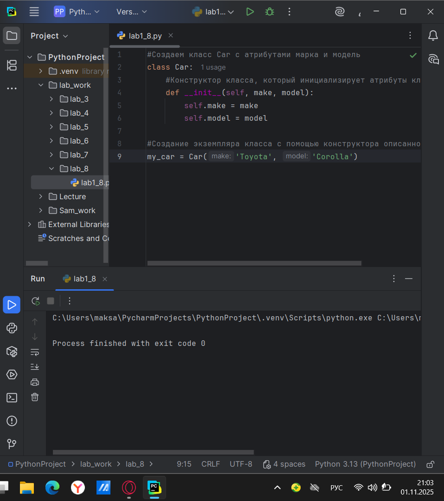
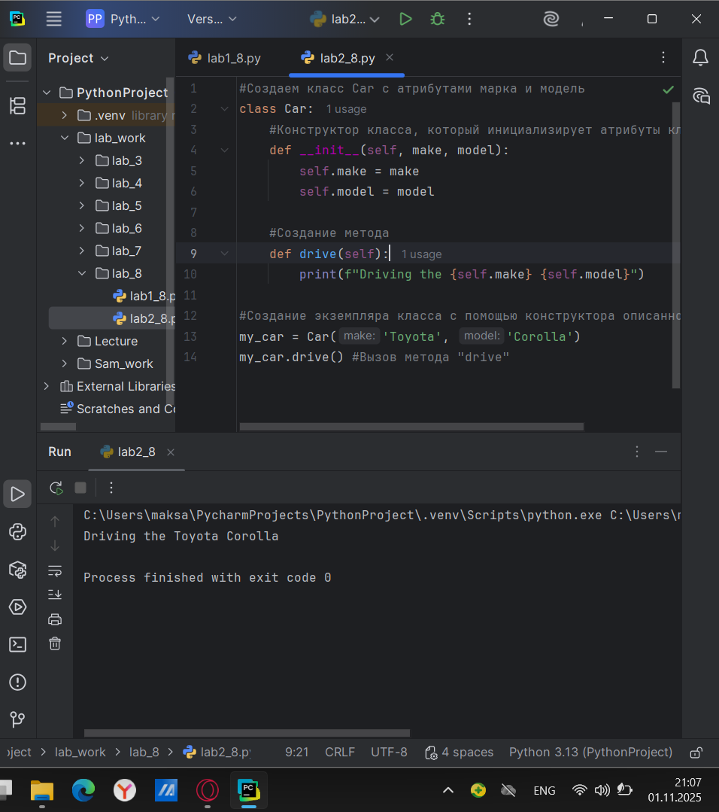
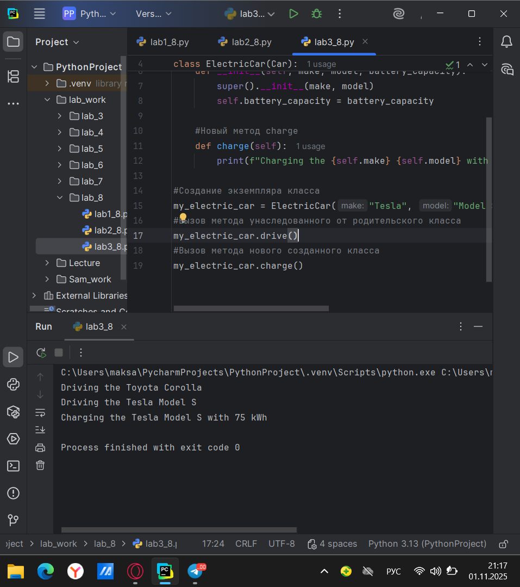
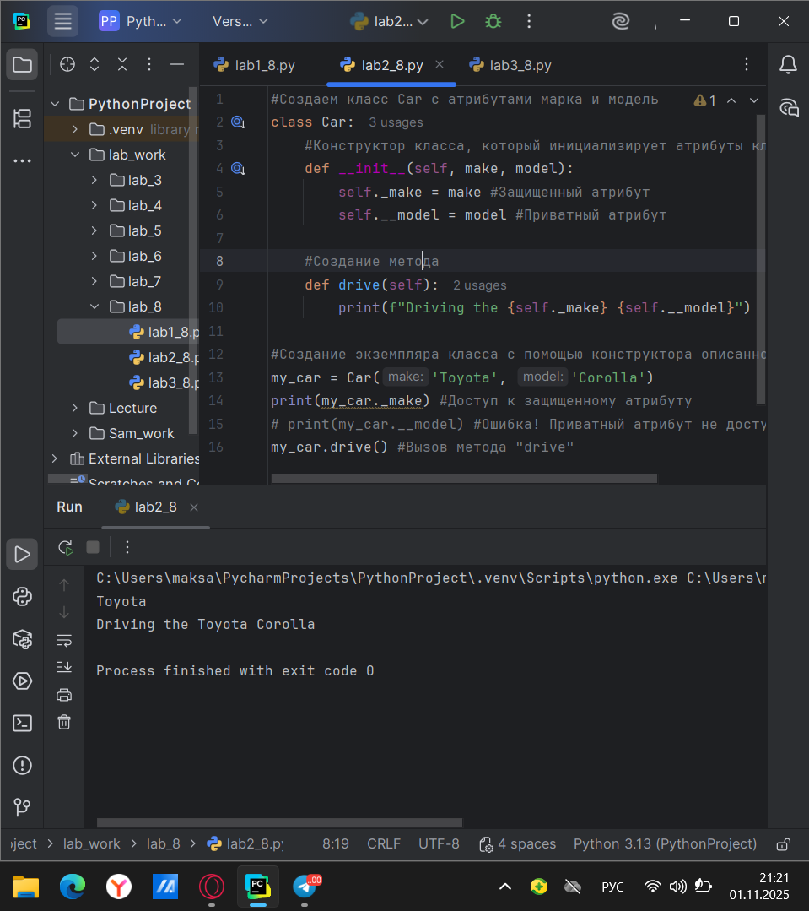
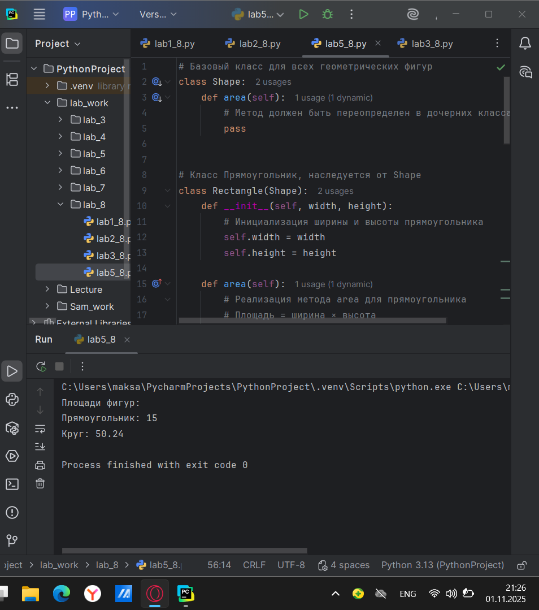
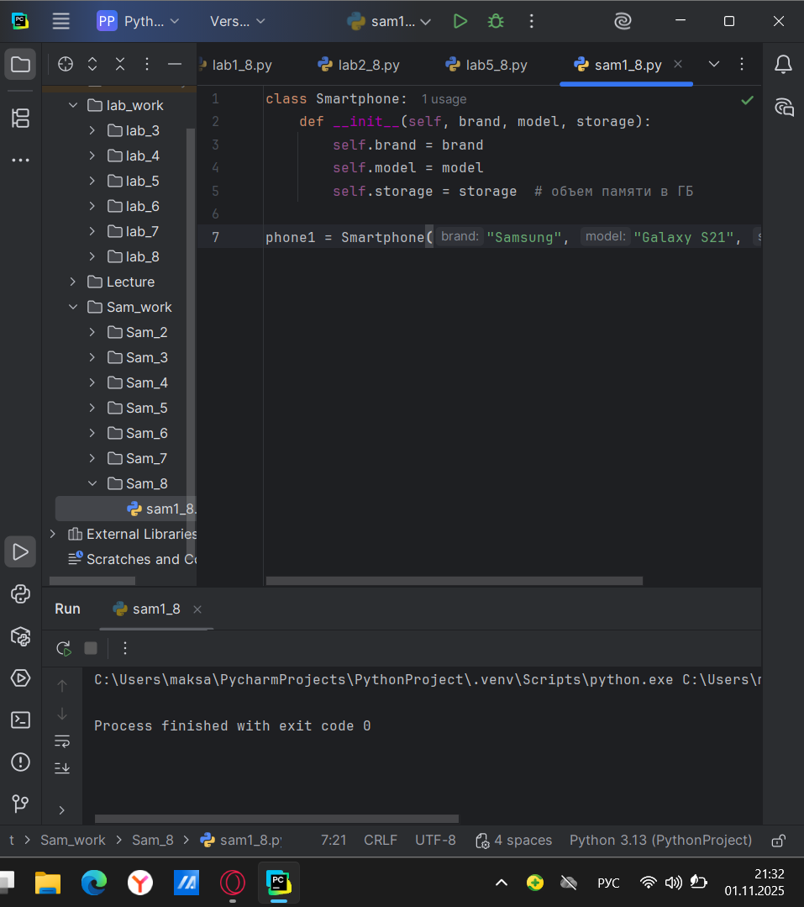
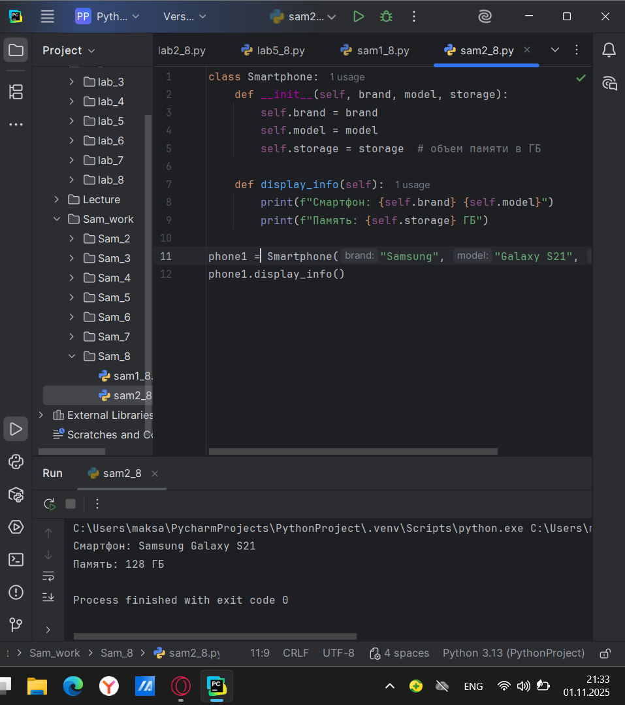
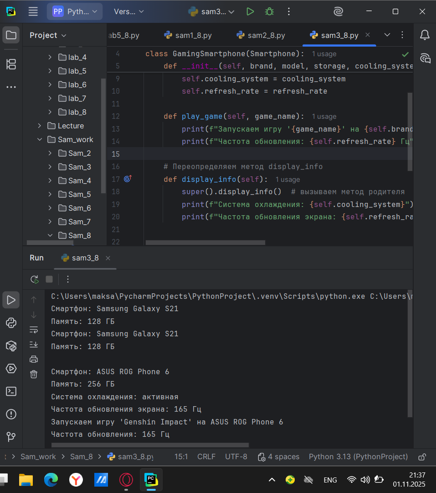
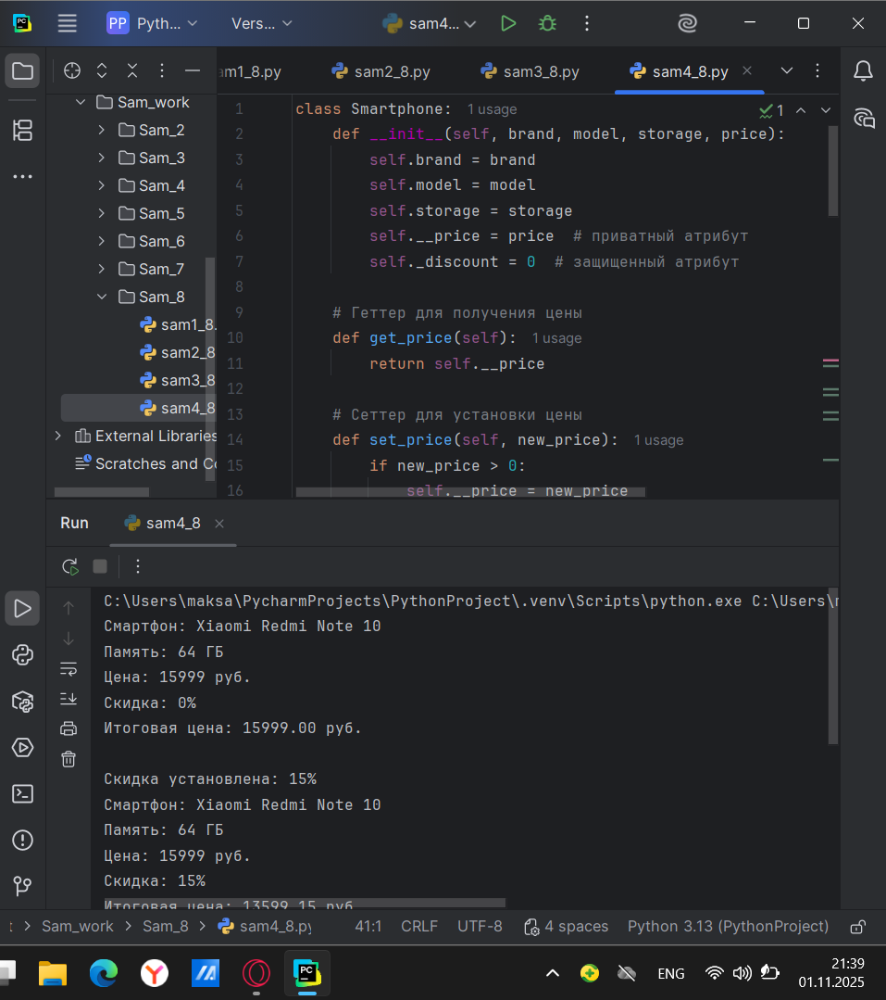
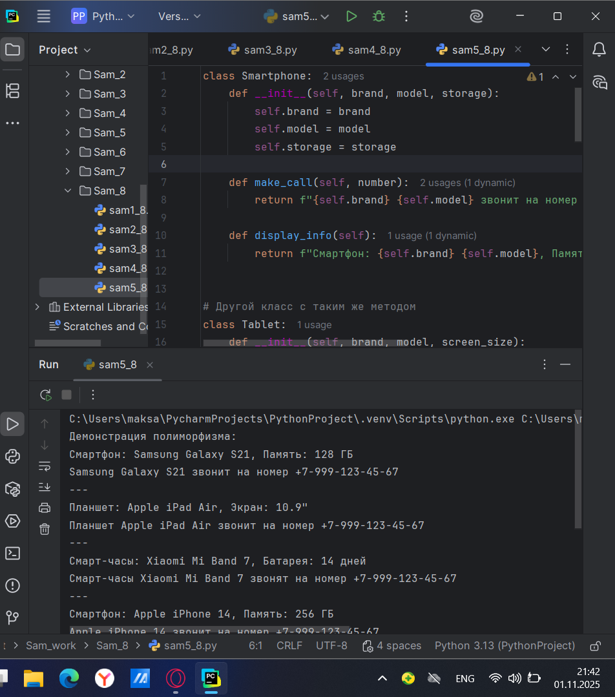

# Тема 8. Введение в ООП.
Отчет по Теме #8 выполнил:
- Атаманов Максим Денисович
- ИВТ-23-1

| Задание | Лаб_раб | Сам_раб |
| ------ | ------ | ------ |
| Задание 1 | + | + |
| Задание 2 | + | + |
| Задание 3 | + | + |
| Задание 4 | + | + |
| Задание 5 | + | + |

знак "+" - задание выполнено; знак "-" - задание не выполнено;

Работу проверили:
- Ротенштрайх Т.В.

## Лабораторная работа №1
### Создайте класс "Car" с атрибутами производитель и модель. Создайте объект этого класса. Напишите комментарии для кода, объясняющие его работу. Результатом выполнения задания будет листинг кода с комментариями. 

```python
#Создаем класс Car с атрибутами марка и модель
class Car:
    #Конструктор класса, который инициализирует атрибуты класса Car
    def __init__(self, make, model):
        self.make = make
        self.model = model

#Создание экземпляра класса с помощью конструктора описанного выше
my_car = Car('Toyota', 'Corolla')
```

### Результат.


## Лабораторная работа №2
### Дополните код из первого задания, добавив в него атрибуты и методы класса, заставьте машину "поехать". Напишите комментарии для кода, объясняющие его работу. Результатом выполнения задания будет листинг кода с комментариями и получившийся вывод в консоль.

```python
#Создаем класс Car с атрибутами марка и модель
class Car:
    #Конструктор класса, который инициализирует атрибуты класса Car
    def __init__(self, make, model):
        self.make = make
        self.model = model

    #Создание метода
    def drive(self):
        print(f"Driving the {self.make} {self.model}")

#Создание экземпляра класса с помощью конструктора описанного выше
my_car = Car('Toyota', 'Corolla')
my_car.drive() #Вызов метода "drive"
```
### Результат


## Лабораторная работа №3
### Создайте новый класс “ElectricCar” с методом “charge” и атрибутом емкость батареи. Реализуйте его наследование от класса, созданного в первом задании. Заставьте машину поехать, а потом заряжаться. Напишите комментарии для кода, объясняющие его работу. Результатом выполнения задания будет листинг кода с комментариями и получившийся вывод в консоль.

```python
from lab_work.lab_8.lab2_8 import Car

#Создаем класс ElectricCar
class ElectricCar(Car):
    #Конструктор, который заимствует атрибуты суперкласса (родителя) и добавляет новый атрибут - объем батареи
    def __init__(self, make, model, battery_capacity):
        super().__init__(make, model)
        self.battery_capacity = battery_capacity

    #Новый метод charge
    def charge(self):
        print(f"Charging the {self.make} {self.model} with {self.battery_capacity} kWh")

#Создание экземпляра класса
my_electric_car = ElectricCar("Tesla", "Model S", 75)
#Вызов метода унаследованного от родительского класса
my_electric_car.drive()
#Вызов метода нового созданного класса
my_electric_car.charge()
```

### Результат


## Лабораторная работа №4
### Реализуйте инкапсуляцию для класса, созданного в первом задании. Создайте защищенный атрибут производителя и приватный атрибут модели. Вызовите защищенный атрибут и заставьте машину поехать. Напишите комментарии для кода, объясняющие его работу. Результатом выполнения задания будет листинг кода с комментариями и получившийся вывод в консоль.

```python
#Создаем класс Car с атрибутами марка и модель
class Car:
    #Конструктор класса, который инициализирует атрибуты класса Car
    def __init__(self, make, model):
        self._make = make #Защищенный атрибут
        self.__model = model #Приватный атрибут

    #Создание метода
    def drive(self):
        print(f"Driving the {self._make} {self.__model}")

#Создание экземпляра класса с помощью конструктора описанного выше
my_car = Car('Toyota', 'Corolla')
print(my_car._make) #Доступ к защищенному атрибуту
# print(my_car.__model) #Ошибка! Приватный атрибут не доступен
my_car.drive() #Вызов метода "drive"
```
### Результат

   
## Лабораторная работа №5
### Реализуйте полиморфизм создав основной (общий) класс “Shape”, а также еще два класса “Rectangle” и “Circle”. Внутри последних двух классов реализуйте методы для подсчета площади фигуры. После этого создайте массив с фигурами, поместите туда круг и прямоугольник, затем при помощи цикла выведите их площади. Напишите комментарии для кода, объясняющие его работу.

```python
# Базовый класс для всех геометрических фигур
class Shape:
    def area(self):
        # Метод должен быть переопределен в дочерних классах
        pass


# Класс Прямоугольник, наследуется от Shape
class Rectangle(Shape):
    def __init__(self, width, height):
        # Инициализация ширины и высоты прямоугольника
        self.width = width
        self.height = height

    def area(self):
        # Реализация метода area для прямоугольника
        # Площадь = ширина × высота
        return self.width * self.height


# Класс Круг, наследуется от Shape
class Circle(Shape):
    def __init__(self, radius):
        # Инициализация радиуса круга
        self.radius = radius

    def area(self):
        # Реализация метода area для круга
        # Площадь = π × радиус² (π ≈ 3.14)
        return 3.14 * self.radius * self.radius


# Демонстрация полиморфизма
if __name__ == "__main__":
    # Создаем массив (список) фигур
    shapes = []

    # Добавляем прямоугольник в массив
    rectangle = Rectangle(5, 3)  # Прямоугольник 5x3
    shapes.append(rectangle)

    # Добавляем круг в массив
    circle = Circle(4)  # Круг с радиусом 4
    shapes.append(circle)

    # Выводим площади всех фигур в массиве
    print("Площади фигур:")
    for shape in shapes:
        # Полиморфизм: вызывается правильный метод area()
        # в зависимости от типа объекта
        area = shape.area()
        # Определяем тип фигуры для красивого вывода
        if isinstance(shape, Rectangle):
            print(f"Прямоугольник: {area}")
        elif isinstance(shape, Circle):
            print(f"Круг: {area}")
```
### Результат


## Самостоятельная работа №1
### Самостоятельно создайте класс и его объект. Они должны отличаться, от тех, что указаны в теоретическом материале (методичке) и лабораторных заданиях. Результатом выполнения задания будет листинг кода и получившийся вывод консоли.

```python
class Smartphone:
    def __init__(self, brand, model, storage):
        self.brand = brand
        self.model = model
        self.storage = storage  # объем памяти в ГБ

phone1 = Smartphone("Samsung", "Galaxy S21", 128)
```

### Результат

  
## Самостоятельная работа №2
### Самостоятельно создайте атрибуты и методы для ранее созданного класса. Они должны отличаться, от тех, что указаны в теоретическом материале (методичке) и лабораторных заданиях. Результатом выполнения задания будет листинг кода и получившийся вывод консоли.

```python
class Smartphone:
    def __init__(self, brand, model, storage):
        self.brand = brand
        self.model = model
        self.storage = storage  # объем памяти в ГБ

    def display_info(self):
        print(f"Смартфон: {self.brand} {self.model}")
        print(f"Память: {self.storage} ГБ")

phone1 = Smartphone("Samsung", "Galaxy S21", 128)
phone1.display_info()
```

### Результат


## Самостоятельная работа №3
###  Самостоятельно реализуйте наследование, продолжая работать с ранее созданным классом. Оно должно отличаться, от того, что указано в теоретическом материале (методичке) и лабораторных заданиях. Результатом выполнения задания будет листинг кода и получившийся вывод консоли.


```python
from Sam_work.Sam_8.sam2_8 import Smartphone

# Наследование - создаем класс игрового смартфона
class GamingSmartphone(Smartphone):
    def __init__(self, brand, model, storage, cooling_system, refresh_rate):
        # Вызываем конструктор родительского класса
        super().__init__(brand, model, storage)
        # Добавляем новые атрибуты
        self.cooling_system = cooling_system
        self.refresh_rate = refresh_rate

    def play_game(self, game_name):
        print(f"Запускаем игру '{game_name}' на {self.brand} {self.model}")
        print(f"Частота обновления: {self.refresh_rate} Гц")

    # Переопределяем метод display_info
    def display_info(self):
        super().display_info()  # вызываем метод родителя
        print(f"Система охлаждения: {self.cooling_system}")
        print(f"Частота обновления экрана: {self.refresh_rate} Гц")


# Создаем обычный смартфон
phone1 = Smartphone("Samsung", "Galaxy S21", 128)
phone1.display_info()
print()

# Создаем игровой смартфон
gaming_phone = GamingSmartphone("ASUS", "ROG Phone 6", 256, "активная", 165)
gaming_phone.display_info()
gaming_phone.play_game("Genshin Impact")
```

### Результат


## Самостоятельная работа №4
### Самостоятельно реализуйте инкапсуляцию, продолжая работать с ранее созданным классом. Она должна отличаться, от того, что указана в теоретическом материале (методичке) и лабораторных заданиях. Результатом выполнения задания будет листинг кода и получившийся вывод консоли.

```python
class Smartphone:
    def __init__(self, brand, model, storage, price):
        self.brand = brand
        self.model = model
        self.storage = storage
        self.__price = price  # приватный атрибут
        self._discount = 0  # защищенный атрибут

    # Геттер для получения цены
    def get_price(self):
        return self.__price

    # Сеттер для установки цены
    def set_price(self, new_price):
        if new_price > 0:
            self.__price = new_price
            print(f"Цена изменена на {new_price} руб.")
        else:
            print("Цена должна быть положительной!")

    # Метод для установки скидки
    def set_discount(self, discount_percent):
        if 0 <= discount_percent <= 50:
            self._discount = discount_percent
            print(f"Скидка установлена: {discount_percent}%")
        else:
            print("Скидка должна быть от 0% до 50%")

    # Метод для расчета цены со скидкой
    def get_final_price(self):
        return self.__price * (1 - self._discount / 100)

    def display_info(self):
        print(f"Смартфон: {self.brand} {self.model}")
        print(f"Память: {self.storage} ГБ")
        print(f"Цена: {self.__price} руб.")
        print(f"Скидка: {self._discount}%")
        print(f"Итоговая цена: {self.get_final_price():.2f} руб.")


phone = Smartphone("Xiaomi", "Redmi Note 10", 64, 15999)
phone.display_info()
print()

# Работа с инкапсулированными данными
phone.set_discount(15)
phone.display_info()
print()

phone.set_price(14999)
phone.display_info()
print()

# Попытка прямого доступа к приватному атрибуту (не сработает)
# print(phone.__price)  # Вызовет ошибку!

# Корректный доступ через геттер
print(f"Текущая цена через геттер: {phone.get_price()} руб.")
```

### Результат


## Самостоятельная работа №5
### Самостоятельно реализуйте полиморфизм. Он должен отличаться, от того, что указан в теоретическом материале (методичке) и лабораторных заданиях. Результатом выполнения задания будет листинг кода и получившийся вывод консоли.

```python
class Smartphone:
    def __init__(self, brand, model, storage):
        self.brand = brand
        self.model = model
        self.storage = storage

    def make_call(self, number):
        return f"{self.brand} {self.model} звонит на номер {number}"

    def display_info(self):
        return f"Смартфон: {self.brand} {self.model}, Память: {self.storage} ГБ"


# Другой класс с таким же методом
class Tablet:
    def __init__(self, brand, model, screen_size):
        self.brand = brand
        self.model = model
        self.screen_size = screen_size

    def make_call(self, number):
        return f"Планшет {self.brand} {self.model} звонит на номер {number}"

    def display_info(self):
        return f"Планшет: {self.brand} {self.model}, Экран: {self.screen_size}\""


# Еще один класс с таким же методом
class SmartWatch:
    def __init__(self, brand, model, battery_life):
        self.brand = brand
        self.model = model
        self.battery_life = battery_life

    def make_call(self, number):
        return f"Смарт-часы {self.brand} {self.model} звонят на номер {number}"

    def display_info(self):
        return f"Смарт-часы: {self.brand} {self.model}, Батарея: {self.battery_life} дней"


# Функция, демонстрирующая полиморфизм
def use_device(device, number):
    """Эта функция работает с любым устройством, у которого есть методы make_call и display_info"""
    print(device.display_info())
    print(device.make_call(number))
    print("---")


# Создаем разные устройства
devices = [
    Smartphone("Samsung", "Galaxy S21", 128),
    Tablet("Apple", "iPad Air", 10.9),
    SmartWatch("Xiaomi", "Mi Band 7", 14),
    Smartphone("Apple", "iPhone 14", 256)
]

# Демонстрация полиморфизма
print("Демонстрация полиморфизма:")
for device in devices:
    use_device(device, "+7-999-123-45-67")

# Еще один пример полиморфизма
print("\nМассив разных устройств:")
for device in devices:
    # Полиморфный вызов метода - один интерфейс, разное поведение
    call_result = device.make_call("+7-495-111-22-33")
    print(call_result)
```

### Результат


## Общие выводы по теме
В ходе выполнения лабораторной работы были успешно освоены и применены на практике все четыре основных принципа объектно-ориентированного программирования в Python. На примере класса Smartphone и его производных продемонстрировано создание объектов с уникальными атрибутами и методами. Реализовано наследование через класс GamingSmartphone, который расширил функциональность базового класса. Принцип инкапсуляции применен для защиты внутренних данных с использованием приватных и защищенных атрибутов. Полиморфизм продемонстрирован через создание различных классов устройств с единым интерфейсом методов. Работа подтвердила понимание ООП и умение применять его для создания структурированного, поддерживаемого и расширяемого кода.
