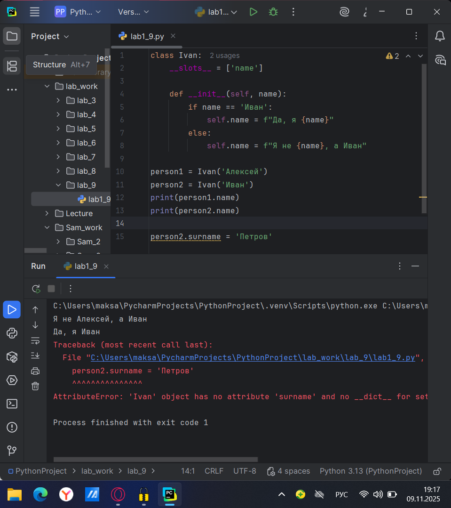
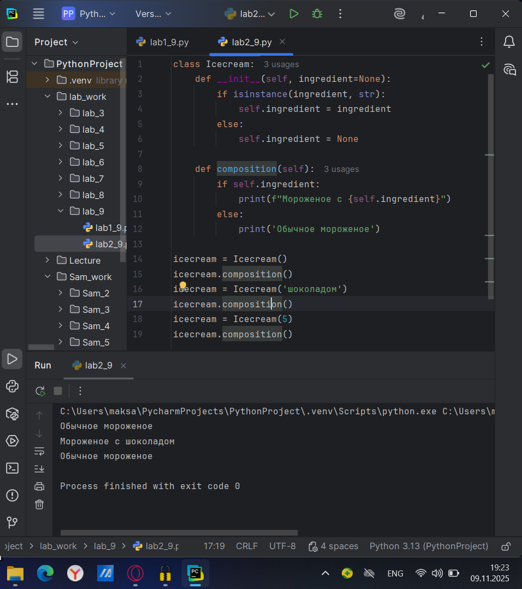
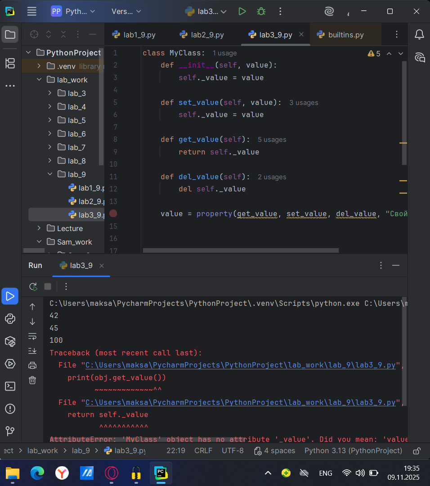
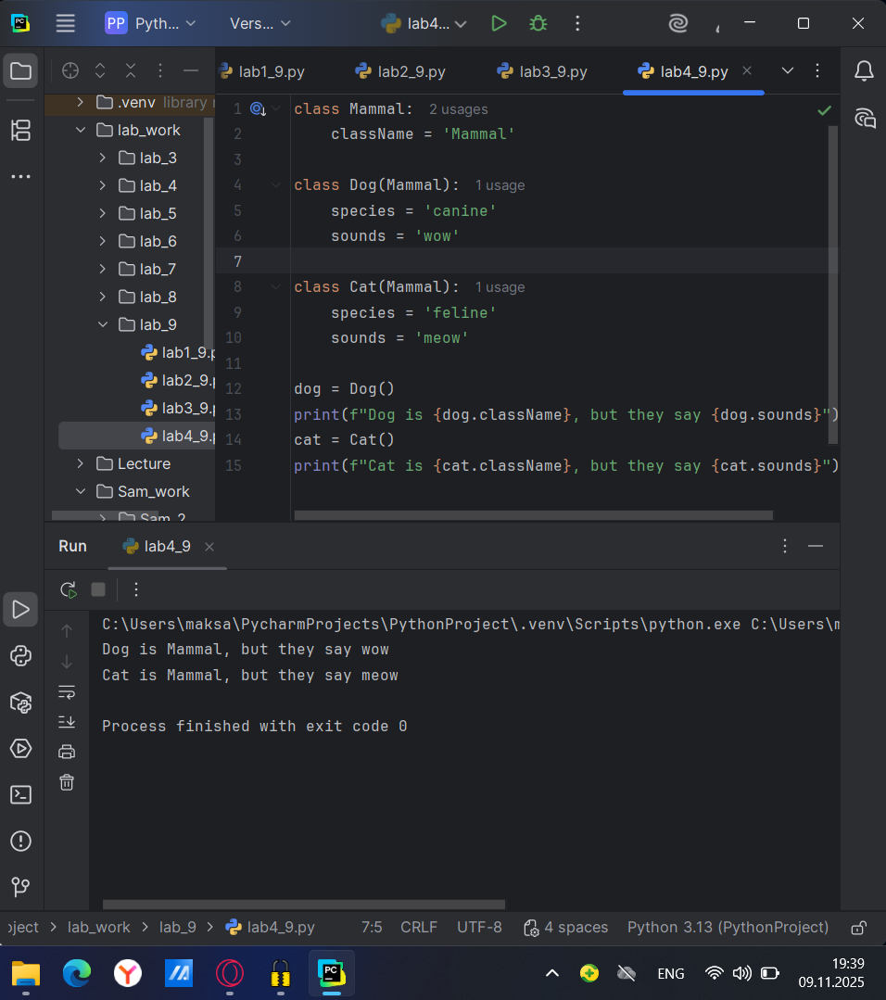
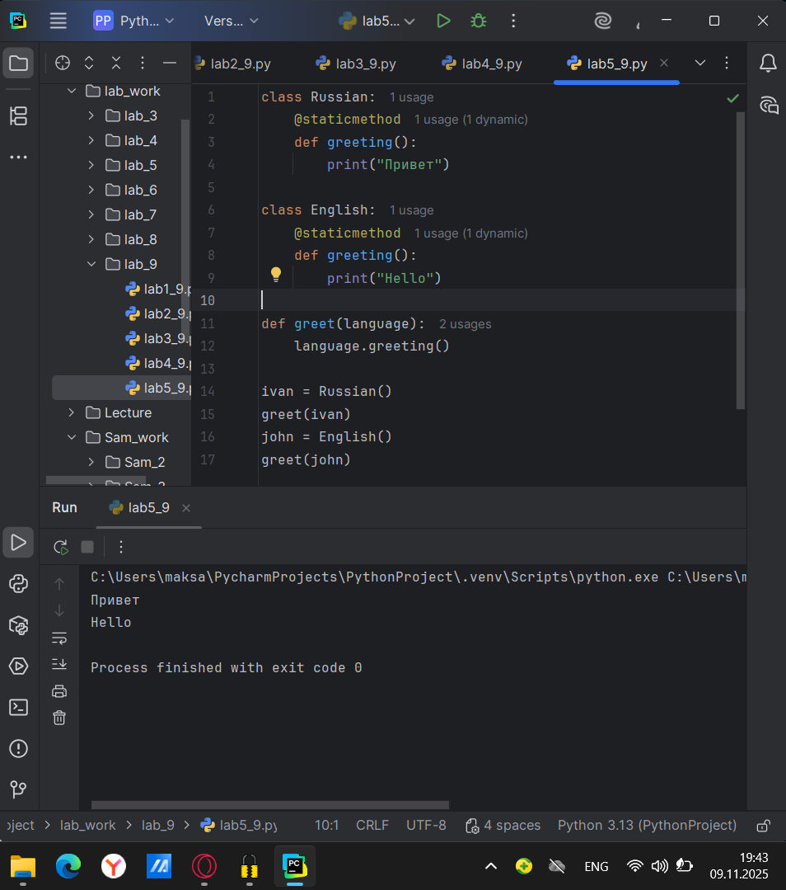
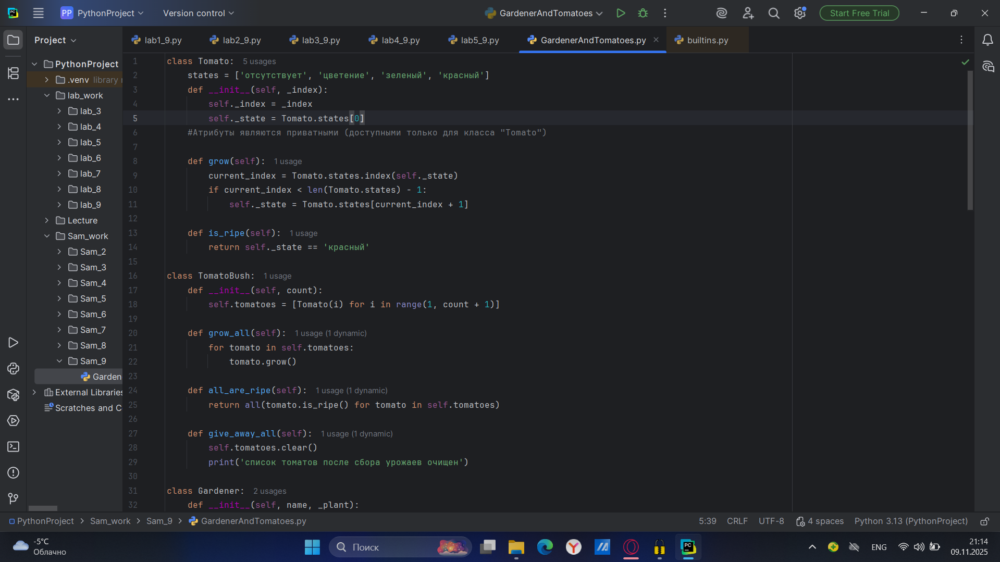
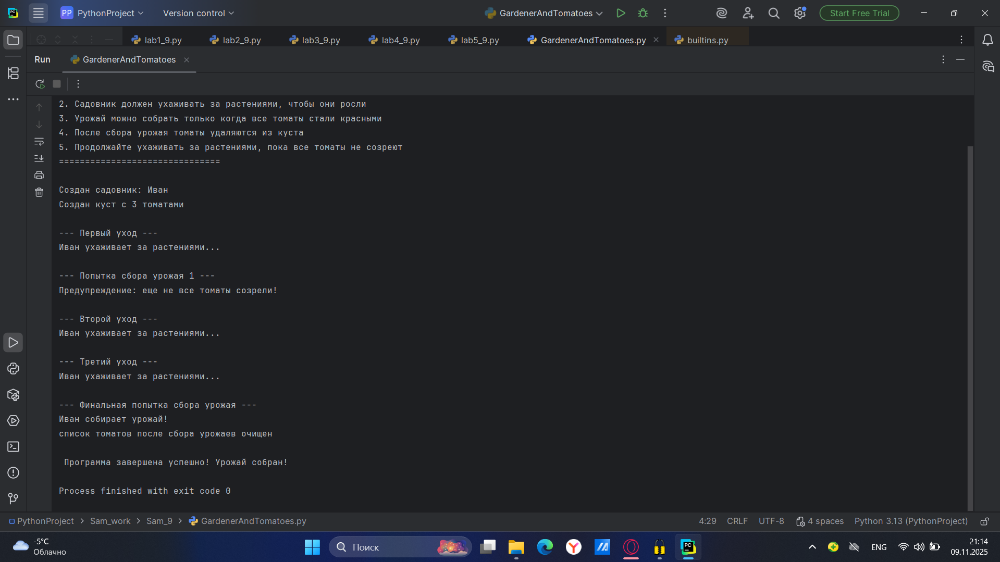

# Тема 9. Концепции и принципы ООП.
Отчет по Теме #9 выполнил:
- Атаманов Максим Денисович
- ИВТ-23-1

| Задание | Лаб_раб | Сам_раб |
| ------ | ------ | ------ |
| Задание 1 | + | + |
| Задание 2 | + | + |
| Задание 3 | + | + |
| Задание 4 | + | + |
| Задание 5 | + | + |

знак "+" - задание выполнено; знак "-" - задание не выполнено;

Работу проверили:
- Ротенштрайх Т.В.

## Лабораторная работа №1
### Допустим, что вы решили оригинально и немного странно познакомится с человеком. Для этого у вас должен быть написан свой класс на Python, который будет проверять угадал ваше имя человек или нет. Для этого создайте класс, указав в свойствах только имя. Дальше создайте функцию __init__(), а в ней сделайте проверку на то угадал человек ваше имя или нет. Также можете проверить что будет, если в этой функции указав атрибут, который не указан в вашем классе, например, попробуйте вызвать фамилию. 

```python
class Ivan:
    __slots__ = ['name']

    def __init__(self, name):
        if name == 'Иван':
            self.name = f"Да, я {name}"
        else:
            self.name = f"Я не {name}, а Иван"

person1 = Ivan('Алексей')
person2 = Ivan('Иван')
print(person1.name)
print(person2.name)

person2.surname = 'Петров'
```

### Результат.


## Лабораторная работа №2
### Вам дали важное задание, написать продавцу мороженого программу, которая будет писать добавили ли топпинг в мороженое и цену после возможного изменения. Для этого вам нужно написать класс, в котором будет определяться изменили ли состав мороженого или нет. В этом классе реализуйте метод, выводящий на печать «Мороженое с {ТОППИНГ}» в случае наличия добавки, а иначе отобразится следующая фраза: «Обычное мороженое». При этом программа должна воспринимать как топпинг только атрибуты типа string.

```python
class Icecream:
    def __init__(self, ingredient=None):
        if isinstance(ingredient, str):
            self.ingredient = ingredient
        else:
            self.ingredient = None

    def composition(self):
        if self.ingredient:
            print(f"Мороженое с {self.ingredient}")
        else:
            print('Обычное мороженое')

icecream = Icecream()
icecream.composition()
icecream = Icecream('шоколадом')
icecream.composition()
icecream = Icecream(5)
icecream.composition()
```
### Результат


## Лабораторная работа №3
### Петя – начинающий программист и на занятиях ему сказали реализовать икапсу…что-то. А вы хороший друг Пети и ко всему прочему прекрасно знаете, что икапсу…что-то – это инкапсуляция, поэтому решаете помочь вашему другу с написанием класса с инкапсуляцией. Ваш класс будет не просто инкапсуляцией, а классом с сеттером, геттером и деструктором. После написания класса вам необходимо продемонстрировать что все написанные вами функции работают. Также вам необходимо объяснить Пете почему на скриншоте ниже в консоли выводится ошибка.

```python
class MyClass:
    def __init__(self, value):
        self._value = value

    def set_value(self, value):
        self._value = value

    def get_value(self):
        return self._value

    def del_value(self):
        del self._value

    value = property(get_value, set_value, del_value, "Свойство value")

obj = MyClass(42)
print(obj.get_value())
obj.set_value(45)
print(obj.get_value())
obj.set_value(100)
print(obj.get_value())
obj.del_value()
print(obj.get_value())
```
### Ошибка возникает из за того, что мы удаляем значение атрибута и пытаемся его получить.
### Результат


## Лабораторная работа №4
### Вам прекрасно известно, что кошки и собаки являются млекопитающими, но компьютер этого не понимает, поэтому вам нужно написать три класса: Кошки, Собаки, Млекопитающие. И при помощи Михаил А. Панов “наследования” объяснить компьютеру что кошки и собаки – это млекопитающие. Также добавьте какой-нибудь свой атрибут для кошек и собак, чтобы показать, что они чем-то отличаются друг от друга.

```python
class Mammal:
    className = 'Mammal'

class Dog(Mammal):
    species = 'canine'
    sounds = 'wow'
    
class Cat(Mammal):
    species = 'feline'
    sounds = 'meow'

dog = Dog()
print(f"Dog is {dog.className}, but they say {dog.sounds}")
cat = Cat()
print(f"Cat is {cat.className}, but they say {cat.sounds}")
```
### Результат

   
## Лабораторная работа №5
### На разных языках здороваются по-разному, но суть остается одинаковой, люди друг с другом здороваются. Давайте вместе с вами реализуем программу с полиморфизмом, которая будет описывать всю суть первого предложения задачи. Для этого мы можем выбрать два языка, например, русский и английский и написать для них отдельные классы, в которых будет в виде атрибута слово, которым здороваются на этих языках. А также напишем функцию, которая будет выводить информацию о том, как на этих языках здороваются. Заметьте, что для решения поставленной задачи мы использовали декоратор @staticmethod, поскольку нам не нужны обязательные параметры-ссылки вроде self.

```python
class Russian:
    @staticmethod
    def greeting():
        print("Привет")

class English:
    @staticmethod
    def greeting():
        print("Hello")

def greet(language):
    language.greeting()

ivan = Russian()
greet(ivan)
john = English()
greet(john)
```
### Результат


## Самостоятельная работа №1
### Задание садовник и помидоры.

```python
class Tomato:
    states = ['отсутствует', 'цветение', 'зеленый', 'красный']
    def __init__(self, _index):
        self._index = _index
        self._state = Tomato.states[0]
    #Атрибуты являются приватными (доступными только для класса "Tomato")

    def grow(self):
        current_index = Tomato.states.index(self._state)
        if current_index < len(Tomato.states) - 1:
            self._state = Tomato.states[current_index + 1]

    def is_ripe(self):
        return self._state == 'красный'

class TomatoBush:
    def __init__(self, count):
        self.tomatoes = [Tomato(i) for i in range(1, count + 1)]

    def grow_all(self):
        for tomato in self.tomatoes:
            tomato.grow()

    def all_are_ripe(self):
        return all(tomato.is_ripe() for tomato in self.tomatoes)

    def give_away_all(self):
        self.tomatoes.clear()
        print('список томатов после сбора урожаев очищен')

class Gardener:
    def __init__(self, name, _plant):
        self.name = name
        self._plant = _plant
        #Name - публичное, _plant - приватное

    def work(self):
        print(f"{self.name} ухаживает за растениями...")
        self._plant.grow_all()

    def harvest(self):
        if self._plant.all_are_ripe():
            print(f"{self.name} собирает урожай!")
            self._plant.give_away_all()
            return True
        else:
            print("Предупреждение: еще не все томаты созрели!")
            return False

    @staticmethod
    def knowledge_base():
        print("\n=== СПРАВКА ПО САДОВОДСТВУ ===")
        print("1. Томаты проходят 4 стадии созревания: отсутствует, цветение, зеленый, красный")
        print("2. Садовник должен ухаживать за растениями, чтобы они росли")
        print("3. Урожай можно собрать только когда все томаты стали красными")
        print("4. После сбора урожая томаты удаляются из куста")
        print("5. Продолжайте ухаживать за растениями, пока все томаты не созреют")
        print("===============================\n")


if __name__ == "__main__":
    Gardener.knowledge_base()

    bush = TomatoBush(3)  # Куст с 3 томатами
    gardener = Gardener("Иван", bush)

    print(f"Создан садовник: {gardener.name}")
    print(f"Создан куст с {len(bush.tomatoes)} томатами")

    print("\n--- Первый уход ---")
    gardener.work()

    print("\n--- Попытка сбора урожая 1 ---")
    gardener.harvest()

    print("\n--- Второй уход ---")
    gardener.work()

    print("\n--- Третий уход ---")
    gardener.work()

    print("\n--- Финальная попытка сбора урожая ---")
    success = gardener.harvest()

    if success:
        print("\n Программа завершена успешно! Урожай собран!")
    else:
        print("\n Нужно продолжать ухаживать за растениями!")
```

### Результат 




